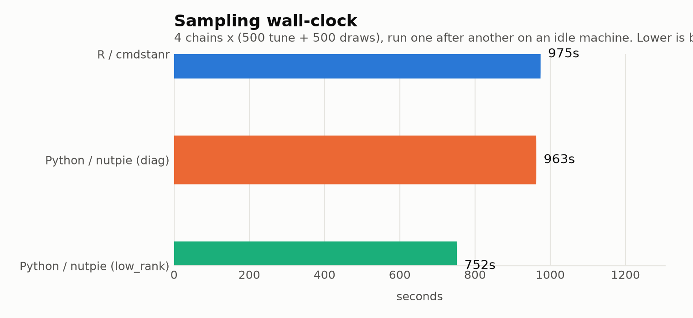
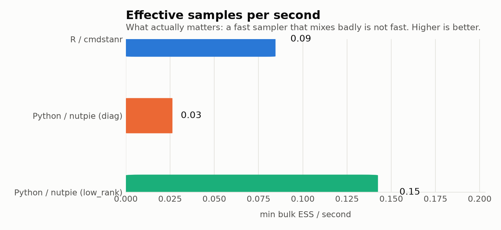
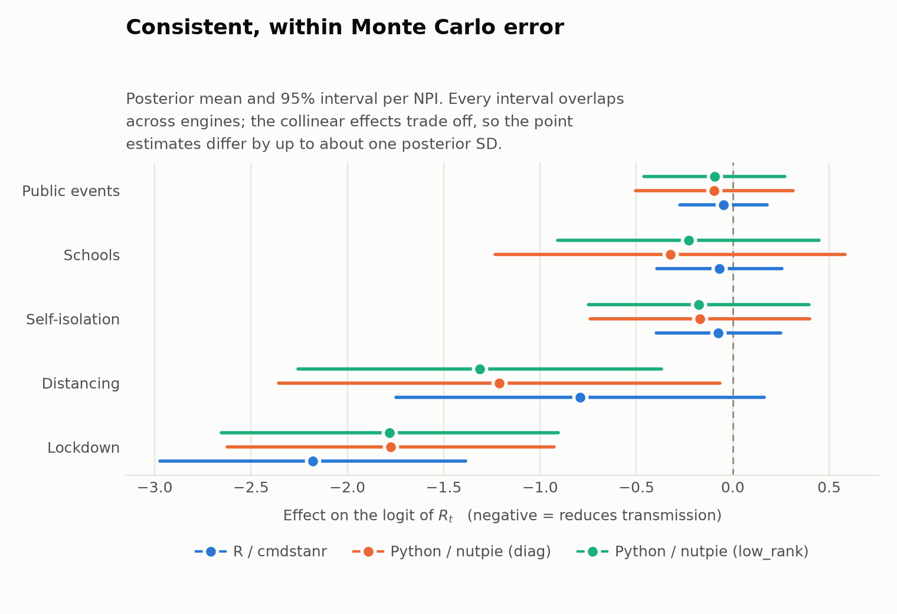

# Performance

Is the Python port faster than the R package? On the model both can fit, the
honest answer is: **not by default — but it can be, and the difference comes
from one argument.**

The benchmark fits the *same* model in both: the eleven-country
Europe/COVID-19 multilevel model, five NPIs, deaths, 4 chains of
500 tuning + 500 draws. Engines run strictly one after another on an idle
machine, so the timings are comparable.

Reproduce it with:

```bash
uv run --project python python benchmarks/run.py --draws 500 --tune 500
uv run --project python python benchmarks/report.py \
    --json "$TMPDIR/epidemia-bench/benchmark.json" --out python/docs/img
```

## Wall-clock



nutpie with its default diagonal adaptation finishes in essentially the same
time as Stan — 963s against 975s, a 1% difference that means nothing. Switching
to `low_rank` adaptation drops it to 752s.

## The number that matters

Wall-clock alone is misleading, because a sampler that finishes quickly having
explored badly has not saved you anything. The comparison worth making is
**effective samples per second**.



Now the picture separates:

- **nutpie's default is the worst of the three.** Same wall-clock as Stan, but
  a minimum bulk ESS of 27 against Stan's 88, with 27 divergences and an R-hat
  of 1.10 — which is to say it had not converged.
- **nutpie with `low_rank` is the best.** 1.7× Stan's effective samples per
  second, and **4.6× nutpie's own default**.

--8<-- "benchmark-table.md"

## Why `low_rank` matters so much here

The five NPIs were enacted within days of each other across most of these
countries — Germany banned public events on the same day it locked down. Their
effects are therefore **highly collinear**, and the posterior has a narrow ridge
that a diagonal mass matrix cannot follow. The sampler does not fall over; it
just fails to move along the ridge.

That is exactly the failure `low_rank` is for: it fits a low-rank correction to
the mass matrix and recovers the ridge.

```python
idata = fit_multilevel(data, config, adaptation="low_rank")
```

!!! warning "A clean divergence count is not evidence of a good fit"
    The default run above produced an R-hat of 1.10 and an ESS of 27. Always
    read `arviz.summary` for `r_hat` and `ess_bulk`; divergences alone would not
    have told you.

## Do the two implementations agree?

They are the same model, so they should — and within Monte Carlo error, they do.



Every 95% interval overlaps across engines, and all three agree on the
substance: lockdown carries by far the largest effect, distancing a smaller one,
and the remaining three are indistinguishable from zero.

The point estimates are not identical — lockdown is −2.18 in R against −1.78 in
Python, roughly one posterior SD apart. Two things explain that, and neither is
a discrepancy between the ports. The collinear effects **trade off against one
another**, so what is attributed to lockdown versus distancing shifts between
runs; and at a minimum ESS of around 100 out of 2000 draws, **neither run is
converged tightly enough** to resolve a difference that size. Run either engine
longer and the estimates converge on each other.

## Compilation

Stan compiles once per machine and caches the executable — 0.1s here, because it
was already built. nutpie re-compiles the log-density on **every run**, about
20s. Irrelevant for a real fit; noticeable if you are iterating on a small model.

## What this means in practice

| If you… | Use |
|---|---|
| Are iterating on a model, or already work in PyMC/ArviZ | Python, with `adaptation="low_rank"` |
| Have correlated covariates | Python + `low_rank`, or Stan; **not** nutpie's default |
| Need multiple observation series, forecasting, or scoring | R — see [parity](parity.md) |
| Want the fewest surprises | R; it is the reference implementation |

The headline is not "Rust beats C++". Both samplers are good, both struggle on
this posterior's ridge, and the one setting that actually changes the outcome is
the mass-matrix adaptation.

!!! note "Your numbers will differ"
    Measured on a 10-core Apple Silicon machine. The *ratios* should hold; the
    absolute times will not. Nothing here is fitted at documentation-build time,
    and the benchmark writes only to a temporary directory.
