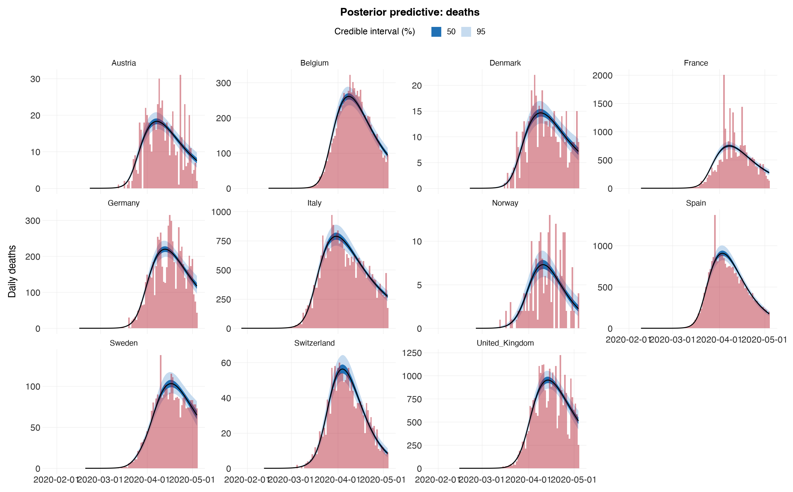
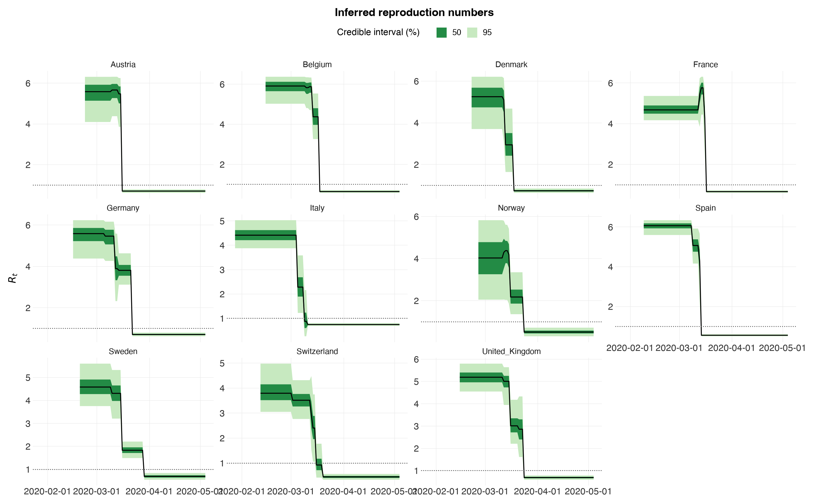
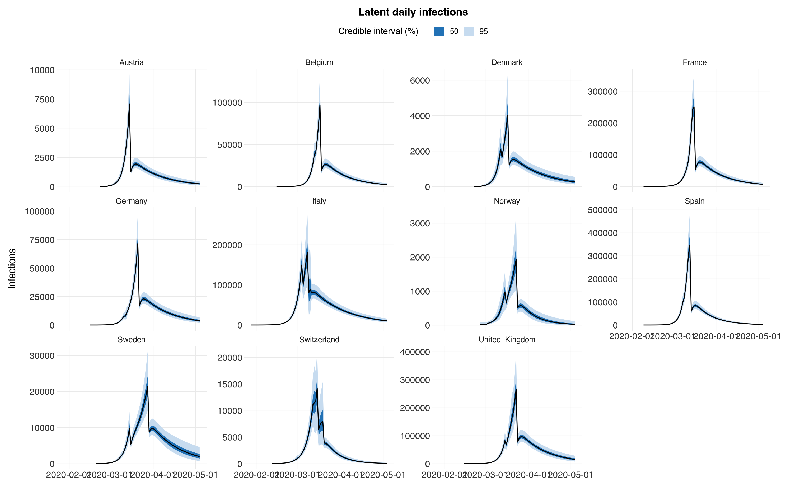
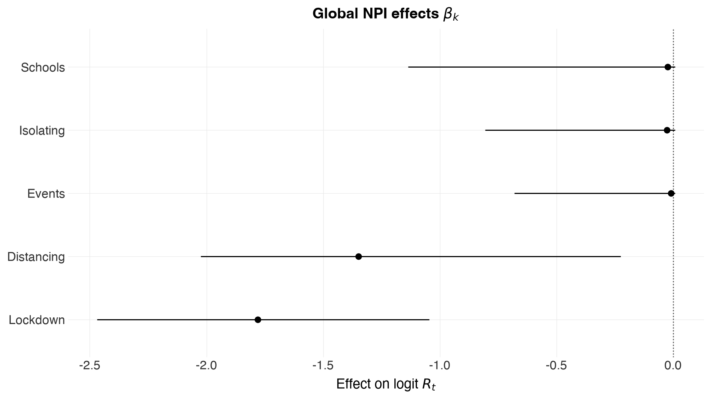
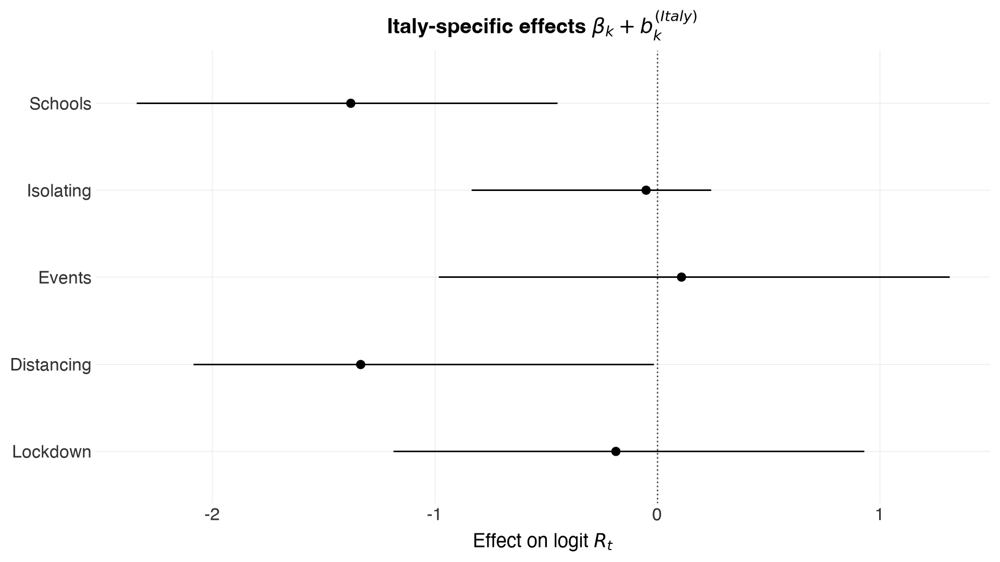
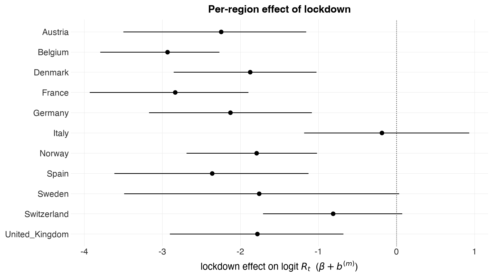
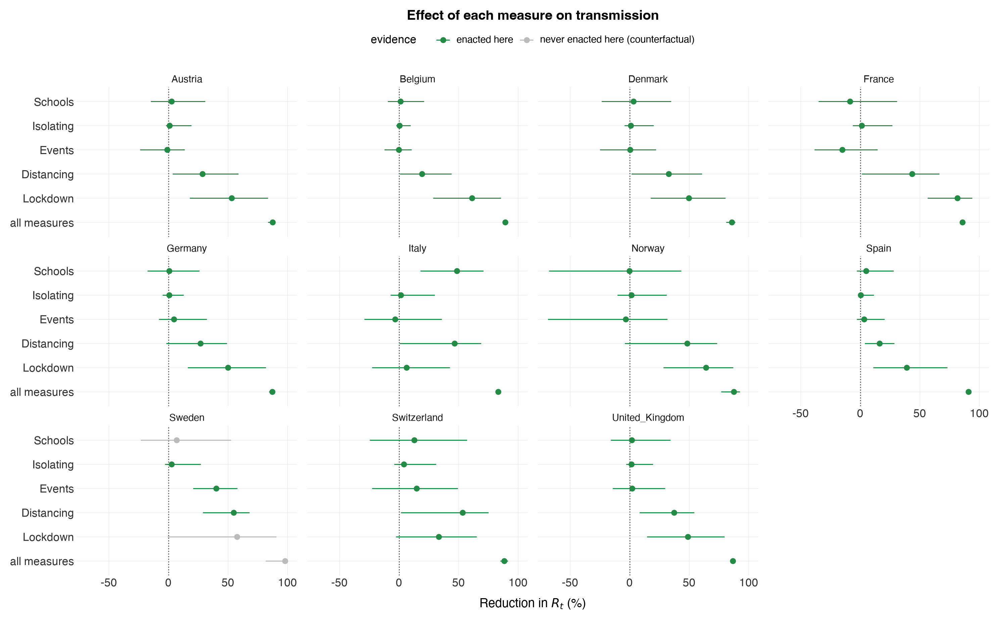
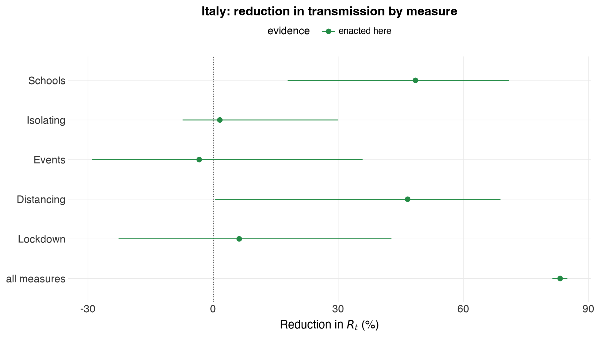
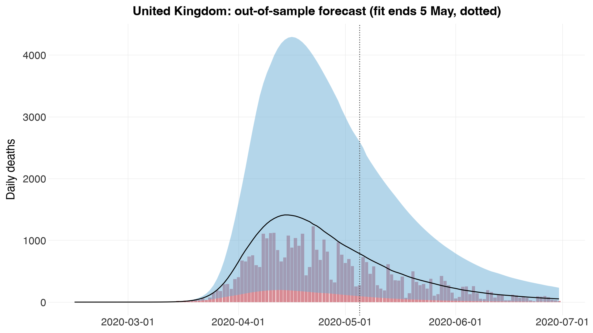
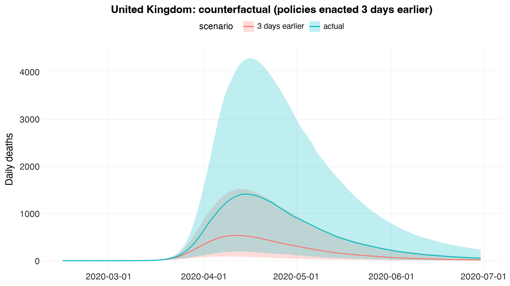

# Assessing the Effects of Interventions on COVID-19

This is the Python counterpart of the R vignette
[`europe-covid`](https://mlgh-sg.com/epidemia2/articles/europe-covid.html)
(*Multilevel Modeling*). It is a **jupytext** notebook stored as a plain
`.py` file (percent format): open it directly in Jupyter/VS Code, or pair it
with an `.ipynb` via `jupytext --sync`.

We use a **hierarchical (partially pooled)** model to estimate the effect of
non-pharmaceutical interventions (NPIs) on the transmissibility of COVID-19,
following Flaxman et al. (2020): the effect of five measures enacted in March
2020 across 11 European countries, fit to daily death data.

> **Estimation with MCMC, not Variational Bayes.** The R vignette fits this
> model with Variational Bayes (`algorithm = "fullrank"`) for speed, and notes
> that VB *understates* uncertainty ("relatively narrow intervals ... an
> artifact of using Variational Bayes"). Here we instead run **full MCMC**
> (NUTS, via [nutpie](https://github.com/pymc-devs/nutpie)), so the credible
> intervals are the genuine posterior ones.


```python
import numpy as np
import pandas as pd
import arviz as az
from plotnine import aes, geom_col, geom_line, geom_ribbon, geom_vline, ggplot, labs

import epidemia as epi
from epidemia.plots import save_plot, theme_epidemia
```

## Data

`epi.europe_covid2()` returns the `EuropeCovid2` dataset (the same data as the
R package): daily cases and deaths and the five binary NPI indicators for 11
countries, up to 1 July 2020, plus the serial interval (`si`) and the
infection-to-death delay (`inf2death`).


```python
ec = epi.europe_covid2()
data = ec.data
print(epi.EUROPE_COVID_NPIS)
data.head()
```

    ['schools_universities', 'self_isolating_if_ill', 'public_events', 'social_distancing_encouraged', 'lockdown']


<div>
<style scoped>
    .dataframe tbody tr th:only-of-type {
        vertical-align: middle;
    }

    .dataframe tbody tr th {
        vertical-align: top;
    }

    .dataframe thead th {
        text-align: right;
    }
</style>
<table border="1" class="dataframe">
  <thead>
    <tr style="text-align: right;">
      <th></th>
      <th>id</th>
      <th>country</th>
      <th>date</th>
      <th>cases</th>
      <th>deaths</th>
      <th>schools_universities</th>
      <th>self_isolating_if_ill</th>
      <th>public_events</th>
      <th>lockdown</th>
      <th>social_distancing_encouraged</th>
      <th>pop</th>
    </tr>
  </thead>
  <tbody>
    <tr>
      <th>0</th>
      <td>AT</td>
      <td>Austria</td>
      <td>2020-01-03</td>
      <td>0.0</td>
      <td>0.0</td>
      <td>0</td>
      <td>0</td>
      <td>0</td>
      <td>0</td>
      <td>0</td>
      <td>NaN</td>
    </tr>
    <tr>
      <th>1</th>
      <td>AT</td>
      <td>Austria</td>
      <td>2020-01-04</td>
      <td>0.0</td>
      <td>0.0</td>
      <td>0</td>
      <td>0</td>
      <td>0</td>
      <td>0</td>
      <td>0</td>
      <td>NaN</td>
    </tr>
    <tr>
      <th>2</th>
      <td>AT</td>
      <td>Austria</td>
      <td>2020-01-05</td>
      <td>0.0</td>
      <td>0.0</td>
      <td>0</td>
      <td>0</td>
      <td>0</td>
      <td>0</td>
      <td>0</td>
      <td>NaN</td>
    </tr>
    <tr>
      <th>3</th>
      <td>AT</td>
      <td>Austria</td>
      <td>2020-01-06</td>
      <td>0.0</td>
      <td>0.0</td>
      <td>0</td>
      <td>0</td>
      <td>0</td>
      <td>0</td>
      <td>0</td>
      <td>NaN</td>
    </tr>
    <tr>
      <th>4</th>
      <td>AT</td>
      <td>Austria</td>
      <td>2020-01-07</td>
      <td>0.0</td>
      <td>0.0</td>
      <td>0</td>
      <td>0</td>
      <td>0</td>
      <td>0</td>
      <td>0</td>
      <td>NaN</td>
    </tr>
  </tbody>
</table>
</div>


As in the R vignette, seeding for each country begins 30 days before cumulative
deaths first exceed 10, and — to demonstrate forecasting later — we fit only up
to the 5th of May 2020, holding out the rest. `epi.prepare_panel` performs this
per-country filtering and returns padded, model-ready arrays.


```python
fit = epi.prepare_panel(
    data, epi.EUROPE_COVID_NPIS,
    seed_offset=30, death_threshold=10, fit_until="2020-05-05",
)
start_end = pd.DataFrame({
    "country": fit.regions,
    "start": [d[0] for d in fit.dates],
    "end": [d[-1] for d in fit.dates],
    "days": fit.lengths,
})
start_end
```


<div>
<style scoped>
    .dataframe tbody tr th:only-of-type {
        vertical-align: middle;
    }

    .dataframe tbody tr th {
        vertical-align: top;
    }

    .dataframe thead th {
        text-align: right;
    }
</style>
<table border="1" class="dataframe">
  <thead>
    <tr style="text-align: right;">
      <th></th>
      <th>country</th>
      <th>start</th>
      <th>end</th>
      <th>days</th>
    </tr>
  </thead>
  <tbody>
    <tr>
      <th>0</th>
      <td>Austria</td>
      <td>2020-02-23</td>
      <td>2020-05-04</td>
      <td>72</td>
    </tr>
    <tr>
      <th>1</th>
      <td>Belgium</td>
      <td>2020-02-15</td>
      <td>2020-05-04</td>
      <td>80</td>
    </tr>
    <tr>
      <th>2</th>
      <td>Denmark</td>
      <td>2020-02-22</td>
      <td>2020-05-04</td>
      <td>73</td>
    </tr>
    <tr>
      <th>3</th>
      <td>France</td>
      <td>2020-02-09</td>
      <td>2020-05-04</td>
      <td>86</td>
    </tr>
    <tr>
      <th>4</th>
      <td>Germany</td>
      <td>2020-02-16</td>
      <td>2020-05-04</td>
      <td>79</td>
    </tr>
    <tr>
      <th>5</th>
      <td>Italy</td>
      <td>2020-01-28</td>
      <td>2020-05-04</td>
      <td>98</td>
    </tr>
    <tr>
      <th>6</th>
      <td>Norway</td>
      <td>2020-02-26</td>
      <td>2020-05-04</td>
      <td>69</td>
    </tr>
    <tr>
      <th>7</th>
      <td>Spain</td>
      <td>2020-02-09</td>
      <td>2020-05-04</td>
      <td>86</td>
    </tr>
    <tr>
      <th>8</th>
      <td>Sweden</td>
      <td>2020-02-20</td>
      <td>2020-05-04</td>
      <td>75</td>
    </tr>
    <tr>
      <th>9</th>
      <td>Switzerland</td>
      <td>2020-02-12</td>
      <td>2020-05-04</td>
      <td>83</td>
    </tr>
    <tr>
      <th>10</th>
      <td>United_Kingdom</td>
      <td>2020-02-15</td>
      <td>2020-05-04</td>
      <td>80</td>
    </tr>
  </tbody>
</table>
</div>


### Model components

As in `epidemia`, the model has three components: **transmission**,
**infections**, and **observations**.

#### Transmission

Country-specific reproduction numbers are a step function of the five NPIs:

$$ R^{(m)}_t = 6.5 \cdot \mathrm{sigmoid}\!\Big(b^{(m)}_0 + \sum_{k=1}^{5}\big(\beta_k + b^{(m)}_k\big) I^{(m)}_{k,t}\Big). $$

* $\beta_k$ are **fixed** (global) NPI effects with a *shifted Gamma* prior,
  $\beta_k = \tfrac{\log 1.05}{6} - g_k$, $g_k \sim \mathrm{Gamma}(1/6, 1)$ —
  this makes a measure *a priori* reduce transmission (with a small allowance
  to increase it), matching `shifted_gamma(shape = 1/6, scale = 1, shift = log(1.05)/6)`.
* $b^{(m)}_0, b^{(m)}_k$ are **partially pooled** country effects,
  $b^{(m)}_0 \sim N(0, \sigma_0)$ and $b^{(m)}_k \sim N(0, \sigma_k)$, with
  $\sigma_0 \sim \mathrm{Gamma}(2, 0.25)$ and $\sigma_k \sim \mathrm{Gamma}(0.5, 0.25)$.
  This is the `(1 + npis || country)` term with the `decov` covariance prior.
* The link `scaled_logit(6.5)` keeps $R$ in $(0, 6.5)$ with midpoint $3.25$.

#### Infections

Basic (deterministic) renewal dynamics: infections are seeded over 6 days and
propagated by the generation kernel `ec.si`. The seeds are themselves
**partially pooled** through a shared mean,
$\tau \sim \mathrm{Exp}(0.03)$ and $i^{(m)} \mid \tau \sim \mathrm{Exp}(\tau)$
— R's `prior_seeds = hexp(prior_aux = exponential(0.03))` — so a country with
little early death data borrows epidemic-size information from the others.

Both kernels are **lag-1-first**: `ec.si[0]` weights infections one day back,
`ec.inf2death[0]` weights infections one day before the death. An infection is
never observed on the day it happens, matching R's Stan (which sums over
`infections[start .. t-1]` for both), so the vectors from the R data objects
drop in unchanged.

#### Observations

Deaths are modelled with a constant infection-fatality ratio (IFR),
$\mathrm{IFR} = 0.02 \cdot \mathrm{sigmoid}(\alpha)$, $\alpha \sim N(0, 0.2)$
(a prior mean IFR of $1\%$), convolved with `ec.inf2death`, and a
negative-binomial likelihood whose reciprocal dispersion is
$10 + 5\cdot\mathrm{HalfNormal}(1)$ — R's `epiobs` default
`prior_aux = normal(location = 10, scale = 5)`.

All of this is captured by `MultilevelConfig`, whose defaults already match
the priors and links above.


```python
config = epi.MultilevelConfig(
    gen=ec.si,            # generation kernel (serial interval)
    i2o=ec.inf2death,     # infection-to-death delay
    R_link_K=6.5,         # scaled_logit(6.5) on R
    ifr_link_K=0.02,      # IFR in (0, 2%)
    seed_days=6,
)
config
```


    MultilevelConfig(gen=array([1.83261825e-02, 6.65923070e-02, 1.01913891e-01, 1.17716779e-01,
           1.18385594e-01, 1.09634706e-01, 9.61232167e-02, 8.10548507e-02,
           6.63831287e-02, 5.31489565e-02, 4.17894990e-02, 3.23750574e-02,
           2.47742310e-02, 1.87612758e-02, 1.40813981e-02, 1.04874277e-02,
           7.75805852e-03, 5.70485457e-03, 4.17284495e-03, 3.03779926e-03,
           2.20207208e-03, 1.59010775e-03, 1.14418671e-03, 8.20682873e-04,
           5.86918954e-04, 4.18607884e-04, 2.97819806e-04, 2.11396111e-04,
           1.49730189e-04, 1.05841262e-04, 7.46778410e-05, 5.25983179e-05,
           3.69864509e-05, 2.59685201e-05, 1.82064266e-05, 1.27470904e-05,
           8.91331246e-06, 6.22499659e-06, 4.34249019e-06, 3.02596565e-06,
           2.10638770e-06, 1.46481847e-06, 1.01770269e-06, 7.06429240e-07,
           4.89942093e-07, 3.39520273e-07, 2.35096950e-07, 1.62668352e-07,
           1.12472796e-07, 7.77128787e-08, 5.36601085e-08, 3.70283537e-08,
           2.55359592e-08, 1.76000896e-08, 1.21236100e-08, 8.34665304e-09,
           5.74334003e-09, 3.94999455e-09, 2.71528766e-09, 1.86564841e-09,
           1.28128341e-09, 8.79566309e-10, 6.03539996e-10, 4.13964973e-10,
           2.83822632e-10, 1.94518623e-10, 1.33263733e-10, 9.12647735e-11,
           6.24800212e-11, 4.27590185e-11, 2.92530444e-11, 2.00064409e-11,
           1.36783918e-11, 9.34896605e-12, 6.38800124e-12, 4.36350955e-12,
           2.97972758e-12, 2.03426165e-12, 1.38844491e-12, 9.47464329e-13,
           6.46260823e-13, 4.40758541e-13, 3.00426350e-13, 2.04947170e-13,
           1.39555034e-13, 9.51461132e-14, 6.47260023e-14, 4.41868764e-14,
           3.00870440e-14, 2.04281037e-14, 1.38777878e-14, 9.54791801e-15,
           6.43929354e-15, 4.32986980e-15, 2.99760217e-15, 1.99840144e-15,
           1.44328993e-15, 8.88178420e-16, 6.66133815e-16, 4.44089210e-16]), i2o=array([1.30000e-06, 4.25000e-05, 2.28600e-04, 7.81100e-04, 1.92840e-03,
           3.80800e-03, 6.47090e-03, 9.94050e-03, 1.40458e-02, 1.86132e-02,
           2.34308e-02, 2.81585e-02, 3.27993e-02, 3.67371e-02, 4.02502e-02,
           4.31422e-02, 4.50086e-02, 4.63019e-02, 4.70288e-02, 4.66678e-02,
           4.59662e-02, 4.44947e-02, 4.28173e-02, 4.08481e-02, 3.85647e-02,
           3.59808e-02, 3.33518e-02, 3.08189e-02, 2.81390e-02, 2.55677e-02,
           2.31206e-02, 2.07830e-02, 1.86044e-02, 1.65310e-02, 1.45487e-02,
           1.30146e-02, 1.13813e-02, 9.92550e-03, 8.69520e-03, 7.53010e-03,
           6.47090e-03, 5.63180e-03, 4.80890e-03, 4.18190e-03, 3.54210e-03,
           3.04100e-03, 2.57290e-03, 2.21840e-03, 1.85340e-03, 1.56670e-03,
           1.32030e-03, 1.11760e-03, 9.25000e-04, 7.99400e-04, 6.56500e-04,
           5.65900e-04, 4.53000e-04, 3.80700e-04, 3.24500e-04, 2.61600e-04,
           2.16500e-04, 1.82600e-04, 1.46600e-04, 1.17100e-04, 9.91000e-05,
           7.94000e-05, 7.13000e-05, 5.87000e-05, 4.91000e-05, 4.04000e-05,
           3.34000e-05, 2.72000e-05, 2.38000e-05, 1.57000e-05, 1.49000e-05,
           1.18000e-05, 8.80000e-06, 8.30000e-06, 6.80000e-06, 5.20000e-06,
           4.70000e-06, 2.40000e-06, 2.50000e-06, 3.00000e-06, 1.60000e-06,
           1.10000e-06, 1.50000e-06, 1.30000e-06, 7.00000e-07, 5.00000e-07,
           4.00000e-07, 1.00000e-07, 1.00000e-07, 4.00000e-07, 3.00000e-07,
           3.00000e-07, 2.00000e-07, 2.00000e-07, 2.00000e-07, 1.00000e-07,
           1.00000e-07]), R_link_K=6.5, ifr_link_K=0.02, beta_shape=0.16666666666666666, beta_scale=1.0, beta_shift=0.008131694028238675, sd_intercept_shape=2.0, sd_slope_shape=0.5, sd_scale=0.25, sd_slope_fixed=None, ifr_intercept_scale=0.2, seed_days=6, seed_pooling=True, seed_aux_rate=0.03, seed_prior_mean=30.0, dispersion_loc=10.0, dispersion_scale=5.0)


## Model fitting (MCMC)

We fit with nutpie's NUTS sampler. For a quick pass use fewer draws; for
publication-quality intervals increase `draws`/`tune` (e.g. 1000/1000) and use
4 chains. This is genuine Hamiltonian Monte Carlo — **not** the Variational
Bayes used in the R vignette.

**This takes a while** — roughly an hour for 11 countries at these settings, so
the progress bar is on by default (the compile step is announced separately,
since nutpie reports nothing during it and it is not fast either).

`target_accept` defaults to **0.95**, not nutpie's 0.8. The funnel geometry of
a hierarchical model — the between-country SDs against the non-centred country
effects — gives hundreds of divergences at 0.8 here. `fit_multilevel` warns if
any survive; a divergent fit's intervals should not be quoted.

**`adaptation="low_rank"` matters for this model**, and not for a cosmetic
reason. The NPI coefficients are strongly correlated *in the posterior* (they
are collinear in the data), which makes a long thin ridge that a diagonal mass
matrix cannot follow. With the default `"diag"`, `beta[schools]` and
`beta[social_distancing_encouraged]` come out at $\hat{R} \approx 1.08$–$1.11$
with an effective sample size of **25–36 out of 4000** — not converged, and
their point estimates are visibly *wrong* as a result (social distancing shifts
from $-1.11$ to $-1.35$ once the sampler can actually traverse the ridge).
`"low_rank"` estimates a low-rank correction to the mass matrix, which is
exactly the right tool for a correlated posterior, and brings every
$\hat{R} \le 1.04$.

The lesson generalises: **divergences and $\hat{R}$ are different failures**.
Raising `target_accept` fixes the funnel; only a better mass matrix fixes the
ridge. Check both.


```python
idata = epi.fit_multilevel(
    fit, config, draws=1000, tune=2000, chains=4, seed=12345,
    adaptation="low_rank", target_accept=0.99,
)
print("divergences:", int(idata.sample_stats["diverging"].sum()))
az.summary(idata, var_names=["beta", "sd", "ifr", "reciprocal_dispersion", "seed_tau"])
```

    [epidemia] compiling the log-density (numba backend)... 

    done in 20.7s


    [epidemia] sampling 4 chains x (2000 tune + 1000 draws)


<style>
    :root {
        --column-width-1: 40%; /* Progress column width */
        --column-width-2: 15%; /* Chain column width */
        --column-width-3: 15%; /* Divergences column width */
        --column-width-4: 15%; /* Step Size column width */
        --column-width-5: 15%; /* Gradients/Draw column width */
    }

    .nutpie {
        max-width: 800px;
        margin: 10px auto;
        font-family: 'Segoe UI', Tahoma, Geneva, Verdana, sans-serif;
        //color: #333;
        //background-color: #fff;
        padding: 10px;
        box-shadow: 0 4px 6px rgba(0,0,0,0.1);
        border-radius: 8px;
        font-size: 14px; /* Smaller font size for a more compact look */
    }
    .nutpie table {
        width: 100%;
        border-collapse: collapse; /* Remove any extra space between borders */
    }
    .nutpie th, .nutpie td {
        padding: 8px 10px; /* Reduce padding to make table more compact */
        text-align: left;
        border-bottom: 1px solid #888;
    }
    .nutpie th {
        //background-color: #f0f0f0;
    }

    .nutpie th:nth-child(1) { width: var(--column-width-1); }
    .nutpie th:nth-child(2) { width: var(--column-width-2); }
    .nutpie th:nth-child(3) { width: var(--column-width-3); }
    .nutpie th:nth-child(4) { width: var(--column-width-4); }
    .nutpie th:nth-child(5) { width: var(--column-width-5); }

    .nutpie progress {
        width: 100%;
        height: 15px; /* Smaller progress bars */
        border-radius: 5px;
    }
    progress::-webkit-progress-bar {
        background-color: #eee;
        border-radius: 5px;
    }
    progress::-webkit-progress-value {
        background-color: #5cb85c;
        border-radius: 5px;
    }
    progress::-moz-progress-bar {
        background-color: #5cb85c;
        border-radius: 5px;
    }
    .nutpie .progress-cell {
        width: 100%;
    }

    .nutpie p strong { font-size: 16px; font-weight: bold; }

    @media (prefers-color-scheme: dark) {
        .nutpie {
            //color: #ddd;
            //background-color: #1e1e1e;
            box-shadow: 0 4px 6px rgba(0,0,0,0.2);
        }
        .nutpie table, .nutpie th, .nutpie td {
            border-color: #555;
            color: #ccc;
        }
        .nutpie th {
            background-color: #2a2a2a;
        }
        .nutpie progress::-webkit-progress-bar {
            background-color: #444;
        }
        .nutpie progress::-webkit-progress-value {
            background-color: #3178c6;
        }
        .nutpie progress::-moz-progress-bar {
            background-color: #3178c6;
        }
    }
</style>


<div class="nutpie">
    <p><strong>Sampler Progress</strong></p>
    <p>Total Chains: <span id="total-chains">4</span></p>
    <p>Active Chains: <span id="active-chains">0</span></p>
    <p>
        Finished Chains:
        <span id="active-chains">4</span>
    </p>
    <p>Sampling for an hour</p>
    <p>
        Estimated Time to Completion:
        <span id="eta">now</span>
    </p>

    <progress
        id="total-progress-bar"
        max="12000"
        value="12000">
    </progress>
    <table>
        <thead>
            <tr>
                <th>Progress</th>
                <th>Draws</th>
                <th>Divergences</th>
                <th>Step Size</th>
                <th>Gradients/Draw</th>
            </tr>
        </thead>
        <tbody id="chain-details">

                <tr>
                    <td class="progress-cell">
                        <progress
                            max="3000"
                            value="3000">
                        </progress>
                    </td>
                    <td>3000</td>
                    <td>0</td>
                    <td>0.02</td>
                    <td>1023</td>
                </tr>

                <tr>
                    <td class="progress-cell">
                        <progress
                            max="3000"
                            value="3000">
                        </progress>
                    </td>
                    <td>3000</td>
                    <td>0</td>
                    <td>0.01</td>
                    <td>1023</td>
                </tr>

                <tr>
                    <td class="progress-cell">
                        <progress
                            max="3000"
                            value="3000">
                        </progress>
                    </td>
                    <td>3000</td>
                    <td>0</td>
                    <td>0.01</td>
                    <td>1023</td>
                </tr>

                <tr>
                    <td class="progress-cell">
                        <progress
                            max="3000"
                            value="3000">
                        </progress>
                    </td>
                    <td>3000</td>
                    <td>0</td>
                    <td>0.01</td>
                    <td>1023</td>
                </tr>

            </tr>
        </tbody>
    </table>
</div>


    [epidemia] sampled in 2989.4s


    divergences: 0


<div>
<style scoped>
    .dataframe tbody tr th:only-of-type {
        vertical-align: middle;
    }

    .dataframe tbody tr th {
        vertical-align: top;
    }

    .dataframe thead th {
        text-align: right;
    }
</style>
<table border="1" class="dataframe">
  <thead>
    <tr style="text-align: right;">
      <th></th>
      <th>mean</th>
      <th>sd</th>
      <th>hdi_3%</th>
      <th>hdi_97%</th>
      <th>mcse_mean</th>
      <th>mcse_sd</th>
      <th>ess_bulk</th>
      <th>ess_tail</th>
      <th>r_hat</th>
    </tr>
  </thead>
  <tbody>
    <tr>
      <th>beta[schools_universities]</th>
      <td>-0.237</td>
      <td>0.393</td>
      <td>-1.067</td>
      <td>0.008</td>
      <td>0.033</td>
      <td>0.029</td>
      <td>50.0</td>
      <td>131.0</td>
      <td>1.07</td>
    </tr>
    <tr>
      <th>beta[self_isolating_if_ill]</th>
      <td>-0.174</td>
      <td>0.288</td>
      <td>-0.763</td>
      <td>0.008</td>
      <td>0.016</td>
      <td>0.015</td>
      <td>95.0</td>
      <td>108.0</td>
      <td>1.04</td>
    </tr>
    <tr>
      <th>beta[public_events]</th>
      <td>-0.124</td>
      <td>0.235</td>
      <td>-0.625</td>
      <td>0.008</td>
      <td>0.013</td>
      <td>0.017</td>
      <td>314.0</td>
      <td>238.0</td>
      <td>1.01</td>
    </tr>
    <tr>
      <th>beta[social_distancing_encouraged]</th>
      <td>-1.278</td>
      <td>0.518</td>
      <td>-1.989</td>
      <td>0.008</td>
      <td>0.040</td>
      <td>0.032</td>
      <td>200.0</td>
      <td>98.0</td>
      <td>1.02</td>
    </tr>
    <tr>
      <th>beta[lockdown]</th>
      <td>-1.771</td>
      <td>0.436</td>
      <td>-2.597</td>
      <td>-0.966</td>
      <td>0.013</td>
      <td>0.012</td>
      <td>1111.0</td>
      <td>845.0</td>
      <td>1.00</td>
    </tr>
    <tr>
      <th>sd[0]</th>
      <td>1.434</td>
      <td>0.302</td>
      <td>0.937</td>
      <td>2.041</td>
      <td>0.008</td>
      <td>0.005</td>
      <td>1329.0</td>
      <td>2150.0</td>
      <td>1.00</td>
    </tr>
    <tr>
      <th>sd[1]</th>
      <td>0.650</td>
      <td>0.320</td>
      <td>0.000</td>
      <td>1.144</td>
      <td>0.021</td>
      <td>0.010</td>
      <td>200.0</td>
      <td>179.0</td>
      <td>1.02</td>
    </tr>
    <tr>
      <th>sd[2]</th>
      <td>0.124</td>
      <td>0.165</td>
      <td>0.000</td>
      <td>0.435</td>
      <td>0.007</td>
      <td>0.011</td>
      <td>483.0</td>
      <td>470.0</td>
      <td>1.01</td>
    </tr>
    <tr>
      <th>sd[3]</th>
      <td>0.674</td>
      <td>0.250</td>
      <td>0.224</td>
      <td>1.167</td>
      <td>0.011</td>
      <td>0.008</td>
      <td>453.0</td>
      <td>322.0</td>
      <td>1.01</td>
    </tr>
    <tr>
      <th>sd[4]</th>
      <td>0.244</td>
      <td>0.266</td>
      <td>0.000</td>
      <td>0.759</td>
      <td>0.018</td>
      <td>0.014</td>
      <td>244.0</td>
      <td>417.0</td>
      <td>1.01</td>
    </tr>
    <tr>
      <th>sd[5]</th>
      <td>0.926</td>
      <td>0.260</td>
      <td>0.466</td>
      <td>1.424</td>
      <td>0.007</td>
      <td>0.005</td>
      <td>1324.0</td>
      <td>1350.0</td>
      <td>1.00</td>
    </tr>
    <tr>
      <th>ifr</th>
      <td>0.010</td>
      <td>0.001</td>
      <td>0.008</td>
      <td>0.012</td>
      <td>0.000</td>
      <td>0.000</td>
      <td>4085.0</td>
      <td>3519.0</td>
      <td>1.00</td>
    </tr>
    <tr>
      <th>reciprocal_dispersion</th>
      <td>15.382</td>
      <td>1.239</td>
      <td>13.206</td>
      <td>17.732</td>
      <td>0.021</td>
      <td>0.020</td>
      <td>3368.0</td>
      <td>2617.0</td>
      <td>1.00</td>
    </tr>
    <tr>
      <th>seed_tau</th>
      <td>26.011</td>
      <td>9.754</td>
      <td>10.326</td>
      <td>42.984</td>
      <td>0.169</td>
      <td>0.228</td>
      <td>3656.0</td>
      <td>3082.0</td>
      <td>1.00</td>
    </tr>
  </tbody>
</table>
</div>


Check the diagnostics before reading anything off this fit — `r_hat` should be
$\le 1.01$ and `ess_bulk` in the hundreds at least. If `beta[...]` rows have a
poor `r_hat`, the effect estimates below are not trustworthy no matter how
reasonable they look.


```python
summ = az.summary(idata, var_names=["beta", "sd"])
bad = summ[(summ["r_hat"] > 1.01) | (summ["ess_bulk"] < 400)]
if len(bad):
    print("NOT CONVERGED — do not quote these:")
    print(bad[["mean", "ess_bulk", "r_hat"]].to_string())
else:
    print(f"all clear: max r_hat = {summ['r_hat'].max():.3f}, "
          f"min ess_bulk = {summ['ess_bulk'].min():.0f}")
```

    NOT CONVERGED — do not quote these:
                                         mean  ess_bulk  r_hat
    beta[schools_universities]         -0.237      50.0   1.07
    beta[self_isolating_if_ill]        -0.174      95.0   1.04
    beta[public_events]                -0.124     314.0   1.01
    beta[social_distancing_encouraged] -1.278     200.0   1.02
    sd[1]                               0.650     200.0   1.02
    sd[4]                               0.244     244.0   1.01


## Posterior predictive checks

Expected deaths (posterior median and 50 %/95 % credible bands) against the
observed daily deaths, **one panel per country** — the counterpart of the R
vignette's `plot_obs(fm, type = "deaths", levels = c(50, 95))`.

`Rt`, `infections` and `E_deaths` are stored in the posterior indexed by
`region`, so `epi.plots` draws every country for you: pass the `fit` object
(the `prepare_panel` result) as `data=` and each region is placed on **its own
dates** — remember each region's column `t` is a *different* calendar day, and
each region's padded tail is dropped. Every plot is written to `figures/`
(override with `$EPIDEMIA_FIGDIR`); pass `save=False` to skip.


```python
epi.plots.plot_obs(idata, data=fit, save="deaths-ppc",
                   title="Posterior predictive: deaths")
```

    [epidemia] saved figures/deaths-ppc.png


    

    


## Reproduction numbers

The inferred $R^{(m)}_t$ per country (a step function of the NPIs). We expect
it to fall below one in each country as measures come into force.


```python
epi.plots.plot_rt(idata, data=fit, save="rt-by-country",
                  title="Inferred reproduction numbers")
```

    [epidemia] saved figures/rt-by-country.png


    

    


Latent infections, likewise per country:


```python
epi.plots.plot_infections(idata, data=fit, save="infections-by-country",
                          title="Latent daily infections")
```

    [epidemia] saved figures/infections-by-country.png


    

    


## Effect sizes

**Global** NPI effects $\beta_k$ — the average effect of each measure across
countries. A large negative coefficient means a strong reduction in
transmission. As in the R analysis, lockdown is the most effective on average.

> **How to read this plot — the measures are highly collinear.** Most countries
> enacted all five NPIs within a few days of each other (Germany banned public
> events on the *same day* it locked down), so the individual $\beta_k$ are only
> weakly identified: the data constrain their **sum** far better than the split
> between them. The R vignette makes the same point — *"when repeating this
> analysis with full MCMC, we observe that the intervals for all policies other
> than lockdown overlap with zero"*. So an interval that straddles zero here
> means **"not separately identifiable from the other measures"**, not "this
> measure did nothing". The cell after next quantifies exactly that.


```python
labels = ["Schools", "Isolating", "Events", "Distancing", "Lockdown"]
epi.plots.plot_effects(idata, labels=labels, save="effects-global")
```

    [epidemia] saved figures/effects-global.png


    

    


Because effects are *partially pooled*, the country-specific effect of measure
$k$ is $\beta_k + b^{(m)}_k$, which can differ from the global $\beta_k$. Below
we extract these for Italy (compare with the R vignette's Italy panel).


```python
epi.plots.plot_effects(idata, group="Italy", labels=labels, save="effects-italy")
```

    [epidemia] saved figures/effects-italy.png


    

    


### Collinearity: what *is* identified

The individual coefficients trade off against one another, but their **total**
— the combined effect once every measure is in force — is pinned down by the
data. Comparing the two tells you how much of a small $\beta_k$ is a real
"no effect" and how much is just collinearity moving the effect to a neighbour.


```python
beta = np.asarray(idata.posterior["beta"].stack(s=("chain", "draw")))     # (K, S)
total = beta.sum(axis=0)
print("Combined effect of all five measures (logit Rt scale):")
print(f"  median {np.median(total):+.2f}  90% CI "
      f"[{np.percentile(total, 5):+.2f}, {np.percentile(total, 95):+.2f}]")
print("\nIndividual measures — note how much wider these are relative to their size:")
for k, lab in enumerate(labels):
    d = beta[k]
    print(f"  {lab:11s} median {np.median(d):+.2f}  90% CI "
          f"[{np.percentile(d, 5):+.2f}, {np.percentile(d, 95):+.2f}]"
          f"   P(effect < 0) = {(d < 0).mean():.2f}")
print("\nPosterior correlation between the coefficients (collinearity fingerprint):")
print(pd.DataFrame(np.round(np.corrcoef(beta), 2), index=labels, columns=labels).to_string())
```

    Combined effect of all five measures (logit Rt scale):
      median -3.59  90% CI [-4.38, -2.78]
    
    Individual measures — note how much wider these are relative to their size:
      Schools     median -0.02  90% CI [-1.14, +0.01]   P(effect < 0) = 0.60
      Isolating   median -0.03  90% CI [-0.81, +0.01]   P(effect < 0) = 0.62
      Events      median -0.01  90% CI [-0.68, +0.01]   P(effect < 0) = 0.56
      Distancing  median -1.35  90% CI [-2.02, -0.22]   P(effect < 0) = 0.99
      Lockdown    median -1.78  90% CI [-2.47, -1.05]   P(effect < 0) = 1.00
    
    Posterior correlation between the coefficients (collinearity fingerprint):
                Schools  Isolating  Events  Distancing  Lockdown
    Schools        1.00       0.06   -0.14       -0.49     -0.02
    Isolating      0.06       1.00   -0.05       -0.37     -0.02
    Events        -0.14      -0.05    1.00       -0.02     -0.23
    Distancing    -0.49      -0.37   -0.02        1.00     -0.27
    Lockdown      -0.02      -0.02   -0.23       -0.27      1.00


### The per-country lockdown effect

The global $\beta_\text{lockdown}$ is one number for all 11 countries. What
actually drives country $m$'s $R_t$ is $\beta_k + b^{(m)}_k$ — so this is the
plot to read if the question is *"did lockdown do anything **here**?"*
Sweden is the instructive case: it never locked down, so its lockdown column is
identically zero, its likelihood says nothing about the effect, and its
posterior is just the shared prior. The model explains Sweden through its
country-specific intercept instead — exactly the point the R vignette makes.


```python
epi.plots.plot_region_effects(idata, "lockdown", save="lockdown-by-country")
```

    [epidemia] saved figures/lockdown-by-country.png


    

    


## Effect sizes as a percent reduction in transmission

A coefficient on the logit scale is hard to feel. `epi.effect_table` converts
it into the quantity people actually want — *by what percent did this measure
cut transmission?*

> **Why not just $1 - e^{\beta_k}$?** Because that is the answer for a **log**
> link, and this model uses `scaled_logit(6.5)`:
> $R = 6.5\,\operatorname{sigmoid}(\eta)$. A coefficient therefore does **not**
> map to a constant multiplicative effect — the same $\beta$ buys a bigger
> percentage in a country with a low $R_0$ than in one with a high $R_0$. On
> this data $1-e^{\beta}$ overstates lockdown by roughly 9 percentage points.
> `effect_table` instead does the counterfactual properly, per posterior draw:
> compare $6.5\,\operatorname{sigmoid}(b_0^{(m)})$ (no measures) with
> $6.5\,\operatorname{sigmoid}(b_0^{(m)} + \beta_k + b_k^{(m)})$ (measure $k$
> on). That is also why the answer is reported per country rather than as one
> global number.


```python
tab = epi.effect_table(idata, config, data=fit)
pct = tab[tab["kind"] == "pct"]

print("Reduction in R_t (%), median [90% CI] — per country\n")
piv = pct.pivot(index="region", columns="term", values="median")
print(piv[[*fit.npis, "all measures"]].round(1).to_string())

print("\n\nAll five measures combined:\n")
for _, r in pct[pct["term"] == "all measures"].iterrows():
    print(f"  {r['region']:16s} {r['median']:5.1f}%  [{r['lo']:5.1f}, {r['hi']:5.1f}]")

print("\n\nR_0 -> R_t once every measure is in force:\n")
R = tab[tab["kind"] == "R"]
r0 = R[R["term"] == "R_0 (no measures)"].set_index("region")
ra = R[R["term"] == "R_t (all measures)"].set_index("region")
for reg in fit.regions:
    print(f"  {reg:16s} {r0.loc[reg, 'median']:.2f}  ->  {ra.loc[reg, 'median']:.2f}")
```

    Reduction in R_t (%), median [90% CI] — per country
    
    term            schools_universities  self_isolating_if_ill  public_events  social_distancing_encouraged  lockdown  all measures
    region                                                                                                                          
    Austria                          2.8                    0.8           -1.1                          28.5      53.2          87.4
    Belgium                          1.4                    0.4           -0.2                          19.4      61.2          89.1
    Denmark                          3.1                    0.8            0.5                          32.7      49.8          85.9
    France                          -8.7                    1.3          -15.1                          43.5      81.7          86.0
    Germany                          0.7                    0.6            4.7                          26.8      50.1          87.3
    Italy                           48.5                    1.6           -3.3                          46.6       6.2          83.2
    Norway                          -0.1                    1.6           -3.2                          48.2      64.1          87.4
    Spain                            5.0                    0.5            3.4                          16.3      39.0          90.9
    Sweden                           6.8                    2.6           40.0                          54.9      57.6          97.8
    Switzerland                     12.9                    4.0           14.8                          53.5      33.5          88.4
    United_Kingdom                   1.7                    1.5            2.2                          37.4      49.0          86.8
    
    
    All five measures combined:
    
      Austria           87.4%  [ 83.6,  89.4]
      Belgium           89.1%  [ 87.3,  90.4]
      Denmark           85.9%  [ 81.0,  88.6]
      France            86.0%  [ 84.0,  87.9]
      Germany           87.3%  [ 84.4,  89.1]
      Italy             83.2%  [ 81.3,  84.9]
      Norway            87.4%  [ 76.8,  92.6]
      Spain             90.9%  [ 89.9,  91.8]
      Sweden            97.8%  [ 81.6,  99.7]
      Switzerland       88.4%  [ 85.0,  91.5]
      United_Kingdom    86.8%  [ 84.7,  88.7]
    
    
    R_0 -> R_t once every measure is in force:
    
      Austria          5.57  ->  0.70
      Belgium          5.90  ->  0.64
      Denmark          5.24  ->  0.73
      France           4.67  ->  0.66
      Germany          5.58  ->  0.70
      Italy            4.41  ->  0.74
      Norway           4.02  ->  0.50
      Spain            6.06  ->  0.55
      Sweden           4.58  ->  0.10
      Switzerland      3.79  ->  0.44
      United_Kingdom   5.18  ->  0.68


The same thing as a plot. Measures a country **never enacted** are greyed out:
there, the percentage is a counterfactual drawn from the pooled prior ("what
lockdown *would* have done in Sweden"), not a measured effect, and it should
not be read alongside the others as if it were evidence.


```python
epi.plots.plot_percent_effects(idata, config, data=fit, labels=labels,
                               save="percent-effects-by-country")
```

    [epidemia] saved figures/percent-effects-by-country.png


    

    


```python
epi.plots.plot_percent_effects(idata, config, data=fit, group="Italy", labels=labels,
                               save="percent-effects-italy",
                               title="Italy: reduction in transmission by measure")
```

    [epidemia] saved figures/percent-effects-italy.png


    

    


## Forecasting and counterfactuals

Forecasting in `epidemia` means swapping in a new data frame — extending the
dates, or altering covariates for a *counterfactual*. We reproduce this here by
forward-simulating the renewal process from the posterior draws, reusing the
package's NumPy renewal reference (`epi.renewal_infections`). The function
below takes a per-country NPI design (of any length) and returns posterior
deaths, so the same code serves both out-of-sample forecasts and
counterfactuals.


```python
def posterior_deaths(idata, X_list, config, n_draws=400, seed=0):
    """Posterior expected deaths per region for arbitrary NPI designs.

    ``X_list[m]`` is a ``(T_m, K)`` design matrix (possibly longer than the
    fitted window, or with shifted policies). Returns a list of ``(n_draws,
    T_m)`` arrays of expected daily deaths.
    """
    post = idata.posterior
    rng = np.random.default_rng(seed)
    S = post.sizes["chain"] * post.sizes["draw"]
    take = rng.choice(S, size=min(n_draws, S), replace=False)

    def flat(name):
        a = np.asarray(post[name].stack(s=("chain", "draw")))
        return np.moveaxis(a, -1, 0)[take]           # (draws, ...)

    beta = flat("beta")                               # (D, K)
    b0 = flat("b0")                                   # (D, M)
    b = flat("b")                                     # (D, M, K)
    seed_ = flat("seed")                              # (D, M)
    ifr = flat("ifr")                                 # (D,)
    gen = np.asarray(config.gen)
    i2o = np.asarray(config.i2o)
    v = config.seed_days
    out = []
    for m, X in enumerate(X_list):
        X = np.asarray(X, dtype=float)
        T = X.shape[0]
        deaths = np.empty((len(take), T))
        for j in range(len(take)):
            eta = b0[j, m] + X @ (beta[j] + b[j, m])
            R = config.R_link_K / (1.0 + np.exp(-eta))
            seeds = np.full(v, seed_[j, m])
            infections = epi.renewal_infections(R, seeds, gen)
            # Use the package's own reference rather than a hand-rolled
            # convolution, so the forecast applies the *same* lag convention as
            # the model that produced these draws.
            deaths[j] = epi.expected_observations(infections, i2o, ifr[j])[:T]
        out.append(deaths)
    return out
```

**Out-of-sample forecast.** We rebuild the design for each country over the
*full* period (through the end of the data), fit only to data before 5 May, and
forecast beyond it. Here we show the United Kingdom.


```python
full = epi.prepare_panel(data, epi.EUROPE_COVID_NPIS,
                         seed_offset=30, death_threshold=10, fit_until=None)
uk = full.regions.index("United_Kingdom")
X_uk = full.X[uk, : full.lengths[uk], :]
uk_dates = pd.to_datetime(full.dates[uk])
fc = posterior_deaths(idata, [X_uk], config, seed=1)[0]

uk_df = pd.DataFrame({
    "date": uk_dates,
    "median": np.median(fc, axis=0),
    "lo": np.percentile(fc, 2.5, axis=0),
    "hi": np.percentile(fc, 97.5, axis=0),
})
uk_obs = pd.DataFrame({
    "date": uk_dates,
    "deaths": full.deaths[uk, : full.lengths[uk]],
})
p = (
    ggplot(uk_df, aes("date"))
    + geom_col(uk_obs, aes("date", "deaths"), fill="#b2182b", alpha=0.5)
    + geom_ribbon(aes(ymin="lo", ymax="hi"), fill="#6baed6", alpha=0.5)
    + geom_line(aes(y="median"), color="black", size=0.5)
    + geom_vline(xintercept=pd.Timestamp("2020-05-05"), linetype="dotted",
                 color="#555555")
    + labs(x="", y="Daily deaths",
           title="United Kingdom: out-of-sample forecast (fit ends 5 May, dotted)")
    + theme_epidemia()
)
save_plot(p, "uk-forecast")
p
```

    /var/folders/3b/9h2hhrtd6m10021mpjqtv6s40000gn/T/ipykernel_93270/3853627252.py:1: UserWarning: 2 missing deaths value(s) inside the modelled window were left out of the likelihood (masked as unobserved, as R treats NA). The latent series are still estimated on those days.


    [epidemia] saved figures/uk-forecast.png


    

    


**Counterfactual: all policies 3 days earlier.** We shift each NPI indicator
back three days for the UK and re-simulate deaths from the same posterior.


```python
def shift_earlier(col, k):
    return np.concatenate([col[k:], np.ones(k)])


X_cf = X_uk.copy()
for j in range(X_cf.shape[1]):
    X_cf[:, j] = shift_earlier(X_cf[:, j], 3)
cf = posterior_deaths(idata, [X_cf], config, seed=1)[0]

cmp = pd.concat([
    pd.DataFrame({"date": uk_dates, "median": np.median(fc, axis=0),
                  "lo": np.percentile(fc, 2.5, axis=0),
                  "hi": np.percentile(fc, 97.5, axis=0), "scenario": "actual"}),
    pd.DataFrame({"date": uk_dates, "median": np.median(cf, axis=0),
                  "lo": np.percentile(cf, 2.5, axis=0),
                  "hi": np.percentile(cf, 97.5, axis=0), "scenario": "3 days earlier"}),
], ignore_index=True)
p = (
    ggplot(cmp, aes("date", color="scenario", fill="scenario"))
    + geom_ribbon(aes(ymin="lo", ymax="hi"), alpha=0.25, color=None)
    + geom_line(aes(y="median"), size=0.6)
    + labs(x="", y="Daily deaths",
           title="United Kingdom: counterfactual (policies enacted 3 days earlier)")
    + theme_epidemia()
)
save_plot(p, "uk-counterfactual")
p
```

    [epidemia] saved figures/uk-counterfactual.png


    

    


As in the R vignette, enacting measures a few days earlier markedly lowers the
projected death curve. These results illustrate usage rather than a rigorous
analysis.

### References

* Flaxman, S. et al. (2020). *Estimating the effects of non-pharmaceutical
  interventions on COVID-19 in Europe.* Nature 584, 257–261.
* Bhatt, S. et al. *Semi-mechanistic Bayesian modelling of COVID-19.*
