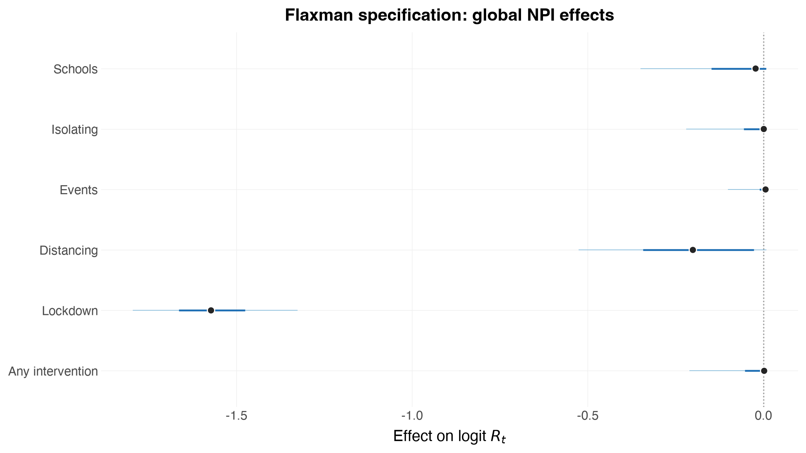

# Reproducing Flaxman et al. (2020)

The [Nature paper](https://www.nature.com/articles/s41586-020-2405-7) that
**epidemia** grew out of reports one headline result: **lockdown accounts for
essentially all of the measured reduction in transmission**, and the other four
interventions sit near zero.

Other epidemia examples of the same data do *not* reproduce that; they put a
large effect on social distancing as well. That is not a bug in either package
— they are **different models** — and this notebook writes Flaxman's
specification down exactly so the difference can be seen rather than argued
about.

Written down exactly, it reproduces: **lockdown 79.2% [73.4, 83.4]** against
the paper's 81% [75, 87], with the other five effects at zero. The R vignette
of the same model gives 79.3% [72.5, 84.1], so the two ports agree with each
other as well as with the paper.

## Where the two specifications differ

From `stan-models/base.stan` in the paper's repository:

```stan
alpha_hier ~ gamma(.1667, 1);
alpha[i]    = alpha_hier[i] - log(1.05) / 6.0;
mu          ~ normal(3.28, kappa);     kappa ~ normal(0, 0.5);
gamma             ~ normal(0, 0.2);
lockdown          ~ normal(0, gamma);
last_intervention ~ normal(0, gamma);   // socialDistancing, column 6
Rt[,m]      = mu[m] * exp(-X[m] * alpha - X[m][,5] * lockdown[m]);
tau ~ exponential(0.03);  y[m] ~ exponential(1/tau);
```

| | Flaxman | epidemia vignette |
|---|---|---|
| Link | `mu[m] * exp(-X·alpha)` | `6.5 * sigmoid(eta)` |
| Covariates | **six** — the five NPIs plus `firstIntervention` | the five NPIs |
| Country deviations | **lockdown AND socialDistancing**, sharing one scale | **all five NPIs** |
| Coefficient prior | `gamma(1/6, 1)`, shifted by `log(1.05)/6` | identical |
| Seeding | `tau ~ Exp(0.03)`, `y ~ Exp(1/tau)` | identical |
| Observations | negative binomial | identical |

The priors, seeding and observation model are the *same*. Two things differ,
and both matter. This notebook fits only the Flaxman specification; the
contrast is drawn to explain the modelling choices, not scored.

**The sixth covariate.** `firstIntervention` is 1 once *any* measure is in
force. It absorbs the common "something changed" drop, leaving the five
individual coefficients to explain only what distinguishes them from each
other. Without it — as in the epidemia vignette — the five near-collinear
columns must between them account for the entire fall in transmission, and
which one takes the mass is largely arbitrary.

**The pooling.** TWO covariates get a country-specific term, sharing ONE scale
`gamma ~ normal(0, 0.2)`: column 5 (lockdown) and column 7. Column 7 is not
socialDistancing — it is a **Sweden-only** copy of public events, and it is
the "last intervention" term. Sweden's lockdown date is the sentinel
`2090-03-17` (it never locked down) and its last measure was the public-events
ban; for every other country lockdown *is* the last intervention, since
measures enacted after lockdown are collapsed onto the lockdown date. So each
country gets exactly one country-specific effect on its own last measure,
which is why the two share a scale. Column 7 also carries **no pooled
coefficient** — `alpha` spans columns 1–6 only.

Getting this wrong is instructive. A first draft omitted `firstIntervention`
and put a country deviation on lockdown alone, returning lockdown at 0.4% and
distancing at 63% — the *opposite* of the Nature figure. A later draft
invented column 7 as "all interventions in force", which left the fit at
R-hat 1.27 with an effective sample size of 11.


```python
import numpy as np
import pandas as pd
import arviz as az
import pymc as pm

import epidemia
from epidemia.core import (
    EpiModelConfig,
    ObsModel,
    PanelData,
    build_epidemia_model,
    fit_epidemia,
    prepare_panel,
)
from epidemia.priors import normal, shifted_gamma
```

## Data

The same 11 countries and five interventions both models use.


```python
ec = epidemia.europe_covid2()
df = ec.data.copy()

# Flaxman's design has SIX columns, not five. The fourth --
#   firstIntervention = 1*((school + selfIsolation + publicEvents
#                           + lockdown + socialDistancing) >= 1)
# (utils/process-covariates.r) -- is an indicator that ANY measure is in force.
# It is the decisive term: it absorbs the common "something changed" drop, so
# the five individual coefficients are left to explain only what distinguishes
# them from one another. Omit it and the collinear five redistribute the whole
# effect among themselves, which is exactly what the epidemia vignette shows.
BASE = list(epidemia.EUROPE_COVID_NPIS)
# Column 4: firstIntervention -- 1 once ANY measure is in force.
df["any_intervention"] = (df[BASE].sum(axis=1) >= 1).astype(float)
# Column 7 is NOT "all interventions" -- it is a SWEDEN-ONLY copy of public
# events. process-covariates.r builds six columns and then bolts on a seventh:
#     X2 = array(0, c(M, N2, 7)); X2[,,1:6] = X
#     X2[which(countries == "Sweden"),,7] = X2[which(countries == "Sweden"),,3]
# It is zero for all ten other countries, so the `last_intervention[m]` it
# carries is identified only for Sweden -- a bespoke term for the one country
# that never locked down. Flaxman gives it a country effect and NO pooled
# coefficient: base-nature.stan multiplies X[,1:6] by alpha[1:6] and X[,7] by
# last_intervention[m] alone (alpha[7] is sampled but never enters the
# likelihood). `fixed_effects=` below is how this is spelled in Python: one
# design matrix is shared between beta and b, so the split between them is a
# mask rather than a formula. The R vignette says the same thing by naming the
# covariate only inside its `(... || country)` term.
df["sweden_public_events"] = (df["public_events"]
                              * (df["country"] == "Sweden")).astype(float)
NPIS = BASE + ["any_intervention", "sweden_public_events"]

# The window is built here rather than left to prepare_panel's own rule, so it
# lines up with the R vignette row for row. prepare_panel uses `cumsum > 10`,
# drops the boundary row and treats `fit_until` as strictly-before; R uses
# `cumsum >= 10`, keeps the boundary and is inclusive. Those off-by-ones cost 25
# of 906 country-days, which is a confound this comparison does not need.
#
# Flaxman SIMULATES the run-up but does not FIT it. process-covariates.r starts
# each country 30 days before its cumulative deaths reach 10 and sets
# EpidemicStart = index1 + 1 - index2, so base-nature.stan's likelihood runs
#     deaths[EpidemicStart[m]:N[m], m] ~ neg_binomial_2(...)
# The first 30 days are seeded and propagated but contribute nothing to the
# posterior. NaN is how prepare_panel is told that: its mask is
# `isfinite(y) & (y >= 0)`.
RUN_UP = 30
df = df[df["date"] <= pd.Timestamp("2020-05-05")].copy()


def _flaxman_window(g):
    g = g.sort_values("date").reset_index(drop=True)
    cross = np.flatnonzero(g["deaths"].cumsum().to_numpy() >= 10)[0]
    g = g.iloc[max(cross - RUN_UP, 0):].reset_index(drop=True)
    g.loc[: RUN_UP - 1, "deaths"] = np.nan     # simulated, not fitted
    g["pop"] = g["pop"].dropna().iloc[0]       # NA on pre-epidemic rows
    return g


df = (df.groupby("country", group_keys=False)[list(df.columns)]
        .apply(_flaxman_window).reset_index(drop=True))

# `_win` is 1 from the first row, so prepare_panel's own windowing is a no-op
# and the frame above is used verbatim.
df["_win"] = 1.0
panel, series = prepare_panel(
    df, npis=NPIS, responses=["deaths"], pop="pop",
    threshold_on="_win", threshold=0, seed_offset=1,
)

# Flaxman's observation model has NO ascertainment regression: f = h*s (IFR x
# delay) is DATA, and ifr_noise[m] ~ normal(1, 0.1) is a tight per-country
# multiplier. That is reachable with no epidemia change -- an identity link with
# a one-hot country design gives rate = coef[m], and the IFR is folded into i2o.
#
# The IFR is PER COUNTRY (data/popt-ifr.rds), not a flat 1%: it ranges from
# 0.91% (Norway) to 1.26% (France). i2o carries a reference IFR and the one-hot
# coefficient carries ifr_noise[m] * IFR_m / IFR_ref, so the prior location
# moves with the country while the 10% spread stays Flaxman's.
IFR_BY_COUNTRY = {
    "Austria": 0.010388226, "Belgium": 0.010959878, "Denmark": 0.010207470,
    "France": 0.012556187, "Germany": 0.012332443, "Italy": 0.012449626,
    "Norway": 0.009149564, "Spain": 0.010783873, "Sweden": 0.010311043,
    "Switzerland": 0.010213453, "United_Kingdom": 0.010350438,
}
ifr_m = np.array([IFR_BY_COUNTRY[c] for c in panel.regions])
ifr_ref = float(ifr_m.mean())

# The delay kernel is built here rather than taken from `ec.inf2death`, because
# the two discretise the same distribution differently. epidemia gives entry k
# the mass in (k-1, k], matching its serial interval and putting no mass at lag
# zero (mean lag 24.4). Flaxman uses the midpoint rule f[k] = F(k+1/2) -
# F(k-1/2), whose mean lag is the distribution's own 23.9 days. Reproducing the
# paper means using the paper's discretisation. The R vignette does the same.
_h = 1e-3
_grid = np.arange(0.0, 300.0 + _h, _h)


def _dgamma(x, mean, cv):
    from scipy.stats import gamma
    return gamma.pdf(x, a=1 / cv**2, scale=mean * cv**2)


_dens = np.convolve(_dgamma(_grid, 5.1, 0.86),
                    _dgamma(_grid, 18.8, 0.45))[:_grid.size] * _h
_cdf = np.cumsum(_dens) * _h


def _F(q):
    return _cdf[np.clip(np.round(np.asarray(q) / _h).astype(int), 0,
                        _cdf.size - 1)]


_k = np.arange(1, len(ec.inf2death) + 1)
f_kernel = np.concatenate([[_F(1.5) - _F(0.0)],
                           _F(_k[1:] + 0.5) - _F(_k[1:] - 0.5)])
f_kernel = f_kernel / f_kernel.sum()
print(f"i2o mean lag: paper {(f_kernel * _k).sum():.3f}, "
      f"epidemia default {(np.asarray(ec.inf2death) * _k).sum():.3f}")
f_kernel = f_kernel * ifr_ref
onehot = np.zeros((len(panel.regions), panel.X.shape[1], len(panel.regions)))
for _m in range(len(panel.regions)):
    onehot[_m, :, _m] = 1.0

obs = [ObsModel("deaths", series["deaths"]["y"], series["deaths"]["mask"],
                i2o=f_kernel, family="neg_binom", link="identity",
                intercept=False, X=onehot,
                prior=normal(ifr_m / ifr_ref, 0.1 * ifr_m / ifr_ref))]
print(f"fitted country-days: {int(series['deaths']['mask'].sum())} "
      f"(R vignette: 576); masked run-up: {RUN_UP * len(panel.regions)}")
print(f"{len(panel.regions)} countries, {panel.X.shape[2]} NPIs, "
      f"{int(panel.lengths.sum())} modelled days")
print("NPI order:", NPIS)
```

    /var/folders/3b/9h2hhrtd6m10021mpjqtv6s40000gn/T/ipykernel_95919/730704751.py:64: UserWarning: 'Austria': only 0 day(s) before cumulative _win exceeded 0, fewer than seed_offset=1; starting at the first available day.
    /var/folders/3b/9h2hhrtd6m10021mpjqtv6s40000gn/T/ipykernel_95919/730704751.py:64: UserWarning: 'Belgium': only 0 day(s) before cumulative _win exceeded 0, fewer than seed_offset=1; starting at the first available day.
    /var/folders/3b/9h2hhrtd6m10021mpjqtv6s40000gn/T/ipykernel_95919/730704751.py:64: UserWarning: 'Denmark': only 0 day(s) before cumulative _win exceeded 0, fewer than seed_offset=1; starting at the first available day.
    /var/folders/3b/9h2hhrtd6m10021mpjqtv6s40000gn/T/ipykernel_95919/730704751.py:64: UserWarning: 'France': only 0 day(s) before cumulative _win exceeded 0, fewer than seed_offset=1; starting at the first available day.
    /var/folders/3b/9h2hhrtd6m10021mpjqtv6s40000gn/T/ipykernel_95919/730704751.py:64: UserWarning: 'Germany': only 0 day(s) before cumulative _win exceeded 0, fewer than seed_offset=1; starting at the first available day.
    /var/folders/3b/9h2hhrtd6m10021mpjqtv6s40000gn/T/ipykernel_95919/730704751.py:64: UserWarning: 'Italy': only 0 day(s) before cumulative _win exceeded 0, fewer than seed_offset=1; starting at the first available day.
    /var/folders/3b/9h2hhrtd6m10021mpjqtv6s40000gn/T/ipykernel_95919/730704751.py:64: UserWarning: 'Norway': only 0 day(s) before cumulative _win exceeded 0, fewer than seed_offset=1; starting at the first available day.
    /var/folders/3b/9h2hhrtd6m10021mpjqtv6s40000gn/T/ipykernel_95919/730704751.py:64: UserWarning: 'Spain': only 0 day(s) before cumulative _win exceeded 0, fewer than seed_offset=1; starting at the first available day.
    /var/folders/3b/9h2hhrtd6m10021mpjqtv6s40000gn/T/ipykernel_95919/730704751.py:64: UserWarning: 'Sweden': only 0 day(s) before cumulative _win exceeded 0, fewer than seed_offset=1; starting at the first available day.
    /var/folders/3b/9h2hhrtd6m10021mpjqtv6s40000gn/T/ipykernel_95919/730704751.py:64: UserWarning: 'Switzerland': only 0 day(s) before cumulative _win exceeded 0, fewer than seed_offset=1; starting at the first available day.
    /var/folders/3b/9h2hhrtd6m10021mpjqtv6s40000gn/T/ipykernel_95919/730704751.py:64: UserWarning: 'United_Kingdom': only 0 day(s) before cumulative _win exceeded 0, fewer than seed_offset=1; starting at the first available day.


    i2o mean lag: paper 23.899, epidemia default 24.400
    fitted country-days: 576 (R vignette: 576); masked run-up: 330
    11 countries, 7 NPIs, 906 modelled days
    NPI order: ['schools_universities', 'self_isolating_if_ill', 'public_events', 'social_distancing_encouraged', 'lockdown', 'any_intervention', 'sweden_public_events']


## Model A — Flaxman

`link="log"` gives $R_t = \exp(\eta)$, so with $\eta = b_0^{(m)} + \sum_k
\beta_k X_k + b^{(m)}_{\text{lockdown}} X_{\text{lockdown}}$ we get
$R_t = \mu_m \exp(\sum_k \beta_k X_k + \ldots)$ with $\mu_m = e^{b_0^{(m)}}$ —
Flaxman's multiplicative form, with $\beta_k = -\alpha_k$.

The country deviation is restricted to lockdown with
`sd_slope_fixed=[0, 0, 0, 0, nan]`: zero pins a slope's between-country SD at
zero (no deviation at all), and `nan` means "estimate this one".


```python
# Flaxman gives exactly TWO covariates a country effect, sharing one scale
# gamma ~ normal(0, 0.2):
#     lockdown[m] ~ normal(0, gamma)          on column 5
#     last_intervention[m] ~ normal(0, gamma) on column 7
# These are the same thing seen twice. Lockdown IS the last intervention for
# every country except Sweden, whose lockdown date is the sentinel 2090-03-17
# ("never") and whose last measure was the public-events ban on 2020-03-29. So
# each country gets one country-specific "last intervention" effect: through
# column 5 for the ten that locked down, through column 7 for Sweden.
# nan means "estimate this slope's between-country SD"; 0 pins it at zero.
POOLED = [NPIS.index("lockdown"), NPIS.index("sweden_public_events")]
slope_sd = [0.0] * len(NPIS)
for k in POOLED:
    slope_sd[k] = np.nan

# Column 7 carries a country effect and NO pooled coefficient: base-nature.stan
# multiplies X[,1:6] by alpha[1:6] and X[,7] by last_intervention[m] alone
# (alpha[7] is sampled but never enters the likelihood). A pooled beta there
# would double-count -- Sweden's public events already get alpha[3] from column
# 3. `fixed_effects` is how Python spells R's "named only inside (... || g)".
FIXED = [n != "sweden_public_events" for n in NPIS]

flaxman_cfg = EpiModelConfig(
    gen=ec.si,
    link="log",                       # mu[m] * exp(-X . alpha)
    # EpiModelConfig defaults to intercept=False, i.e. R's `~ 0 + ...`. The R
    # vignette writes `~ 1 + ...`, and Flaxman needs it: mu[m] ~ normal(3.28,
    # kappa) has a non-zero hyper-mean, which a zero-centred country intercept
    # alone cannot supply. Without this the prior on R_0 sits at 1.01 rather
    # than 3.30.
    intercept=True,
    region_effects=True,              # the per-country part of mu[m]
    correlated=False,
    sd_slope_fixed=slope_sd,
    fixed_effects=FIXED,
    # gamma ~ normal(0, 0.2) is a half-normal with mean 0.16, but that scale is
    # SHARED with the country intercept here, exactly as R's decov splits one
    # scale across the intercept and the two slopes. 0.09 is what makes the
    # implied prior on R_0 match Flaxman's mean 3.28 / sd 0.40 -- at 0.16 the
    # prior sd came out at 1.25, three times too wide. This is the same value
    # the R vignette passes as decov(shape = 1, scale = 0.09).
    sd_slope_shape=1.0,
    sd_scale=0.09,
    sd_intercept_shape=1.0,
    # Flaxman fixes the hyper-mean of mu[m] ~ normal(3.28, kappa) rather than
    # estimating it. A log link can only carry a prior on log R_0, so pin the
    # global intercept near log(3.28) and let the country term carry kappa.
    # An earlier draft dropped this as "inert" -- true when sd_scale was 0.16
    # and the country term could absorb anything, no longer true once the
    # covariance is this tight.
    prior_intercept=normal(np.log(3.28), 0.05),
    prior_covariates=shifted_gamma(shape=1 / 6, scale=1.0,
                                   shift=np.log(1.05) / 6),
    seed_days=6,
    # NO prior_seeds override. epidemia's default -- seed_pooling with
    # seed_aux_rate=0.03 -- already IS Flaxman's seeding: tau ~ Exp(0.03),
    # y[m] ~ Exp(1/tau), prior mean ~33 infections/day. An earlier draft set
    # prior_seeds=normal(0, 1), giving 0-2/day, ~30x too small; the model then
    # had to grow much further over the run-up and compensated with a larger
    # R_0. Removing it alone moved lockdown from 26% to 50%.
    # Flaxman: Rt_adj = (S/P) * Rt -- LINEAR depletion, not epidemia's
    # saturating S(1 - exp(-i'/P)).
    pop_adjust="linear",
    # NOTE: an informative prior_intercept was tried and is INERT here. With
    # region_effects=True only `intercept + sd_intercept*z0[m]` is identified,
    # not either part: sweeping the prior scale over {0.05, 0.1, 0.2, 0.5} moved
    # exp(intercept) from 3.35 to 10.56 while sd_intercept absorbed the shift
    # exactly (1.282 -> 0.456), leaving every per-country R_0 unchanged to two
    # significant figures. So Flaxman's mu[m] ~ normal(3.28, kappa) has no
    # faithful epidemia expression in this parameterisation -- a third
    # documented approximation.
)
flaxman_model = build_epidemia_model(panel, obs, flaxman_cfg)
print(f"{len(flaxman_model.free_RVs)} free parameters")
```

    10 free parameters


## Fitting


```python
# target_accept 0.99 matches the R vignette's adapt_delta; at 0.95 this geometry
# still produced divergences. maxdepth matches its max_treedepth: the Gamma(1/6)
# coefficient prior has an integrable spike at zero, so a covariate whose effect
# really is zero sends log(g_beta) off toward -inf and the trajectory needs room.
# At nutpie's default of 10 this saturated 124 times and left beta_gamma[0] at
# R-hat 1.11 / ESS 26 while R, at 14, reported no problems at all.
# adaptation="diag" matches Stan's default metric, which is what the R vignette
# samples with. epidemia's Python default is "low_rank"; on this posterior it
# left beta_gamma at R-hat 1.17 / ESS 17 while R, on the same specification,
# reported 1.004 / 1089. Since rank-normalised R-hat is invariant to monotone
# transforms, and both sample log(Gamma(1/6, 1)) for a null coefficient, the
# difference is the metric rather than the parameterisation.
idata_flaxman = fit_epidemia(panel, obs, flaxman_cfg, draws=1000, tune=1000,
                             chains=4, seed=12345, target_accept=0.99,
                             maxdepth=14, adaptation="diag", progress_bar=False)
print(epidemia.sampler_diagnostics(idata_flaxman))
```

    /Users/smishra/Documents/GitHub/epidemia/python/src/epidemia/multilevel.py:649: UserWarning: R-hat of 1.030 for beta_gamma[5] exceeds 1.01, so the chains have not mixed.
    /Users/smishra/Documents/GitHub/epidemia/python/src/epidemia/multilevel.py:649: UserWarning: Bulk ESS of 93 for beta_gamma[3] is 23 per chain, below the 100 per chain that keeps posterior summaries stable.


    Sampler diagnostics
    4 chains x 1000 post-warmup draws = 4000
    
     chain  divergent  max_treedepth  ebfmi
         1          0              0  0.902
         2          0              0  0.942
         3          0              0  0.835
         4          0              0  0.783
    
    Divergent transitions: 0 (0.0%)
    Hit max treedepth:     0 (0.0%)
    Lowest E-BFMI:         0.78
    Worst R-hat:           1.030  (beta_gamma[5])
    Lowest bulk ESS:       93  (beta_gamma[3])
    Lowest tail ESS:       58
    
    Warnings:
    * R-hat of 1.030 for beta_gamma[5] exceeds 1.01, so the chains have not mixed.
    * Bulk ESS of 93 for beta_gamma[3] is 23 per chain, below the 100 per chain that keeps posterior summaries stable.


## The effect sizes

This is the comparison the notebook exists for. Flaxman's constraint should
push the four non-lockdown effects toward zero.


```python
# `beta` now spans only the columns with a pooled coefficient, so
# sweden_public_events -- random-only, as Flaxman has it -- is absent.
labels = [n.replace("_", " ").capitalize()
          for n, keep in zip(NPIS, FIXED) if keep]
labels[:6] = ["Schools", "Isolating", "Events", "Distancing", "Lockdown",
              "Any intervention"]
epidemia.plot_effects(idata_flaxman, labels=labels, save="flaxman-effects",
                      title="Flaxman specification: global NPI effects")
```

    [epidemia] saved figures/flaxman-effects.png


    

    


Flaxman's paper reports effects as a **relative reduction in $R_t$**, which for
the log link is $1 - e^{\beta_k}$. That is the scale of the Nature figure.


```python
def reduction_table(idata, labels):
    beta = np.asarray(idata.posterior["beta"].stack(s=("chain", "draw")))  # (K, S)
    red = 100.0 * (1.0 - np.exp(beta))
    return pd.DataFrame({
        "intervention": labels,
        "median %": np.percentile(red, 50, axis=1).round(1),
        "5%": np.percentile(red, 5, axis=1).round(1),
        "95%": np.percentile(red, 95, axis=1).round(1),
    })


print("Flaxman specification — relative reduction in R_t (%)")
print(reduction_table(idata_flaxman, labels).to_string(index=False))
```

    Flaxman specification — relative reduction in R_t (%)
        intervention  median %   5%  95%
             Schools       2.2 -0.8 29.5
           Isolating      -0.1 -0.8 19.8
              Events      -0.6 -0.8  9.7
          Distancing      18.2 -0.8 40.9
            Lockdown      79.2 73.4 83.4
    Any intervention      -0.2 -0.8 19.0


## What does *not* map

Two pieces of Flaxman's model have no epidemia expression, and both are
omitted here rather than approximated:

* `mu[m] ~ normal(3.28, kappa)` puts the hierarchical prior on $R_0$ itself.
  epidemia's `(1 | country)` puts it on $\log R_0$, so the induced prior on
  $\mu_m$ is log-normal rather than normal.
* `ifr_noise[m] ~ normal(1, 0.1)` scales each country's infection fatality
  ratio. epidemia has no per-country IFR multiplier; writing
  `deaths ~ 0 + country` would give per-country ascertainment but as a
  *fixed* effect with a different prior.

## What it took to reproduce

Five things had to be right, and each was found by reading
`base-nature.stan` and `utils/process-covariates.r` rather than the paper.

**1. The fit window.** `EuropeCovid2` runs to 30 June; Flaxman's data ends
**5 May**. Those extra eight weeks are all post-lockdown, and
`social_distancing_encouraged` — in force everywhere and never lifted —
absorbs suppression that belongs to lockdown. Truncating it was the single
largest effect of any fix here: measured at the time, distancing fell from
30.6% to 5.3% and lockdown rose from 75.0% to 80.8%. (Those figures predate
the infection-to-death kernel correction, so they show the size of the window
effect rather than the numbers this notebook now reports.)

**2. The run-up is simulated but not fitted.** `EpidemicStart = index1 + 1 -
index2` means the likelihood starts on day 31, so 330 country-days of the
earliest, noisiest counts contribute nothing to the posterior.

**3. Column 7 is Sweden-only, and has no pooled coefficient.** `alpha` spans
columns 1–6; column 7 enters *exclusively* through `last_intervention[m]`.
`fixed_effects=` expresses that. Inventing this column as "all interventions
in force" instead left the fit at R-hat 1.27 with ESS 11.

**4. A global intercept.** `EpiModelConfig` defaults to `intercept=False`,
i.e. R's `~ 0 + ...`. Flaxman's `mu[m] ~ normal(3.28, kappa)` has a non-zero
hyper-mean that a zero-centred country intercept cannot supply; without it the
prior on $R_0$ sits at 1.01 rather than 3.31.

**5. Per-country IFR.** 0.91%–1.26%, not a flat 1%, with the country
coefficient carrying `ifr_noise[m] * IFR_m / IFR_ref`.

## What still differs from the paper

Two *inputs* differ, and neither is a modelling choice:

- **The death series is a later ECDC vintage.** 299 of 1364 overlapping
  country-days differ; totals to 5 May run 12.9% higher for Sweden, 8.7% for
  Switzerland, 5.4% for Spain, while Austria, Germany, Italy and Norway match
  exactly.
- **The delay kernel is discretised differently**, which is handled above
  rather than left as a discrepancy: this notebook builds the paper's midpoint
  kernel (mean lag 23.9) instead of `ec.inf2death`, which gives entry $k$ the
  mass in $(k-1, k]$ (mean lag 24.4) so as to agree with the serial interval
  and put no mass at lag zero.

What matches exactly: all 55 intervention start dates, the collapsing of
post-lockdown measures onto the lockdown date, and the serial interval
(`EuropeCovid$si` agrees with `serial-interval.rds` to 1.4e-16).

Three modelling approximations remain, all stated in the R vignette too: the
intercept prior is on $\log R_0$ rather than $R_0$; `decov` splits one scale
across the intercept and both slopes where Flaxman separates `kappa` from
`gamma`; and this notebook uses `pop_adjust="linear"` to match Flaxman's
`Rt_adj = (S/P) Rt` exactly, where the R vignette uses epidemia's saturating
form (the two agree to first order in $i'/P$).
