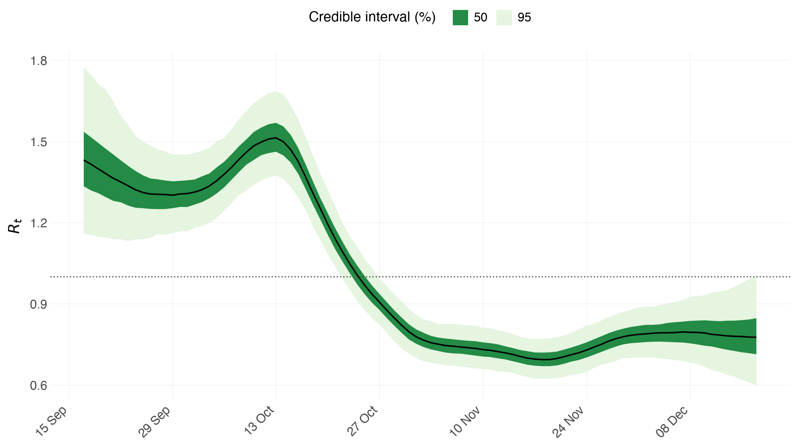
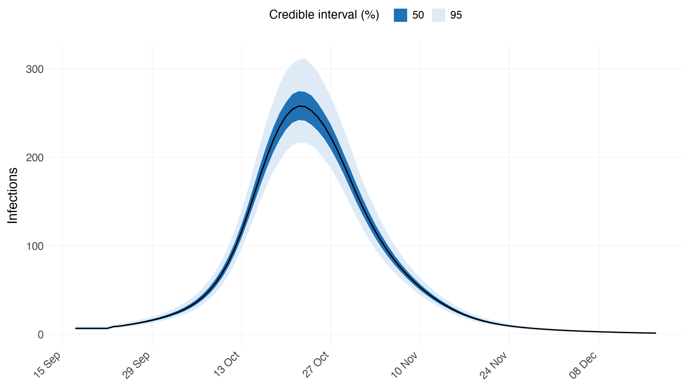
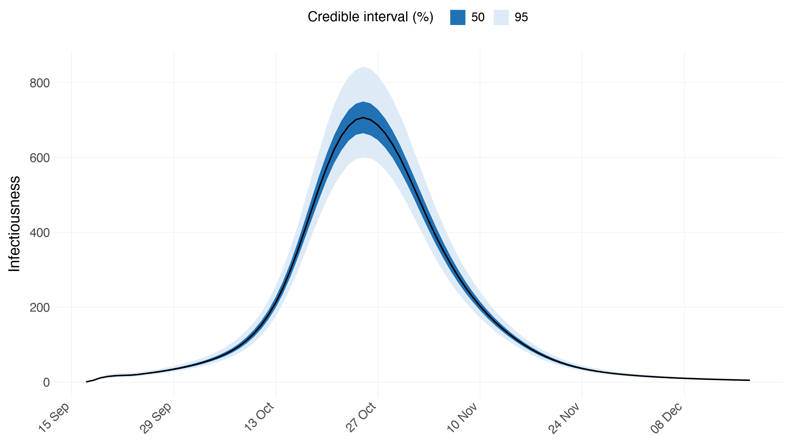
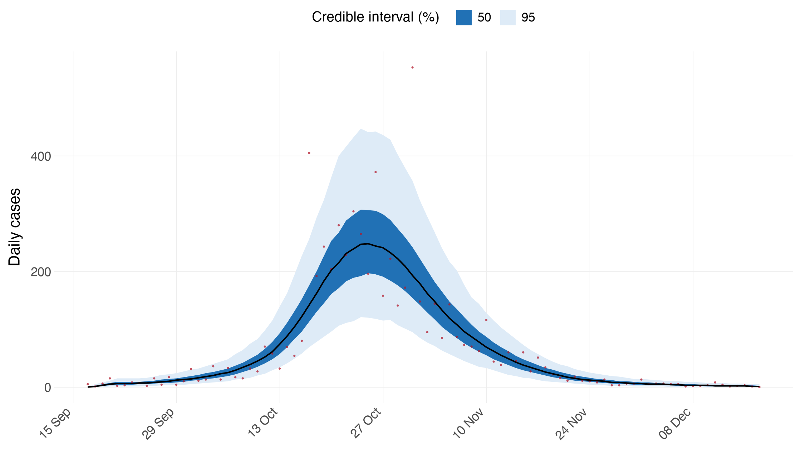

# Spanish Flu in Baltimore

Python counterpart of the R vignette
[`flu`](https://mlgh-sg.com/epidemia2/articles/flu.html).

The smallest interesting model the package can fit: **one population, one
observation series, and a random walk on $R_t$**. There are no covariates and
no partial pooling, so everything the model says about transmission comes from
the walk. That makes it the right place to see the renewal process on its own,
and to compare the two infection models — the deterministic recursion, and the
*latent* one that adds variance to it.

The data are 93 days of case counts from the 1918 influenza pandemic in
Baltimore, together with the serial interval **EpiEstim** ships with them.


```python
import numpy as np
import pandas as pd
import arviz as az

import epidemia
from epidemia.core import (
    EpiModelConfig,
    ObsModel,
    PanelData,
    RandomWalk,
    build_epidemia_model,
    fit_epidemia,
)
from epidemia.priors import normal
```

## Data

`flu1918()` returns the daily counts and the serial-interval PMF. Note the
distinction the package draws between the two kernels it carries: the serial
interval `si[k]` is the probability of a serial interval of exactly `k` days
and so begins with a zero (nobody infects on the day they are infected), while
the **generation kernel** the renewal equation wants is that vector with the
leading zero dropped, so that `generation[0]` weights *yesterday's* infections.
`EpiData.generation` does that for you — getting it wrong shifts the whole
epidemic by a day.


```python
flu = epidemia.flu1918()
y = flu.incidence
T = len(y)
dates = pd.date_range("1918-09-17", periods=T)

print(f"{T} days, {int(y.sum())} cases, peak {int(y.max())} on "
      f"{dates[int(y.argmax())].date()}")
print("serial interval starts:", np.round(flu.serial_interval[:5], 3))
print("generation kernel starts:", np.round(flu.generation[:5], 3))
```

    92 days, 6202 cases, peak 553 on 1918-10-31
    serial interval starts: [0.    0.233 0.359 0.198 0.103]
    generation kernel starts: [0.233 0.359 0.198 0.103 0.053]


## The panel

The Python builder is written for many regions and many series, so a
single-population model is the degenerate case: one region, no covariates.
`region_effects=False` in the config below turns off the hierarchical
intercept that would otherwise be estimated across regions — with one region
there is nothing to pool.


```python
M = 1
panel = PanelData(
    X=np.zeros((M, T, 0)),          # no covariates: the walk does the work
    lengths=np.array([T]),
    regions=["Baltimore"],
    npis=[],
    dates=[dates.values],
    pops=None,                      # no susceptibility adjustment
)
```

## Transmission: a daily random walk

$R_t$ follows a random walk on the log scale, which is R's

```r
epirt(formula = R(city, date) ~ 1 + rw(prior_scale = 0.01), ...)
```

`RandomWalk(index=)` is the Python spelling of R's `rw(time=)`: it says which
walk step each day belongs to. `arange(T)` gives one step per day; repeating
indices would give a coarser walk. `prior_scale` is the scale of the
half-normal prior on the step size — small, because a daily walk with a loose
step prior can absorb almost any epidemic curve and tell you nothing.

The prior on the intercept puts $R_0$ near 2.


```python
config = EpiModelConfig(
    gen=flu.generation,
    link="log",
    intercept=True,
    prior_intercept=normal(np.log(2), 0.2),
    region_effects=False,
    rw=RandomWalk(index=np.tile(np.arange(T), (M, 1)), prior_scale=0.01),
    seed_days=6,
)
```

## Observations: full ascertainment

This example assumes every infection eventually shows up as a case, so the
ascertainment rate is fixed at 1 rather than estimated. R writes that as

```r
epiobs(formula = cases ~ 0 + offset(rep(1, 93)), link = "identity", i2o = rep(.25, 4))
```

— an `identity` link with an offset of 1 and no intercept, so the linear
predictor *is* the rate and no parameter multiplies it. The same three pieces
translate directly: `intercept=False`, `offset=ones`, `link="identity"`.

`i2o` says a case is recorded with equal probability on any of the four days
after infection. Like every kernel in the package it is lag-1-first, so an
infection is never observed on the day it happens.


```python
obs = ObsModel(
    name="cases",
    y=y[None, :],
    mask=np.ones((M, T), dtype=bool),
    i2o=np.repeat(0.25, 4),
    family="neg_binom",              # R's epiobs() default
    link="identity",
    intercept=False,
    offset=np.ones((M, T)),          # rate == 1: full ascertainment
)
```

## Fitting

Two infection models, exactly as the R vignette compares them. The first is
the plain renewal recursion: infections are a deterministic function of past
infections and $R_t$. The second sets `latent=True`, which makes the
post-seeding infections *parameters* whose mean the renewal equation supplies
— so the epidemic can wobble around its own expectation. `prior_aux` sets the
dispersion; a mean around 10 says the conditional variance is about ten times
the conditional mean.

The observation family is the `epiobs()` default, `neg_binom`. That matters
more than it looks: with a Poisson likelihood and full ascertainment the
deterministic model is over-determined — infections must reproduce the counts
exactly through the convolution — and the sampler diverges on essentially
every iteration. The diagnostics below are the check that catches it.


```python
idata = fit_epidemia(panel, [obs], config, draws=1000, tune=1000, chains=4,
                     seed=12345, target_accept=0.99, progress_bar=False)
```


```python
config_latent = EpiModelConfig(
    **{**config.__dict__, "latent": True, "prior_aux": normal(10.0, 2.0)}
)
idata_latent = fit_epidemia(panel, [obs], config_latent, draws=1000, tune=1000,
                            chains=4, seed=12345, target_accept=0.99,
                            progress_bar=False)
```

## Check the sampler first

Before reading any estimate, check that the sampler explored the posterior.
`sampler_diagnostics()` is the mirror of R's function of the same name.


```python
print(epidemia.sampler_diagnostics(idata))
```

    Sampler diagnostics
    4 chains x 1000 post-warmup draws = 4000
    
     chain  divergent  max_treedepth  ebfmi
         1          0              0  1.021
         2          0              0  1.053
         3          0              0  0.930
         4          0              0  0.977
    
    Divergent transitions: 0 (0.0%)
    Hit max treedepth:     0 (0.0%)
    Lowest E-BFMI:         0.93
    Worst R-hat:           1.010  (rw_noise[0, 10])
    Lowest bulk ESS:       633  (rw_scale[0])
    Lowest tail ESS:       1067
    
    No problems detected.


```python
print(epidemia.sampler_diagnostics(idata_latent))
```

    Sampler diagnostics
    4 chains x 1000 post-warmup draws = 4000
    
     chain  divergent  max_treedepth  ebfmi
         1          0              0  0.894
         2          0              0  0.999
         3          0              0  0.944
         4          0              0  0.916
    
    Divergent transitions: 0 (0.0%)
    Hit max treedepth:     0 (0.0%)
    Lowest E-BFMI:         0.89
    Worst R-hat:           1.010  (rw_noise[0, 13])
    Lowest bulk ESS:       2133  (infections_raw[0, 13])
    Lowest tail ESS:       880
    
    No problems detected.


## Reproduction numbers

The walk is what makes $R_t$ move, so this plot is the model's whole account
of transmission. The dotted line at 1 is the epidemic threshold.


```python
epidemia.plot_rt(idata, data=panel, levels=(50, 95), save=False)
```


    

    


## Infections and infectiousness

`plot_infections` shows the latent infections; `plot_infectious` shows total
infectiousness, the generation-weighted sum of past infections divided by
`max(gen)` — the same quantity R's `plot_infectious` draws. The second peaks
slightly earlier than the first, because it is a weighted average over the
days *before* each date.


```python
epidemia.plot_infections(idata, data=panel, levels=(50, 95), save=False)
```


    

    


```python
epidemia.plot_infectious(idata, config, data=panel, levels=(50, 95), save=False)
```


    

    


## Posterior predictive check

`plot_obs` bands the posterior **predictive**, not the posterior of the mean:
the ribbon carries the negative-binomial observation noise on top of parameter
uncertainty, which is what makes it comparable to the counts drawn over it.
Banding the expected count instead would give a much narrower ribbon that the
data would fall outside of far too often.


```python
epidemia.plot_obs(idata, data=panel, obs_model=obs, series="cases",
                  ylab="Daily cases", levels=(50, 95), save=False)
```


    

    


## What `latent=True` buys

The two fits tell nearly the same story about $R_t$, but the latent model is
honest about a source of uncertainty the deterministic one ignores: real
epidemics do not follow the renewal equation exactly. Compare the widths.


```python
def rt_width(idata, level=95):
    rt = np.asarray(idata.posterior["Rt"]).reshape(-1, T)
    lo, hi = (100 - level) / 2, 100 - (100 - level) / 2
    return float((np.percentile(rt, hi, axis=0)
                  - np.percentile(rt, lo, axis=0)).mean())


print(f"mean 95% R_t width, deterministic : {rt_width(idata):.3f}")
print(f"mean 95% R_t width, latent        : {rt_width(idata_latent):.3f}")

summ = az.summary(idata_latent, var_names=["inf_aux"])
print()
print(summ[["mean", "sd", "r_hat", "ess_bulk"]].to_string())
```

    mean 95% R_t width, deterministic : 0.249
    mean 95% R_t width, latent        : 0.430
    
              mean     sd  r_hat  ess_bulk
    inf_aux  10.81  0.748    1.0    3682.0


The dispersion `inf_aux` is estimated rather than assumed, so the data get a
say in how far infections may stray from the renewal equation.

## Forecasting

A latent fit can be forecast: the fitted window's infections are read back
from the posterior and the horizon is drawn from the latent process, rather
than run through the deterministic recursion — which would be a different
model from the one that was fitted. The random walk keeps walking too, at its
own fitted scale, so $R_t$ fans out rather than freezing.


```python
fc = epidemia.forecast(idata_latent, panel, [obs], config_latent,
                       draws=200, seed=0)
print("forecast horizon:", fc.Rt.shape[-1], "days")
```

    forecast horizon: 92 days


## Caveats

As with every tutorial here, this demonstrates the software rather than making
an epidemiological claim. Full ascertainment is a strong assumption and
certainly false for 1918; the serial interval stands in for the generation
time; and a daily random walk with no covariates cannot attribute any of the
change in $R_t$ to a cause.
