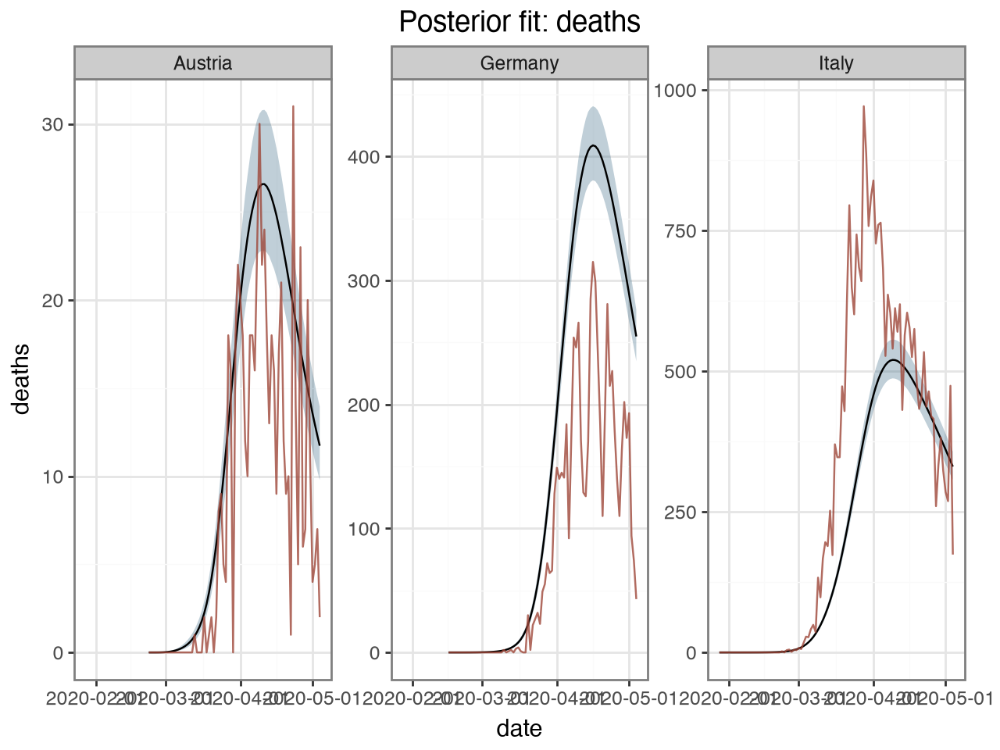
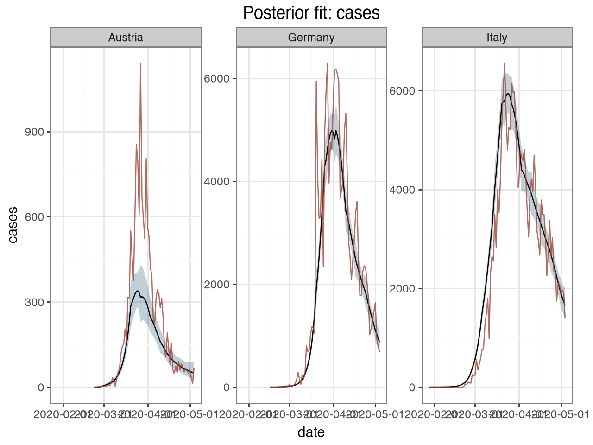
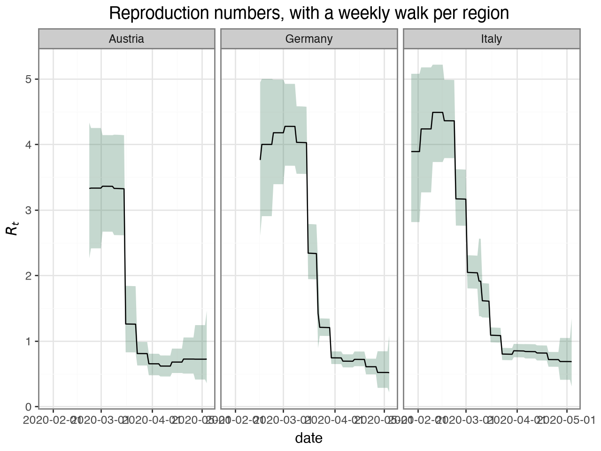

# Multilevel models with several observation series

The Python counterpart of the R vignette
[`multilevel-multi-obs`](https://mlgh-sg.com/epidemia2/articles/multilevel-multi-obs.html).

This is the model the earlier Python builders could not express. It puts four
things together at once:

* **partial pooling** of reproduction numbers across regions, with the region
  intercept and slope *correlated* (R's `(1 + x | region)` with `decov`);
* a **random walk** on $R_t$, one per region (R's `rw(time = week, gr = region)`);
* **two observation series** fitted jointly, deaths and cases, each with its own
  delay distribution, family and ascertainment rate;
* a **susceptibility adjustment**, so infections saturate instead of growing
  without bound.

All of it comes from `epidemia.core`.


```python
import numpy as np
import pandas as pd
import arviz as az
from plotnine import aes, geom_line, geom_ribbon, facet_wrap, ggplot, labs, theme_bw

import epidemia
from epidemia.core import (
    EpiModelConfig,
    ObsModel,
    RandomWalk,
    build_epidemia_model,
    fit_epidemia,
    prepare_panel,
)
```

## Data

`EuropeCovid2` carries daily deaths *and* daily cases for eleven countries,
alongside the intervention indicators. We take three countries to keep the
example quick, and add an ISO week column to index the random walk.


```python
ec = epidemia.europe_covid2()
df = ec.data.copy()
df["week"] = pd.to_datetime(df["date"]).dt.strftime("%G-%V")
df = df[df["country"].isin(["Austria", "Germany", "Italy"])]

panel, series = prepare_panel(
    df,
    npis=["lockdown"],
    responses=["deaths", "cases"],
    pop="pop",
    rw_by="week",
    fit_until="2020-05-05",
)
print(panel.regions, panel.X.shape, panel.pops.astype(int))
```

    ['Austria', 'Germany', 'Italy'] (3, 98, 1) [ 9006400 83783945 60461828]


`prepare_panel` windows every response onto one shared time axis: each region
starts 30 days before its tenth cumulative death, as in the R vignettes. Series
observed on different days are handled by their own masks, so a weekly survey
and a daily count can sit in the same model.

## The two observation series

Neither series *is* the infections. Each is infections convolved with a delay
distribution and scaled by an ascertainment rate that is itself estimated:

$$\mathbb{E}\left[Y^{(s)}_{t,m}\right]
   = \alpha^{(s)}_{t,m} \sum_{k \ge 1} \pi^{(s)}_k\, i_{t-k,m}$$

For deaths, $\alpha$ is the infection fatality ratio, capped at 2% by
`link_K`. For cases it is the ascertainment ratio, capped at 40%. The
infection-to-case delay here is deliberately crude — undetected for four days,
then uniform over a week.


```python
i2o_cases = np.concatenate([np.zeros(4), np.full(7, 1 / 7)])

obs = [
    ObsModel(
        "deaths", series["deaths"]["y"], series["deaths"]["mask"],
        i2o=ec.inf2death, family="neg_binom", link_K=0.02,
    ),
    ObsModel(
        "cases", series["cases"]["y"], series["cases"]["mask"],
        i2o=i2o_cases, family="quasi_poisson", link_K=0.4,
    ),
]
```

## The transmission model

`correlated=True` estimates the full covariance of the region intercept and the
lockdown slope through an LKJ-Cholesky prior — R's single-bar `(1 + lockdown |
country)`. Setting it `False` gives the independent double-bar form.

`RandomWalk(by_region=True)` gives each country its own weekly walk with its own
scale; `by_region=False` would put them all on one shared walk.

`pop_adjust=True` tracks the susceptible pool.


```python
config = EpiModelConfig(
    gen=ec.si,
    correlated=True,
    pop_adjust=True,
    prior_susc_mean=0.95,
    prior_susc_sd=0.05,
    rw=RandomWalk(index=panel.rw_index, by_region=True, prior_scale=0.1),
)

model = build_epidemia_model(panel, obs, config)
print(f"{len(model.free_RVs)} free parameters")
```

    12 free parameters


## Fitting

`fit_epidemia` builds and samples in one call. Two of its defaults differ from
nutpie's, both because of this model class's geometry: `target_accept=0.95` for
the funnel between the between-region SDs and the non-centred effects, and
`adaptation="low_rank"` for the correlated ridge that the covariates and the
random walk create together. A diagonal mass matrix cannot follow that ridge,
and it fails *silently* — bad mixing with no divergences to warn you. See the
[performance](../performance.md) page for the measurements.


```python
idata = fit_epidemia(panel, obs, config, draws=1000, tune=1000, chains=4,
                     seed=12345, target_accept=0.99, progress_bar=False)
summ = az.summary(idata, var_names=["beta", "seed", "rw_scale",
                                   "Sigma_chol_stds"])
print(summ[["mean", "sd", "r_hat", "ess_bulk"]].to_string())
```

                           mean      sd  r_hat  ess_bulk
    beta[lockdown]       -0.268   0.381   1.27      12.0
    seed[Austria]       109.387  31.053   1.00    1614.0
    seed[Germany]        56.393  16.499   1.00    2555.0
    seed[Italy]          15.203   5.524   1.00    1547.0
    rw_scale[0]           0.240   0.080   1.02     387.0
    rw_scale[1]           0.340   0.058   1.01     962.0
    rw_scale[2]           0.328   0.052   1.00    1674.0
    Sigma_chol_stds[0]    0.453   0.279   1.01     194.0
    Sigma_chol_stds[1]    0.616   0.361   1.06      64.0


### Read the diagnostics before the estimates

`beta[lockdown]` will look worse than everything else here, and that is the
model telling you something true rather than the sampler misbehaving.

A **weekly random walk and a one-off step covariate compete for the same
signal**. Lockdown is a single permanent change in one direction; a walk that
is free to move every week can absorb exactly that change into its own
increments. The two are only weakly separable, so the posterior has a ridge
along which `beta[lockdown]` trades off against the walk, and the chains
explore it slowly — a low `ess_bulk` and an `r_hat` above 1.01 for that one
coefficient.

This is not a Python quirk; the same formula in R
(`~ lockdown + rw(time = week, gr = country)`) has the same identifiability
problem. Three honest responses:

* **Report it.** Treat `beta[lockdown]` as poorly identified in this
  specification and do not quote its interval.
* **Drop one of the two.** If the question is "what did lockdown do", use the
  step function alone, as the [interventions tutorial](europe-covid.md) does.
  If the question is "how did transmission evolve", use the walk alone.
* **Make the walk coarser** — a monthly index, or a tighter `prior_scale` —
  so it cannot track a weekly step.

The other parameters, which are what this tutorial is really demonstrating,
are fine. Check rather than assume:


```python
bad = summ[(summ["r_hat"] > 1.01) | (summ["ess_bulk"] < 400)]
if len(bad):
    print("weakly identified or poorly mixed:")
    print(bad[["mean", "ess_bulk", "r_hat"]].to_string())
else:
    print(f"all clear: max r_hat = {summ['r_hat'].max():.3f}")
```

    weakly identified or poorly mixed:
                         mean  ess_bulk  r_hat
    beta[lockdown]     -0.268      12.0   1.27
    rw_scale[0]         0.240     387.0   1.02
    Sigma_chol_stds[0]  0.453     194.0   1.01
    Sigma_chol_stds[1]  0.616      64.0   1.06


## Both series are explained

A joint model has to fit everything it is conditioned on, so check each series.


```python
def series_frame(idata, panel, var, obs_y, obs_mask):
    """Median and 95% band for a latent series, long-form, with the observations."""
    da = idata.posterior[var]
    rows = []
    for m, region in enumerate(panel.regions):
        n = int(panel.lengths[m])
        draws = da.isel(region=m).values.reshape(-1, da.shape[-1])[:, :n]
        lo, mid, hi = np.percentile(draws, [2.5, 50, 97.5], axis=0)
        rows.append(pd.DataFrame({
            "region": region, "date": pd.to_datetime(panel.dates[m][:n]),
            "lower": lo, "median": mid, "upper": hi,
            "observed": np.where(obs_mask[m, :n], obs_y[m, :n], np.nan),
        }))
    return pd.concat(rows, ignore_index=True)


for name in ("deaths", "cases"):
    frame = series_frame(idata, panel, f"E_{name}",
                         series[name]["y"], series[name]["mask"])
    p = (
        ggplot(frame, aes("date"))
        + geom_ribbon(aes(ymin="lower", ymax="upper"), alpha=0.3, fill="#2C5F7C")
        + geom_line(aes(y="median"), colour="black")
        + geom_line(aes(y="observed"), colour="#9E4638", alpha=0.8)
        + facet_wrap("region", scales="free_y")
        + labs(title=f"Posterior fit: {name}", y=name, x=None)
        + theme_bw()
    )
    p.show()
```


    

    


    

    


## What the susceptibility adjustment does

With `pop_adjust`, the realised $R_t$ is the unadjusted rate scaled by the
susceptible fraction, so it falls as the epidemic proceeds even when the
unadjusted rate is flat. Over an eight-week window the effect is small; over a
long forecast it is what stops infections growing without bound.


```python
S = idata.posterior["susceptible"].mean(("chain", "draw")).values
Rt = idata.posterior["Rt"].mean(("chain", "draw")).values
Rt_un = idata.posterior["Rt_unadj"].mean(("chain", "draw")).values

for m, region in enumerate(panel.regions):
    n = int(panel.lengths[m])
    print(f"{region:10s} susceptible {S[m, n-1] / panel.pops[m]:.3f} "
          f"at the end;  Rt {Rt[m, n-1]:.2f} vs unadjusted {Rt_un[m, n-1]:.2f}")
```

    Austria    susceptible 0.933 at the end;  Rt 0.77 vs unadjusted 0.82
    Germany    susceptible 0.941 at the end;  Rt 0.55 vs unadjusted 0.59
    Italy      susceptible 0.927 at the end;  Rt 0.72 vs unadjusted 0.78


## Per-region reproduction numbers

Each country has its own weekly walk, so $R_t$ varies smoothly within a country
rather than stepping only when a policy changes.


```python
rt_frame = series_frame(idata, panel, "Rt",
                        np.full_like(series["deaths"]["y"], np.nan, dtype=float),
                        np.zeros_like(series["deaths"]["mask"]))
p = (
    ggplot(rt_frame, aes("date"))
    + geom_ribbon(aes(ymin="lower", ymax="upper"), alpha=0.3, fill="#3F7D5E")
    + geom_line(aes(y="median"), colour="black")
    + facet_wrap("region")
    + labs(title="Reproduction numbers, with a weekly walk per region",
           y="$R_t$", x=None)
    + theme_bw()
)
p.show()
```


    

    


## Scoring the fit

`epidemia.scoring` mirrors R's `evaluate_forecast`. Feed it observations and
predictive draws — note the orientation: one **row per observation**, one column
per draw.

Note also that these are draws from the posterior *predictive*, not bands on the
expected count: `epidemia.predict.posterior_predict` samples from the negative
binomial, so the intervals include observation noise. Banding `E_deaths` alone
would give intervals that are too narrow.


```python
from epidemia.predict import posterior_predict
from epidemia.scoring import evaluate_forecast

m = 0                                  # score the first region
n = int(panel.lengths[m])
E = idata.posterior["E_deaths"].isel(region=m).values.reshape(-1, panel.X.shape[1])[:, :n]
aux = idata.posterior["deaths|aux"].values.reshape(-1)

pp = posterior_predict(E, family="neg_binom", aux=aux[:, None], rng=np.random.default_rng(0))

mask = series["deaths"]["mask"][m, :n]
y = series["deaths"]["y"][m, :n]
result = evaluate_forecast(
    y[mask], pp[:, mask].T,                     # (observations, draws)
    date=pd.to_datetime(panel.dates[m][:n])[mask],
    levels=(50, 95),
)
print(result.error.head())
print(result.coverage.groupby("level")["in_ci"].mean().round(3))
```

      group       date          crps  mean_abs_error  median_abs_error
    0   all 2020-02-23  0.000000e+00         0.00000               0.0
    1   all 2020-02-24  0.000000e+00         0.00000               0.0
    2   all 2020-02-25  0.000000e+00         0.00000               0.0
    3   all 2020-02-26  5.625000e-07         0.00075               0.0
    4   all 2020-02-27  3.062500e-06         0.00175               0.0
    level
    50.0    0.569
    95.0    0.931
    Name: in_ci, dtype: float64


## Where this differs from R

The models are the same; the interfaces are not. R parses
`R(country, date) ~ (1 + lockdown | country) + rw(time = week, gr = country)`
from a formula, while here you hand `prepare_panel` the column names and it
builds the design matrix. Forecasting from a `newdata` frame is one call in R;
here you use `epidemia.predict.simulate` yourself. See
[parity](../parity.md) for the full list.
