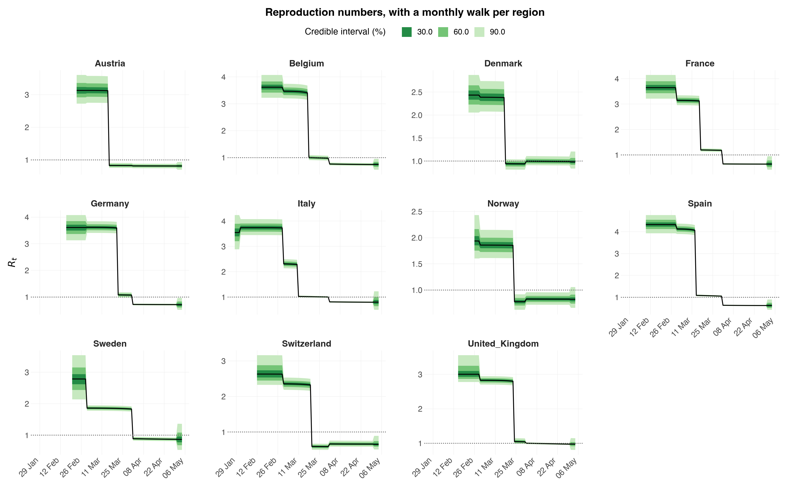

# Multilevel models with several observation series

The Python counterpart of the R vignette
[`multilevel-multi-obs`](https://mlgh-sg.com/epidemia2/articles/multilevel-multi-obs.html).

This is the model the earlier Python builders could not express. It puts four
things together at once:

* **partial pooling** of reproduction numbers across regions, with independent
  region intercepts and slopes (R's double-bar `(1 + x || region)`);
* a **random walk** on $R_t$, one per region (R's `rw(time = week, gr = region)`);
* **two observation series** fitted jointly, deaths and cases, each with its own
  delay distribution, family and ascertainment rate;
* a **susceptibility adjustment**, so infections saturate instead of growing
  without bound.

All of it comes from `epidemia.core`.


```python
import numpy as np
import pandas as pd
import arviz as az

import epidemia
from epidemia.core import (
    EpiModelConfig,
    ObsModel,
    RandomWalk,
    build_epidemia_model,
    fit_epidemia,
    prepare_panel,
)
```

## Data

`EuropeCovid2` carries daily deaths *and* daily cases for eleven countries,
alongside the intervention indicators. We use all eleven countries, and add a
month column to index the random walk.


```python
ec = epidemia.europe_covid2()
df = ec.data.copy()
# A monthly walk index, not a weekly one. See "Read the diagnostics" below:
# a walk free to move every week can absorb a one-off step covariate into its
# own increments, leaving beta[lockdown] only weakly identified.
df["month"] = pd.to_datetime(df["date"]).dt.strftime("%Y-%m")

panel, series = prepare_panel(
    df,
    npis=["lockdown"],
    responses=["deaths", "cases"],
    pop="pop",
    rw_by="month",
    fit_until="2020-05-05",
)
print(panel.regions, panel.X.shape, panel.pops.astype(int))
```

    ['Austria', 'Belgium', 'Denmark', 'France', 'Germany', 'Italy', 'Norway', 'Spain', 'Sweden', 'Switzerland', 'United_Kingdom'] (11, 98, 1) [ 9006400 11589616  5792203 65273512 83783945 60461828  5421242 46754783
     10099270  8654618 67886004]


`prepare_panel` windows every response onto one shared time axis: each region
starts 30 days before its tenth cumulative death, as in the R vignettes. Series
observed on different days are handled by their own masks, so a weekly survey
and a daily count can sit in the same model.

## The two observation series

Neither series *is* the infections. Each is infections convolved with a delay
distribution and scaled by an ascertainment rate that is itself estimated:

$$\mathbb{E}\left[Y^{(s)}_{t,m}\right]
   = \alpha^{(s)}_{t,m} \sum_{k \ge 1} \pi^{(s)}_k\, i_{t-k,m}$$

For deaths, $\alpha$ is the infection fatality ratio, capped at 2% by
`link_K`. For cases it is the ascertainment ratio, capped at 40%. The
infection-to-case delay here is deliberately crude — undetected for four days,
then uniform over a week.


```python
i2o_cases = np.concatenate([np.zeros(4), np.full(7, 1 / 7)])

obs = [
    ObsModel(
        "deaths", series["deaths"]["y"], series["deaths"]["mask"],
        i2o=ec.inf2death, family="neg_binom", link_K=0.02,
    ),
    ObsModel(
        "cases", series["cases"]["y"], series["cases"]["mask"],
        i2o=i2o_cases, family="quasi_poisson", link_K=0.4,
    ),
]
```

## The transmission model

`correlated=False` gives independent region intercepts and slopes — R's
double-bar `(1 + lockdown || country)`. Setting it `True` would estimate their
full covariance through an LKJ-Cholesky prior instead, R's single-bar form.

**This tutorial deliberately uses the independent form.** The correlated one is
the more expressive model and epidemia supports it, but on *these* data it does
not identify: eleven regions are asked to support a full intercept-slope
covariance *and* a per-region random walk at the same time, and the sampler
cannot explore the resulting funnel. Fitted that way it returns a worst R-hat
of **1.620** on `Sigma_chol[0]` with a bulk ESS of **7** — chains that never
mixed, and a plot whose credible bands are an artefact of their disagreement
rather than a posterior. The independent form, at identical sampler settings,
gives R-hat **1.020** and ESS **96**.

Raising `maxdepth` does not rescue the correlated version: at 14 the fit
extrapolates to fifteen hours and still saturates. The fix is the model, not
the compute budget. Use `correlated=True` when the correlation is what you are
after and you have the regions to support it — and check `Sigma_chol` before
believing anything downstream of it.

`RandomWalk(by_region=True)` gives each country its own monthly walk with its
own scale; `by_region=False` would put them all on one shared walk.

`pop_adjust=True` tracks the susceptible pool.


```python
config = EpiModelConfig(
    gen=ec.si,
    correlated=False,
    pop_adjust=True,
    prior_susc_mean=0.95,
    prior_susc_sd=0.05,
    rw=RandomWalk(index=panel.rw_index, by_region=True, prior_scale=0.1),
)

model = build_epidemia_model(panel, obs, config)
print(f"{len(model.free_RVs)} free parameters")
```

    13 free parameters


## Fitting

`fit_epidemia` builds and samples in one call. Two of its defaults differ from
nutpie's, both because of this model class's geometry: `target_accept=0.95` for
the funnel between the between-region SDs and the non-centred effects, and
`adaptation="low_rank"` for the correlated ridge that the covariates and the
random walk create together. A diagonal mass matrix cannot follow that ridge,
and it fails *silently* — bad mixing with no divergences to warn you. See the
[performance](../performance.md) page for the measurements.


```python
# maxdepth is raised from nutpie's 10: about a third of iterations saturate it
# even in the independent form, and a truncated trajectory costs efficiency
# silently. 12 rather than 14 -- on this posterior 14 is not worth its cost.
idata = fit_epidemia(panel, obs, config, draws=1000, tune=1000, chains=4,
                     seed=12345, target_accept=0.99, maxdepth=12,
                     progress_bar=False)
summ = az.summary(idata, var_names=["beta", "seed", "rw_scale", "sd"])
print(summ[["mean", "sd", "r_hat", "ess_bulk"]].to_string())
```

                             mean      sd  r_hat  ess_bulk
    beta[lockdown]         -1.571   0.163   1.00    2949.0
    seed[Austria]         159.727  39.868   1.00    4736.0
    seed[Belgium]          93.071  22.435   1.00    4725.0
    seed[Denmark]         157.189  42.412   1.00    3624.0
    seed[France]           81.588  21.611   1.00    3898.0
    seed[Germany]         100.524  23.914   1.00    4394.0
    seed[Italy]            39.041  10.940   1.00    4223.0
    seed[Norway]          196.442  50.949   1.00    3061.0
    seed[Spain]            68.172  16.086   1.00    3691.0
    seed[Sweden]          381.023  66.685   1.00    4121.0
    seed[Switzerland]     138.672  33.740   1.00    3590.0
    seed[United_Kingdom]  269.087  48.151   1.00    2776.0
    rw_scale[0]             0.071   0.054   1.00    3116.0
    rw_scale[1]             0.176   0.060   1.00    2719.0
    rw_scale[2]             0.099   0.066   1.00    2114.0
    rw_scale[3]             0.279   0.053   1.00    3561.0
    rw_scale[4]             0.216   0.051   1.00    3914.0
    rw_scale[5]             0.305   0.055   1.00    2537.0
    rw_scale[6]             0.117   0.078   1.00     924.0
    rw_scale[7]             0.255   0.053   1.00    2305.0
    rw_scale[8]             0.334   0.053   1.00    4161.0
    rw_scale[9]             0.150   0.077   1.00    1300.0
    rw_scale[10]            0.112   0.072   1.01     574.0
    sd[0]                   0.403   0.170   1.02     269.0
    sd[1]                   0.455   0.138   1.01    1283.0


    /Users/smishra/Documents/GitHub/epidemia/python/src/epidemia/multilevel.py:649: UserWarning: 1 iteration saturated max_treedepth. This costs efficiency rather than correctness; raise max_treedepth.
    /Users/smishra/Documents/GitHub/epidemia/python/src/epidemia/multilevel.py:649: UserWarning: R-hat of 1.020 for sd[0] exceeds 1.01, so the chains have not mixed.
    /Users/smishra/Documents/GitHub/epidemia/python/src/epidemia/multilevel.py:649: UserWarning: Bulk ESS of 269 for sd[0] is 67 per chain, below the 100 per chain that keeps posterior summaries stable.


### Read the diagnostics before the estimates

Check the sampler before reading a single estimate. `sampler_diagnostics()`
is the mirror of R's function of the same name and reports the same
quantities: divergent transitions, iterations that saturated the maximum tree
depth, E-BFMI per chain, and the worst R-hat and effective sample size across
all parameters.


```python
print(epidemia.sampler_diagnostics(idata))
```

    Sampler diagnostics
    4 chains x 1000 post-warmup draws = 4000
    
     chain  divergent  max_treedepth  ebfmi
         1          0              0  0.908
         2          0              0  0.861
         3          0              0  0.845
         4          0              1  0.798
    
    Divergent transitions: 0 (0.0%)
    Hit max treedepth:     1 (0.0%)
    Lowest E-BFMI:         0.80
    Worst R-hat:           1.020  (sd[0])
    Lowest bulk ESS:       269  (sd[0])
    Lowest tail ESS:       300
    
    Warnings:
    * 1 iteration saturated max_treedepth. This costs efficiency rather than correctness; raise max_treedepth.
    * R-hat of 1.020 for sd[0] exceeds 1.01, so the chains have not mixed.
    * Bulk ESS of 269 for sd[0] is 67 per chain, below the 100 per chain that keeps posterior summaries stable.


The three sampler quantities answer different questions. **Divergent
transitions** mean the sampler could not follow the posterior's curvature;
they bias the result and drawing more samples does not help, so they have to
be fixed by raising `target_accept` or reparameterising. **Max treedepth** is
an efficiency problem rather than a correctness one. **E-BFMI** below about
0.2 suggests the momentum resampling is not exploring the energy distribution.

Two choices earlier in this notebook were made to keep these numbers clean,
and both are worth understanding because they are easy to get wrong.

**The walk is monthly, not weekly.** A random walk and a one-off step
covariate compete for the same signal: lockdown is a single permanent change
in one direction, and a walk free to move every week can absorb exactly that
change into its own increments. The two are then only weakly separable, the
posterior has a ridge along which `beta[lockdown]` trades off against the
walk, and the chains explore it slowly — a low `ess_bulk` and an `r_hat` above
1.01 for that one coefficient. A monthly index cannot track a weekly step, so
the competition goes away. This is not a Python quirk; the same formula in R
(`~ lockdown + rw(time = week, gr = country)`) has the same problem.

**All eleven countries, not a handful.** A partially pooled slope asks the
data to estimate a *variance* across groups, and a few groups barely identify
it. Cutting the panel down to three countries to save runtime reintroduces
divergences and a tail ESS in the tens.

If you do hit this in your own model, the honest responses are to report the
parameter as poorly identified and not quote its interval, to drop one of the
two competing terms, or to make the walk coarser as done here.


```python
bad = summ[(summ["r_hat"] > 1.01) | (summ["ess_bulk"] < 400)]
if len(bad):
    print("weakly identified or poorly mixed:")
    print(bad[["mean", "ess_bulk", "r_hat"]].to_string())
else:
    print(f"all clear: max r_hat = {summ['r_hat'].max():.3f}")
```

    weakly identified or poorly mixed:
            mean  ess_bulk  r_hat
    sd[0]  0.403     269.0   1.02


## Both series are explained

A joint model has to fit everything it is conditioned on, so check each series.


```python
# `plot_obs` bands the posterior **predictive** -- draws pushed through each
# series' observation family -- so the ribbon carries the negative-binomial (and
# quasi-Poisson) noise, not just parameter uncertainty. Banding `E_deaths`
# directly, which an earlier version of this notebook did by hand, gives an
# interval several times too narrow to compare against the counts drawn over it.
#
# Three nested credible bands, as R's `plot_obs` draws by default.
```


```python
for name, model in zip(("deaths", "cases"), obs):
    epidemia.plot_obs(
        idata, data=panel, obs_model=model, series=name,
        levels=(30, 60, 90), ylab=name.capitalize(),
        title=f"Posterior predictive: {name}", save=f"multilevel-obs-{name}",
    )
```

    [epidemia] saved figures/multilevel-obs-deaths.png


    [epidemia] saved figures/multilevel-obs-cases.png


## What the susceptibility adjustment does

With `pop_adjust`, the realised $R_t$ is the unadjusted rate scaled by the
susceptible fraction, so it falls as the epidemic proceeds even when the
unadjusted rate is flat. Over an eight-week window the effect is small; over a
long forecast it is what stops infections growing without bound.


```python
S = idata.posterior["susceptible"].mean(("chain", "draw")).values
Rt = idata.posterior["Rt"].mean(("chain", "draw")).values
Rt_un = idata.posterior["Rt_unadj"].mean(("chain", "draw")).values

for m, region in enumerate(panel.regions):
    n = int(panel.lengths[m])
    print(f"{region:10s} susceptible {S[m, n-1] / panel.pops[m]:.3f} "
          f"at the end;  Rt {Rt[m, n-1]:.2f} vs unadjusted {Rt_un[m, n-1]:.2f}")
```

    Austria    susceptible 0.931 at the end;  Rt 0.81 vs unadjusted 0.87
    Belgium    susceptible 0.881 at the end;  Rt 0.74 vs unadjusted 0.85
    Denmark    susceptible 0.911 at the end;  Rt 0.99 vs unadjusted 1.09
    France     susceptible 0.914 at the end;  Rt 0.65 vs unadjusted 0.72
    Germany    susceptible 0.924 at the end;  Rt 0.72 vs unadjusted 0.78
    Italy      susceptible 0.900 at the end;  Rt 0.82 vs unadjusted 0.91
    Norway     susceptible 0.916 at the end;  Rt 0.83 vs unadjusted 0.91
    Spain      susceptible 0.891 at the end;  Rt 0.63 vs unadjusted 0.71
    Sweden     susceptible 0.904 at the end;  Rt 0.89 vs unadjusted 0.99
    Switzerland susceptible 0.909 at the end;  Rt 0.67 vs unadjusted 0.74
    United_Kingdom susceptible 0.891 at the end;  Rt 0.97 vs unadjusted 1.09


## Per-region reproduction numbers

Each country has its own weekly walk, so $R_t$ varies smoothly within a country
rather than stepping only when a policy changes.


```python
epidemia.plot_rt(
    idata, data=panel, levels=(30, 60, 90),
    title="Reproduction numbers, with a monthly walk per region",
    save="multilevel-rt",
)
```

    [epidemia] saved figures/multilevel-rt.png


    

    


## Scoring the fit

`epidemia.scoring` mirrors R's `evaluate_forecast`. Feed it observations and
predictive draws — note the orientation: one **row per observation**, one column
per draw.

Note also that these are draws from the posterior *predictive*, not bands on the
expected count: `epidemia.predict.posterior_predict` samples from the negative
binomial, so the intervals include observation noise. Banding `E_deaths` alone
would give intervals that are too narrow.


```python
from epidemia.predict import posterior_predict
from epidemia.scoring import evaluate_forecast

m = 0                                  # score the first region
n = int(panel.lengths[m])
E = idata.posterior["E_deaths"].isel(region=m).values.reshape(-1, panel.X.shape[1])[:, :n]
aux = idata.posterior["deaths|aux"].values.reshape(-1)

pp = posterior_predict(E, family="neg_binom", aux=aux[:, None], rng=np.random.default_rng(0))

mask = series["deaths"]["mask"][m, :n]
y = series["deaths"]["y"][m, :n]
result = evaluate_forecast(
    y[mask], pp[:, mask].T,                     # (observations, draws)
    date=pd.to_datetime(panel.dates[m][:n])[mask],
    levels=(50, 95),
)
print(result.error.head())
print(result.coverage.groupby("level")["in_ci"].mean().round(3))
```

      group       date      crps  mean_abs_error  median_abs_error
    0   all 2020-02-23  0.000000           0.000               0.0
    1   all 2020-02-24  0.000000           0.000               0.0
    2   all 2020-02-25  0.000000           0.000               0.0
    3   all 2020-02-26  0.000000           0.000               0.0
    4   all 2020-02-27  0.000001           0.001               0.0
    level
    50.0    0.611
    95.0    0.917
    Name: in_ci, dtype: float64


## Where this differs from R

The models are the same; the interfaces are not. R parses
`R(country, date) ~ (1 + lockdown | country) + rw(time = week, gr = country)`
from a formula, while here you hand `prepare_panel` the column names and it
builds the design matrix. Forecasting from a `newdata` frame is one call in R;
here you use `epidemia.predict.simulate` yourself. See
[parity](../parity.md) for the full list.
