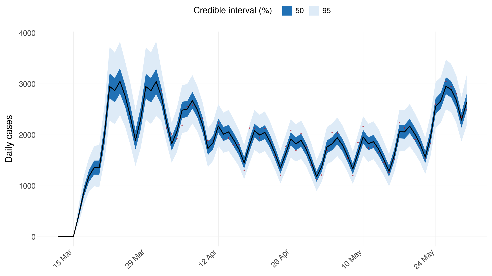
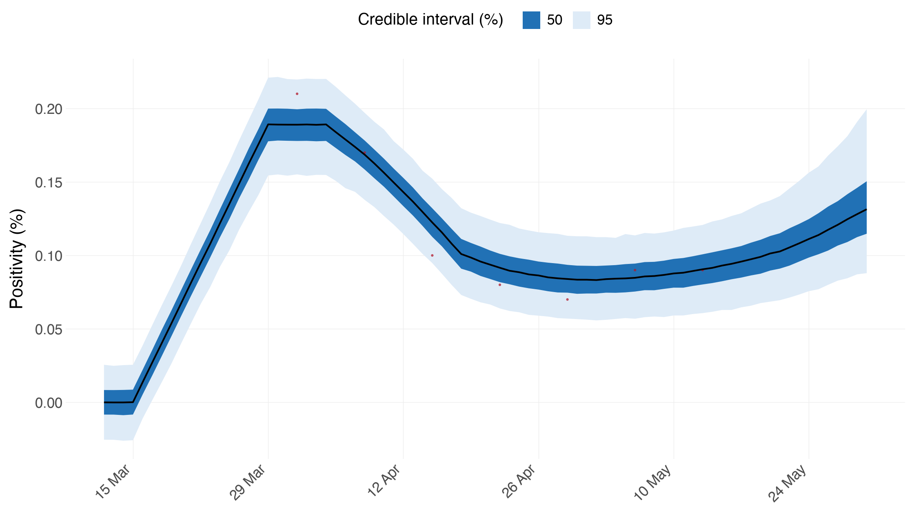
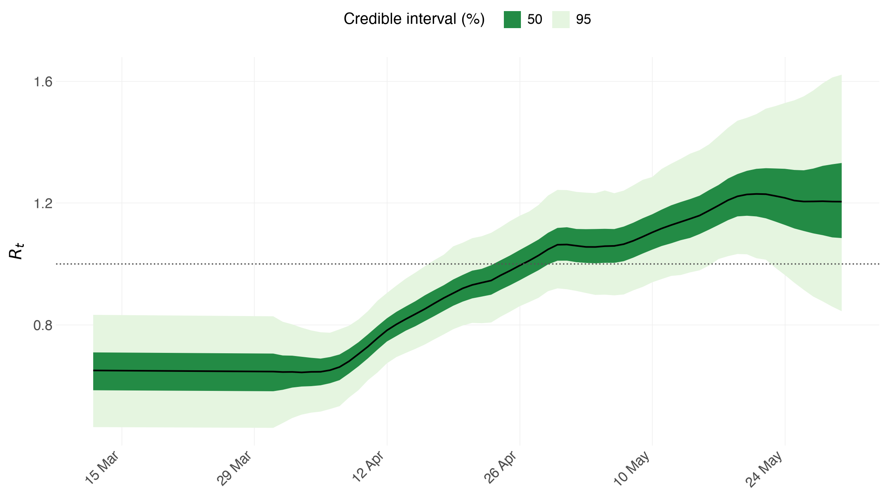
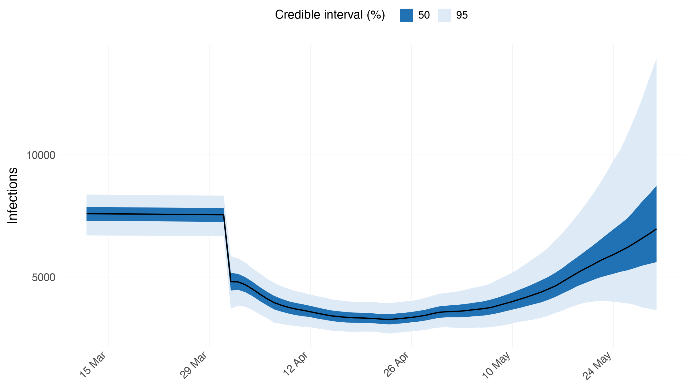
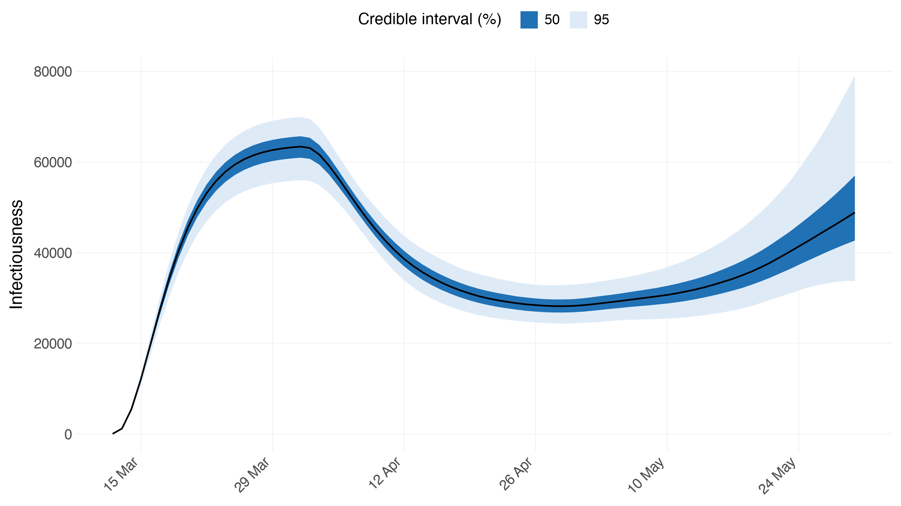
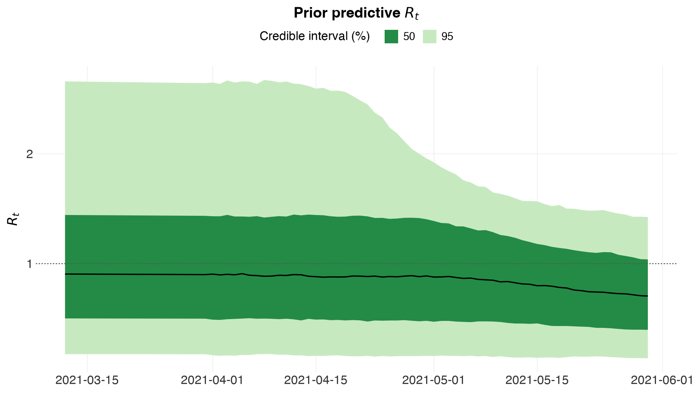

# Tracking SARS-CoV-2 in England

Python counterpart of the R vignette
[`multiple-obs`](https://mlgh-sg.com/epidemia2/articles/multiple-obs.html).

One region, **two very different data streams**. Daily case counts are
plentiful but only a fraction of infections and heavily patterned by day of
week. Weekly ONS positivity estimates are sparse — seven numbers — but they
are a direct estimate of the *prevalence* of infection, with no ascertainment
rate in the way. Fitting both lets each do the job it is suited to: the cases
pin down the shape, the survey pins down the level.

This is the tutorial to read for three things the others do not show:
**series observed on different days**, **day-of-week effects**, and an
observation model whose kernel deliberately does not sum to one.


```python
import numpy as np
import pandas as pd
import arviz as az

import epidemia
from epidemia.core import (
    EpiModelConfig,
    ObsModel,
    PanelData,
    RandomWalk,
    build_epidemia_model,
    fit_epidemia,
)
from epidemia.priors import normal
```

## Data

`england_new_cases()` is PHE's "New Cases by Specimen Date" for England. We fit
the last 80 days, of which the first 20 are the seeding period — the model is
not conditioned on case counts there, which is what the mask below expresses.


```python
cases_df = epidemia.england_new_cases()
cases_df = cases_df[cases_df["date"] > cases_df["date"].max() - pd.Timedelta(days=80)]
cases_df = cases_df.reset_index(drop=True)

T = len(cases_df)
dates = pd.to_datetime(cases_df["date"]).reset_index(drop=True)
cases = cases_df["cases"].to_numpy(dtype=float)
SEED_DAYS = 20
POP = 56_000_000                       # England, roughly

print(f"{T} days, {dates.iloc[0].date()} to {dates.iloc[-1].date()}")
print(f"seeding period: first {SEED_DAYS} days (cases not fitted there)")
```

    80 days, 2021-03-12 to 2021-05-30
    seeding period: first 20 days (cases not fitted there)


The ONS Infection Survey publishes weekly positivity estimates. We take seven
weeks from the 1st of April and place each on the Thursday of its week.


```python
ons_dates = pd.to_datetime("2021-04-01") + pd.to_timedelta(7 * np.arange(7), "D")
ons_values = np.array([0.21, 0.17, 0.10, 0.08, 0.07, 0.09, 0.09])

positivity = np.full(T, np.nan)
for d, v in zip(ons_dates, ons_values):
    hit = np.where(dates == d)[0]
    if hit.size:
        positivity[hit[0]] = v

print(f"{int(np.isfinite(positivity).sum())} of {T} days carry an ONS estimate")
```

    7 of 80 days carry an ONS estimate


## The panel

One region, no covariates on `R_t`.


```python
M = 1
panel = PanelData(
    X=np.zeros((M, T, 0)),
    lengths=np.array([T]),
    regions=["England"],
    npis=[],
    dates=[dates.to_numpy()],
    pops=np.array([POP], dtype=float),
)
```

## Transmission

$R_t = 7\,g^{-1}(\beta_0 + w_t)$ with a logit link, so $R_t$ is confined to
$[0, 7]$. The walk is daily.

The R vignette does something worth copying: it builds a `dt` column that is
`NA` before the 1st of April, which keeps the walk out of the window where
there is no data to constrain it. `RandomWalk(index=-1)` is the Python
spelling of that `NA` — those days take the walk's $w = 0$ initial condition.

It matters more than it looks. Giving the seeding days the walk's *first step*
instead leaves that step confounded with the intercept, since both just shift
the level: the fit comes back with `r_hat` 1.03 on `intercept` and no
divergences to hint at why.


```python
# -1 means "no walk term on this day" -- R's NA in the rw(time =) column. The
# seeding days take the walk's w = 0 initial condition rather than its first
# step, which is a free parameter and would be confounded with the intercept.
rw_index = np.where(np.arange(T) < SEED_DAYS, -1, np.arange(T) - SEED_DAYS)
config = EpiModelConfig(
    gen=epidemia.europe_covid().si,
    link="scaled_logit",
    R_link_K=7.0,
    intercept=True,
    prior_intercept=normal(-1.0, 1.0),
    region_effects=False,
    rw=RandomWalk(index=np.tile(rw_index, (M, 1)), prior_scale=0.05),
    seed_days=SEED_DAYS,
    prior_seeds=normal(15e3, 2e3),
    pop_adjust=True,
    prior_susc_mean=0.49,
    prior_susc_sd=0.1,
)

print(f"walk steps: {rw_index.max() + 1} "
      f"(no walk term for the first {SEED_DAYS} days)")
```

    walk steps: 60 (no walk term for the first 20 days)


## Series 1 — case counts

Cases are a delayed, partially ascertained view of infections: undetected for
three days, then reported with equal probability over the following week. The
ascertainment rate gets a logit link and its own daily random walk, because
testing capacity changed over the period.

**Day-of-week effects** matter here — reporting dips at weekends — so the
ascertainment regression carries six dummies (Monday is the reference level,
absorbed by the intercept). This is R's
`factor(day, ordered = FALSE)`.

The family is `quasi_poisson`: variance proportional to the mean, which is
R's parameterisation `neg_binomial_2(E, E/aux)`.


```python
dow = dates.dt.dayofweek.to_numpy()
X_dow = np.zeros((M, T, 6))
for k in range(6):
    X_dow[0, :, k] = (dow == k + 1).astype(float)      # Mon is the reference

obs_cases = ObsModel(
    name="cases",
    y=cases[None, :],
    mask=(np.arange(T) >= SEED_DAYS)[None, :],         # not fitted while seeding
    i2o=np.concatenate([np.zeros(3), np.full(7, 1 / 7)]),
    family="quasi_poisson",
    link="logit",
    X=X_dow,
    intercept=True,
    prior_intercept=normal(0.0, 1.5),
    prior=normal(0.0, 0.5),
    prior_aux=normal(10.0, 5.0),
    rw=RandomWalk(index=np.tile(rw_index, (M, 1)), prior_scale=0.05),
)
```

## Series 2 — ONS positivity

This one does not fit the usual template, and the R vignette is explicit about
it. Positivity is the *proportion of the population currently infected*:

$$ y^{(2)}_t = \frac{\sum_{s=1}^{14} i_{t-s-3}}{P} $$

— everyone infected in the previous three days tests negative, everyone
infected in the two weeks before that tests positive. There is no
ascertainment rate at all, and the weights deliberately **do not sum to one**:
they sum to 14, then get divided by the population and multiplied by 100 to
give a percentage. All of that is folded into `i2o`, with an `identity` link
and an offset of 1 so no parameter multiplies it.

The mask is what lets a weekly series sit in a daily model: only the seven
days carrying an estimate enter the likelihood.


```python
i2o_ons = np.concatenate([np.zeros(3), np.ones(14)]) * 100.0 / POP

obs_ons = ObsModel(
    name="positivity",
    y=np.nan_to_num(positivity)[None, :],
    mask=np.isfinite(positivity)[None, :],             # weekly, not daily
    i2o=i2o_ons,
    family="normal",
    link="identity",
    intercept=False,
    offset=np.ones((M, T)),
    prior_aux=normal(0.01, 2.5e-3),
)

print(f"i2o sums to {i2o_ons.sum():.3e} -- deliberately not 1")
```

    i2o sums to 2.500e-05 -- deliberately not 1


## Fitting

Both series go in as a list. Everything else is a single-series fit.

`target_accept=0.99` rather than the 0.95 the other tutorials use: the walk's
scale `rw_scale` sits in a funnel against the walk's own increments, and at
0.95 the sampler leaves a handful of divergent transitions and an R-hat above
1.01 on exactly that parameter. The diagnostics below are how that was found.


```python
idata = fit_epidemia(panel, [obs_cases, obs_ons], config,
                     draws=2000, tune=2000, chains=4, seed=12345,
                     target_accept=0.99, progress_bar=False)
```

    /Users/smishra/Documents/GitHub/epidemia/python/src/epidemia/multilevel.py:649: UserWarning: R-hat of 1.020 for rw_scale[0] exceeds 1.01, so the chains have not mixed.
    /Users/smishra/Documents/GitHub/epidemia/python/src/epidemia/multilevel.py:649: UserWarning: Bulk ESS of 260 for rw_scale[0] is 65 per chain, below the 100 per chain that keeps posterior summaries stable.


## Check the sampler first

This model does not sample cleanly, and it is worth being plain about why
rather than quietly raising the iteration count until the warning goes away.

There are **two random walks** here — one on $R_t$, one on case ascertainment
— and with a single region they compete for the same signal. A dip in reported
cases can be explained by transmission falling or by ascertainment falling,
and only the seven ONS positivity numbers distinguish them. The walk *scales*
are what absorb that ambiguity, so `rw_scale` is the parameter the diagnostics
complain about: its R-hat sits above 1.01 and its effective sample size stays
low even after doubling the draws, which is the signature of a geometry
problem rather than too short a run.

The R vignette meets the same wall and answers it the same way — it notes that
"in order to ensure a large enough effective sample size" it raises the tree
depth and uses 4,000 iterations. Treat the walk scales as poorly identified in
this specification and do not quote their intervals. The quantities the
tutorial is actually about — $R_t$, infections, the day-of-week effects — are
fine, which the summary below is the check for.


```python
print(epidemia.sampler_diagnostics(idata))
```

    Sampler diagnostics
    4 chains x 2000 post-warmup draws = 8000
    
     chain  divergent  max_treedepth  ebfmi
         1          0              0  0.886
         2          0              0  0.856
         3          0              0  0.821
         4          0              0  0.901
    
    Divergent transitions: 0 (0.0%)
    Hit max treedepth:     0 (0.0%)
    Lowest E-BFMI:         0.82
    Worst R-hat:           1.020  (rw_scale[0])
    Lowest bulk ESS:       260  (rw_scale[0])
    Lowest tail ESS:       447
    
    Warnings:
    * R-hat of 1.020 for rw_scale[0] exceeds 1.01, so the chains have not mixed.
    * Bulk ESS of 260 for rw_scale[0] is 65 per chain, below the 100 per chain that keeps posterior summaries stable.


```python
summ = az.summary(idata, var_names=["intercept", "cases|coef", "cases|aux",
                                    "positivity|aux"])
print(summ[["mean", "sd", "r_hat", "ess_bulk"]].to_string())
```

                      mean     sd  r_hat  ess_bulk
    intercept       -1.392  0.237   1.01     466.0
    cases|coef[0]   -0.047  0.089   1.00   12435.0
    cases|coef[1]    0.055  0.094   1.00   13145.0
    cases|coef[2]   -0.109  0.093   1.00   12864.0
    cases|coef[3]   -0.346  0.091   1.00   10565.0
    cases|coef[4]   -0.657  0.093   1.00   10656.0
    cases|coef[5]   -0.376  0.087   1.00   11464.0
    cases|aux       13.249  2.391   1.00    2558.0
    positivity|aux   0.013  0.002   1.00    2094.0


## Both series have to be explained

A joint model must fit everything it is conditioned on. `series=` picks one.


```python
epidemia.plot_obs(idata, data=panel, obs_model=obs_cases, series="cases",
                  ylab="Daily cases", levels=(50, 95), save=False)
```


    

    


```python
epidemia.plot_obs(idata, data=panel, obs_model=obs_ons, series="positivity",
                  ylab="Positivity (%)", levels=(50, 95), save=False)
```


    

    


The positivity panel has seven observations and a continuous predicted line
through them, which is exactly what a mask buys: the series constrains the
model only where it was measured.

## Reproduction numbers


```python
epidemia.plot_rt(idata, data=panel, levels=(50, 95), save=False)
```


    

    


## What the day-of-week effects look like

Reporting, not transmission. These shift the *ascertainment* rate, so they
explain the weekly sawtooth in the case counts without contaminating $R_t$.


```python
coef = np.asarray(idata.posterior["cases|coef"]).reshape(-1, 6)
days = ["Tue", "Wed", "Thu", "Fri", "Sat", "Sun"]
tbl = pd.DataFrame({
    "day": days,
    "median": np.percentile(coef, 50, axis=0),
    "5%": np.percentile(coef, 5, axis=0),
    "95%": np.percentile(coef, 95, axis=0),
})
print("logit-scale shift vs Monday:")
print(tbl.round(3).to_string(index=False))
```

    logit-scale shift vs Monday:
    day  median     5%    95%
    Tue  -0.047 -0.192  0.100
    Wed   0.054 -0.100  0.212
    Thu  -0.110 -0.261  0.045
    Fri  -0.344 -0.495 -0.196
    Sat  -0.656 -0.816 -0.507
    Sun  -0.375 -0.521 -0.233


## Infections and susceptibility

`pop_adjust=True` tracks the susceptible pool, so $R_t$ and the *effective*
reproduction number diverge as the epidemic depletes susceptibles.


```python
epidemia.plot_infections(idata, data=panel, levels=(50, 95), save=False)
```


    

    


```python
epidemia.plot_infectious(idata, config, data=panel, levels=(50, 95), save=False)
```


    

    


## Writing the same model as a formula

Everything above assembled design matrices by hand, which is explicit but a
long way from R, where the formula *is* the interface. `parse_formula` reads
R's syntax, and `build_from_formula` turns a long data frame plus a formula
straight into the panel and the config keywords — the closest thing here to
`epirt(formula = ...)`.


```python
from epidemia.formula import build_from_formula, parse_formula

spec = parse_formula("R(region, date) ~ 1 + rw(time = week)")
print("group column   :", spec.group)
print("date column    :", spec.date)
print("intercept      :", spec.intercept)
print("covariates     :", spec.covariates)
print("random walk    :", spec.rw)
```

    group column   : region
    date column    : date
    intercept      : True
    covariates     : []
    random walk    : [RwTerm(time='week', gr=None, prior_scale=0.2)]


Fed a data frame, it returns the same objects built by hand earlier, so the
formula route and the explicit route are interchangeable.


```python
demo = cases_df.assign(
    region="England",
    week=pd.to_datetime(cases_df["date"]).dt.strftime("%G-%V"),
    pop=POP,
)
panel_f, series_f, cfg_kw = build_from_formula(
    demo, "R(region, date) ~ 1 + rw(time = week)",
    responses=["cases"], pop="pop", threshold=1, seed_offset=SEED_DAYS,
)
print("panel regions  :", panel_f.regions)
print("panel shape    :", panel_f.X.shape)
print("series built   :", sorted(series_f))
print("config kwargs  :", sorted(cfg_kw))
```

    panel regions  : ['England']
    panel shape    : (1, 80, 0)
    series built   : ['cases']
    config kwargs  : ['correlated', 'intercept', 'region_effects', 'rw']


    /Users/smishra/Documents/GitHub/epidemia/python/src/epidemia/formula.py:586: UserWarning: 'England': only 0 day(s) before cumulative cases exceeded 1, fewer than seed_offset=20; starting at the first available day.


## Prior predictive checks

Before looking at any posterior it is worth asking what the priors alone
imply. `prior_PD=True` drops every likelihood term, so sampling the model
returns draws from the prior predictive — R's `epim(prior_PD = TRUE)`. If the
prior already rules out plausible epidemics, no amount of data will rescue the
fit.


```python
prior_cfg = EpiModelConfig(**{**config.__dict__, "prior_PD": True})
idata_prior = fit_epidemia(panel, [obs_cases, obs_ons], prior_cfg,
                           draws=500, tune=500, chains=2, seed=1,
                           progress_bar=False)

rt_prior = np.asarray(idata_prior.posterior["Rt"]).reshape(-1, T)
qs = np.percentile(rt_prior, [5, 50, 95])
print(f"prior R_t: median {qs[1]:.2f}, 90% interval [{qs[0]:.2f}, {qs[2]:.2f}]")
print(f"(the scaled_logit cap is {config.R_link_K}, so R_t cannot exceed it)")
```

    prior R_t: median 0.85, 90% interval [0.20, 2.14]
    (the scaled_logit cap is 7.0, so R_t cannot exceed it)


    /Users/smishra/Documents/GitHub/epidemia/python/src/epidemia/multilevel.py:649: UserWarning: R-hat of 1.020 for cases|rw[0, 11] exceeds 1.01, so the chains have not mixed.


```python
epidemia.plot_rt(idata_prior, data=panel, levels=(50, 95), save=False,
                 title="Prior predictive $R_t$")
```


    

    


## Caveats

The vignette this follows is candid that the positivity model is a
simplification: it assumes a test is definitively negative for three days and
definitively positive for the next fourteen, where the truth is a smooth
curve of test sensitivity against time since infection, and says nothing about
specificity. The case-ascertainment walk can absorb a great deal, so its
estimates should not be read as a measurement of testing capacity.
