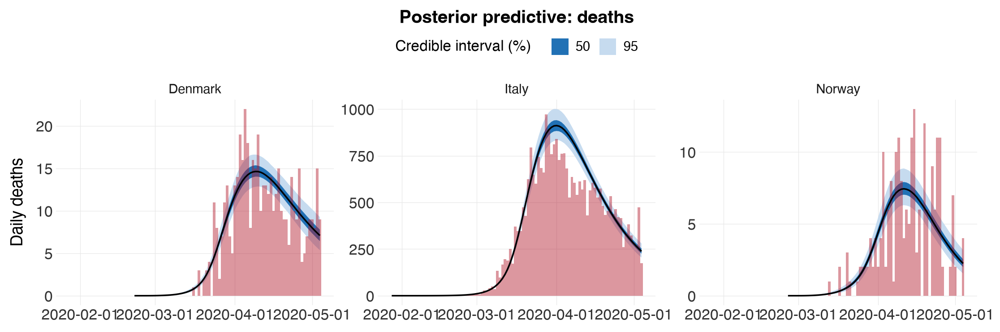
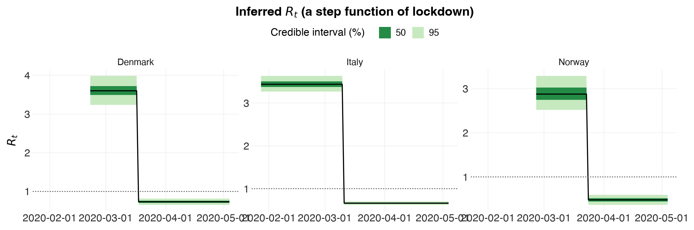
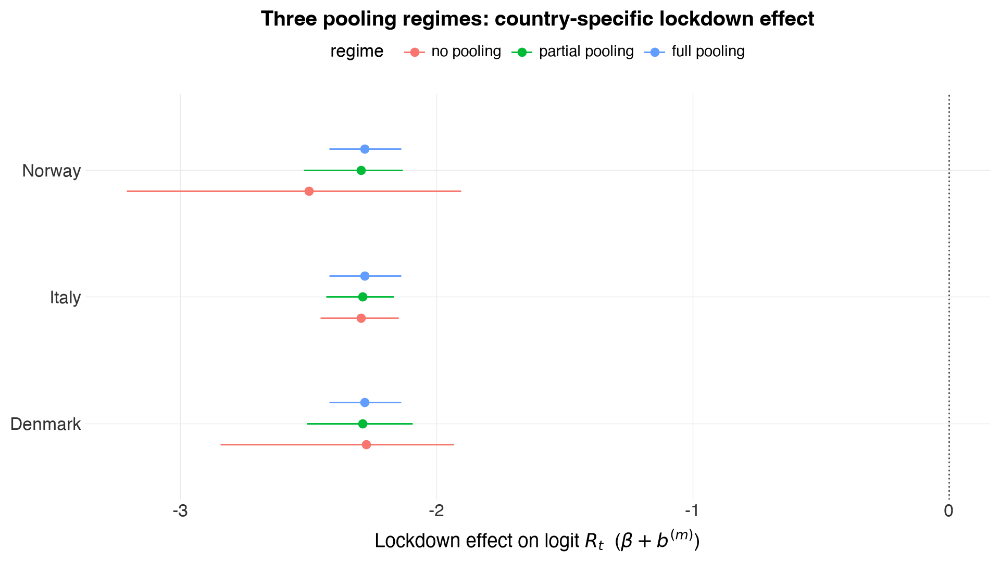
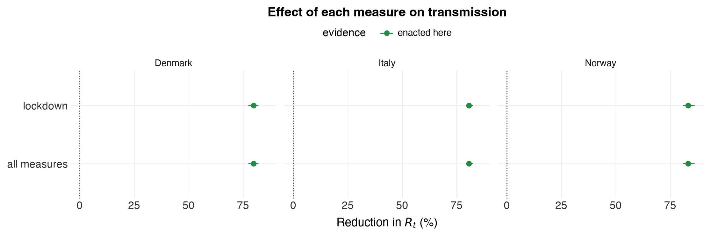

# Partial Pooling

Python counterpart of the R vignette
[`partial-pooling`](https://mlgh-sg.com/epidemia2/articles/partial-pooling.html).
This is a **jupytext** notebook stored as a plain `.py` file (percent format).

In the R package, parameters underlying the reproduction numbers are partially
pooled through a formula operator, `(expr | factor)` (or `(expr || factor)` for
independent effects). There is no formula mini-language in the Python port —
instead the pooling is expressed **directly as hierarchical priors** in the
PyMC model (`epidemia.multilevel`). This notebook explains the mapping and then
**demonstrates** the three regimes — no pooling, partial pooling, full pooling
— fitting each with **MCMC** (NUTS via nutpie), *not* Variational Bayes.


```python
import numpy as np
import pandas as pd
import arviz as az
from plotnine import aes, geom_hline, geom_pointrange, ggplot, labs, coord_flip, position_dodge

import epidemia as epi
from epidemia.plots import save_plot, theme_epidemia
```

## From R formulas to hierarchical priors

A term `(expr | factor)` says: the columns of the model matrix parsed from
`expr` have **separate effects per level of `factor`**, drawn from a **common
prior** whose parameters are themselves estimated — this is what shares
information across levels. The table below maps the R formula idioms
(`R(region, date) ~ ...`) to what the Python model does.

| R formula R.H.S.        | Pooling         | In `epidemia.multilevel` |
|-------------------------|-----------------|--------------------------|
| `1 + npi`               | **Full** pooling | one global `beta_npi`, shared by all regions |
| `1 + npi:region`        | **No** pooling   | an independent effect per region, flat/independent priors |
| `1 + (0 + npi \| region)` | **Partial** pooling | `beta_npi + b[region]`, with `b[region] ~ N(0, sigma_npi)` and `sigma_npi` estimated |
| `(npi \| region)`       | Partial pooling, correlated intercept+slope | multivariate-normal region effects |
| `(npi \|\| region)`      | Partial pooling, **independent** intercept+slope | `b[region,k] ~ N(0, sigma_k)`, one `sigma_k` per column |

The key statistical difference:

* **No pooling** gives each region its own free parameter — noisy where data
  are scarce (early epidemic, small regions).
* **Full pooling** forces one shared value — hides genuine between-region
  variation.
* **Partial pooling** estimates a common distribution $N(0, \sigma_k)$ and lets
  each region's effect deviate from the global mean by an amount **shrunk**
  toward zero; $\sigma_k$ (estimated) controls how much. It interpolates
  between the two extremes and is what the Europe/COVID example uses.

The `epidemia.multilevel` model implements the last two rows: fixed global
effects `beta_k` **plus** partially-pooled region deviations `b[region, k]`
with `b[region, k] ~ N(0, sigma_k)` (the `||`, independent-effects, case).

### Selecting a regime

What separates the three regimes is **what happens to $\sigma_k$**, the
between-region SD:

| Regime | $\sigma_k$ | `MultilevelConfig` |
|--------|-----------|--------------------|
| Partial pooling | estimated from the data | `config.pooling("partial")` (the default) |
| No pooling | fixed large — the prior barely constrains `b[m]`, so each region is free | `config.pooling("none")` |
| Full pooling | fixed ~0 — every region collapses onto the global $\beta_k$ | `config.pooling("full")` |

> **Do not fake no-pooling by inflating the Gamma prior's *shape*** (e.g.
> `sd_slope_shape=1e6`). That puts $\sigma_k$ itself near $10^6$, so
> `b = sigma * z` lands around $N(0, 10^6)$, $\eta$ saturates the
> `scaled_logit(6.5)` link, and every $R_t$ collapses to exactly 0 or 6.5.
> That is a broken prior, not an unpooled model. `pooling("none")` fixes
> $\sigma_k$ at a large-but-sane value instead.

## A worked demonstration

We use a small slice of the Europe/COVID data — three countries and a single
intervention (`lockdown`) — so the three regimes fit quickly and the shrinkage
is easy to see. (See the [europe-covid](europe-covid.md) notebook for the full
11-country, 5-NPI analysis.)

**The countries are chosen for their contrast in *how much data they carry***,
which is what shrinkage responds to. Italy has ~29,000 deaths in the window;
Denmark has ~500 and Norway ~200. Norway's own data pin its lockdown effect
only loosely, so it is the country with the most to gain from borrowing
strength — and the one to watch below.

> **Why not Sweden, the famous case?** Sweden never locked down, so with
> `lockdown` as the only covariate it would have *nothing* that ever switches
> on: its $R_t$ would be pinned to a constant, and (since its epidemic was
> growing when the window opens) a constant above one. The model then could not
> reproduce Sweden's deaths falling at all, and that misfit would leak into
> every shared parameter. Sweden *did* suppress its epidemic, with softer
> measures — which is exactly why it belongs in the full 5-NPI
> [europe-covid](europe-covid.md) analysis, where those measures exist, rather
> than in a one-covariate demo that cannot represent it. Adding a softer
> measure here would not rescue it either: the measures were enacted within days
> of each other, so a second covariate is collinear with `lockdown` and simply
> takes the effect over. Identifiability, not Sweden, is the lesson there.


```python
ec = epi.europe_covid2()
subset = ec.data[ec.data["country"].isin(["Italy", "Norway", "Denmark"])].copy()
npis = ["lockdown"]
fit = epi.prepare_panel(subset, npis, seed_offset=30, death_threshold=10,
                        fit_until="2020-05-05")
print("regions:", fit.regions, "| days:", dict(zip(fit.regions, fit.lengths.tolist())))
print(f"\n{'country':9s}{'lockdown days':>16s}{'total deaths':>15s}")
for m, r in enumerate(fit.regions):
    n = int(fit.lengths[m])
    print(f"{r:9s}{int(fit.X[m, :n, 0].sum()):>10d} of {n:<4d}"
          f"{int(fit.deaths[m, :n].sum()):>15d}")
print("\nAll three locked down, so the effect is identified in each. What differs is")
print("how much data each brings: Italy ~140x Norway. That is what pooling acts on.")
```

    regions: ['Denmark', 'Italy', 'Norway'] | days: {'Denmark': 73, 'Italy': 98, 'Norway': 69}
    
    country     lockdown days   total deaths
    Denmark          48 of 73              484
    Italy            55 of 98            28884
    Norway           42 of 69              208
    
    All three locked down, so the effect is identified in each. What differs is
    how much data each brings: Italy ~140x Norway. That is what pooling acts on.


### Partial pooling

The default `MultilevelConfig` partially pools the region effects. We estimate
the country-specific lockdown effect $\beta + b^{(m)}$ for each country and the
between-country SD $\sigma_\text{lockdown}$.


```python
config = epi.MultilevelConfig(gen=ec.si, i2o=ec.inf2death, seed_days=6)
idata_pp = epi.fit_multilevel(fit, config.pooling("partial"), draws=500, tune=1000,
                              chains=4, seed=1)
print("divergences:", int(idata_pp.sample_stats["diverging"].sum()))
az.summary(idata_pp, var_names=["beta", "sd"])
```

    [epidemia] compiling the log-density (numba backend)... 

    done in 21.0s


    [epidemia] sampling 4 chains x (1000 tune + 500 draws)


<style>
    :root {
        --column-width-1: 40%; /* Progress column width */
        --column-width-2: 15%; /* Chain column width */
        --column-width-3: 15%; /* Divergences column width */
        --column-width-4: 15%; /* Step Size column width */
        --column-width-5: 15%; /* Gradients/Draw column width */
    }

    .nutpie {
        max-width: 800px;
        margin: 10px auto;
        font-family: 'Segoe UI', Tahoma, Geneva, Verdana, sans-serif;
        //color: #333;
        //background-color: #fff;
        padding: 10px;
        box-shadow: 0 4px 6px rgba(0,0,0,0.1);
        border-radius: 8px;
        font-size: 14px; /* Smaller font size for a more compact look */
    }
    .nutpie table {
        width: 100%;
        border-collapse: collapse; /* Remove any extra space between borders */
    }
    .nutpie th, .nutpie td {
        padding: 8px 10px; /* Reduce padding to make table more compact */
        text-align: left;
        border-bottom: 1px solid #888;
    }
    .nutpie th {
        //background-color: #f0f0f0;
    }

    .nutpie th:nth-child(1) { width: var(--column-width-1); }
    .nutpie th:nth-child(2) { width: var(--column-width-2); }
    .nutpie th:nth-child(3) { width: var(--column-width-3); }
    .nutpie th:nth-child(4) { width: var(--column-width-4); }
    .nutpie th:nth-child(5) { width: var(--column-width-5); }

    .nutpie progress {
        width: 100%;
        height: 15px; /* Smaller progress bars */
        border-radius: 5px;
    }
    progress::-webkit-progress-bar {
        background-color: #eee;
        border-radius: 5px;
    }
    progress::-webkit-progress-value {
        background-color: #5cb85c;
        border-radius: 5px;
    }
    progress::-moz-progress-bar {
        background-color: #5cb85c;
        border-radius: 5px;
    }
    .nutpie .progress-cell {
        width: 100%;
    }

    .nutpie p strong { font-size: 16px; font-weight: bold; }

    @media (prefers-color-scheme: dark) {
        .nutpie {
            //color: #ddd;
            //background-color: #1e1e1e;
            box-shadow: 0 4px 6px rgba(0,0,0,0.2);
        }
        .nutpie table, .nutpie th, .nutpie td {
            border-color: #555;
            color: #ccc;
        }
        .nutpie th {
            background-color: #2a2a2a;
        }
        .nutpie progress::-webkit-progress-bar {
            background-color: #444;
        }
        .nutpie progress::-webkit-progress-value {
            background-color: #3178c6;
        }
        .nutpie progress::-moz-progress-bar {
            background-color: #3178c6;
        }
    }
</style>


<div class="nutpie">
    <p><strong>Sampler Progress</strong></p>
    <p>Total Chains: <span id="total-chains">4</span></p>
    <p>Active Chains: <span id="active-chains">0</span></p>
    <p>
        Finished Chains:
        <span id="active-chains">4</span>
    </p>
    <p>Sampling for a minute</p>
    <p>
        Estimated Time to Completion:
        <span id="eta">now</span>
    </p>

    <progress
        id="total-progress-bar"
        max="6000"
        value="6000">
    </progress>
    <table>
        <thead>
            <tr>
                <th>Progress</th>
                <th>Draws</th>
                <th>Divergences</th>
                <th>Step Size</th>
                <th>Gradients/Draw</th>
            </tr>
        </thead>
        <tbody id="chain-details">

                <tr>
                    <td class="progress-cell">
                        <progress
                            max="1500"
                            value="1500">
                        </progress>
                    </td>
                    <td>1500</td>
                    <td>8</td>
                    <td>0.14</td>
                    <td>31</td>
                </tr>

                <tr>
                    <td class="progress-cell">
                        <progress
                            max="1500"
                            value="1500">
                        </progress>
                    </td>
                    <td>1500</td>
                    <td>0</td>
                    <td>0.13</td>
                    <td>63</td>
                </tr>

                <tr>
                    <td class="progress-cell">
                        <progress
                            max="1500"
                            value="1500">
                        </progress>
                    </td>
                    <td>1500</td>
                    <td>0</td>
                    <td>0.15</td>
                    <td>31</td>
                </tr>

                <tr>
                    <td class="progress-cell">
                        <progress
                            max="1500"
                            value="1500">
                        </progress>
                    </td>
                    <td>1500</td>
                    <td>0</td>
                    <td>0.11</td>
                    <td>31</td>
                </tr>

            </tr>
        </tbody>
    </table>
</div>


    [epidemia] sampled in 62.6s


    divergences: 8


    /var/folders/3b/9h2hhrtd6m10021mpjqtv6s40000gn/T/ipykernel_5285/3251248008.py:2: UserWarning: 8 of 2000 post-warmup draws diverged. The posterior is likely biased -- treat the intervals with suspicion. Try a higher target_accept (e.g. 0.99), more tuning, or adaptation='low_rank'.


<div>
<style scoped>
    .dataframe tbody tr th:only-of-type {
        vertical-align: middle;
    }

    .dataframe tbody tr th {
        vertical-align: top;
    }

    .dataframe thead th {
        text-align: right;
    }
</style>
<table border="1" class="dataframe">
  <thead>
    <tr style="text-align: right;">
      <th></th>
      <th>mean</th>
      <th>sd</th>
      <th>hdi_3%</th>
      <th>hdi_97%</th>
      <th>mcse_mean</th>
      <th>mcse_sd</th>
      <th>ess_bulk</th>
      <th>ess_tail</th>
      <th>r_hat</th>
    </tr>
  </thead>
  <tbody>
    <tr>
      <th>beta[lockdown]</th>
      <td>-2.288</td>
      <td>0.108</td>
      <td>-2.515</td>
      <td>-2.094</td>
      <td>0.006</td>
      <td>0.006</td>
      <td>330.0</td>
      <td>134.0</td>
      <td>1.02</td>
    </tr>
    <tr>
      <th>sd[0]</th>
      <td>0.310</td>
      <td>0.171</td>
      <td>0.080</td>
      <td>0.667</td>
      <td>0.018</td>
      <td>0.008</td>
      <td>64.0</td>
      <td>298.0</td>
      <td>1.05</td>
    </tr>
    <tr>
      <th>sd[1]</th>
      <td>0.074</td>
      <td>0.099</td>
      <td>0.000</td>
      <td>0.268</td>
      <td>0.008</td>
      <td>0.010</td>
      <td>183.0</td>
      <td>175.0</td>
      <td>1.02</td>
    </tr>
  </tbody>
</table>
</div>


#### Does it actually fit?

Before reading any effect size, look at the fit itself — one panel per country.
`Rt`, `infections` and `E_deaths` are indexed by `region` in the posterior, so
passing the `fit` panel as `data=` places each country on **its own** dates
(country $m$'s column $t$ is a different calendar day from country $n$'s) and
drops its padded tail. Every plot is written to `figures/` by default.


```python
epi.plots.plot_obs(idata_pp, data=fit, save="pp-deaths-ppc",
                   title="Posterior predictive: deaths")
```

    [epidemia] saved figures/pp-deaths-ppc.png


    

    


```python
epi.plots.plot_rt(idata_pp, data=fit, save="pp-rt",
                  title="Inferred $R_t$ (a step function of lockdown)")
```

    [epidemia] saved figures/pp-rt.png


    

    


Each country steps down at *its own* lockdown date — the model has no
random walk here, so $R_t$ is a two-level step function by construction: one
level before, one after. Each also starts from its **own** baseline $R_0$,
which is what the country-specific intercepts $b^{(m)}_0$ buy you. Without
them every country would be forced to share one baseline, and the lockdown
effect would have to absorb the difference.


```python
b0 = np.asarray(idata_pp.posterior["b0"].stack(s=("chain", "draw")))
R0 = 6.5 / (1.0 + np.exp(-b0))
print("Baseline R_0 per country (before lockdown):")
for m, r in enumerate(fit.regions):
    print(f"  {r:8s} {np.median(R0[m]):.2f}  "
          f"[{np.percentile(R0[m], 5):.2f}, {np.percentile(R0[m], 95):.2f}]")
```

    Baseline R_0 per country (before lockdown):
      Denmark  3.60  [3.30, 3.92]
      Italy    3.43  [3.29, 3.60]
      Norway   2.87  [2.57, 3.23]


### No pooling, and full pooling

Now the two extremes, via `config.pooling(...)`. "No pooling" fixes
$\sigma_\text{lockdown}$ large so each country's `b[m]` is effectively free;
"full pooling" fixes it at ~0 so every country is forced onto the single
global $\beta$.


```python
def per_country_effect(idata):
    """Country-specific lockdown effect beta + b[region] from a pooled fit."""
    post = idata.posterior
    beta = np.asarray(post["beta"].sel(npi="lockdown").stack(s=("chain", "draw")))
    return {
        str(r): beta + np.asarray(
            post["b"].sel(region=r, npi="lockdown").stack(s=("chain", "draw"))
        )
        for r in post.coords["region"].values
    }


idata_np = epi.fit_multilevel(fit, config.pooling("none"), draws=500, tune=1000,
                              chains=4, seed=1)
idata_fp = epi.fit_multilevel(fit, config.pooling("full"), draws=500, tune=1000,
                              chains=4, seed=1)

eff = {
    "partial pooling": per_country_effect(idata_pp),
    "no pooling": per_country_effect(idata_np),
    "full pooling": per_country_effect(idata_fp),
}
```

    [epidemia] compiling the log-density (numba backend)... 

    done in 20.3s


    [epidemia] sampling 4 chains x (1000 tune + 500 draws)


<style>
    :root {
        --column-width-1: 40%; /* Progress column width */
        --column-width-2: 15%; /* Chain column width */
        --column-width-3: 15%; /* Divergences column width */
        --column-width-4: 15%; /* Step Size column width */
        --column-width-5: 15%; /* Gradients/Draw column width */
    }

    .nutpie {
        max-width: 800px;
        margin: 10px auto;
        font-family: 'Segoe UI', Tahoma, Geneva, Verdana, sans-serif;
        //color: #333;
        //background-color: #fff;
        padding: 10px;
        box-shadow: 0 4px 6px rgba(0,0,0,0.1);
        border-radius: 8px;
        font-size: 14px; /* Smaller font size for a more compact look */
    }
    .nutpie table {
        width: 100%;
        border-collapse: collapse; /* Remove any extra space between borders */
    }
    .nutpie th, .nutpie td {
        padding: 8px 10px; /* Reduce padding to make table more compact */
        text-align: left;
        border-bottom: 1px solid #888;
    }
    .nutpie th {
        //background-color: #f0f0f0;
    }

    .nutpie th:nth-child(1) { width: var(--column-width-1); }
    .nutpie th:nth-child(2) { width: var(--column-width-2); }
    .nutpie th:nth-child(3) { width: var(--column-width-3); }
    .nutpie th:nth-child(4) { width: var(--column-width-4); }
    .nutpie th:nth-child(5) { width: var(--column-width-5); }

    .nutpie progress {
        width: 100%;
        height: 15px; /* Smaller progress bars */
        border-radius: 5px;
    }
    progress::-webkit-progress-bar {
        background-color: #eee;
        border-radius: 5px;
    }
    progress::-webkit-progress-value {
        background-color: #5cb85c;
        border-radius: 5px;
    }
    progress::-moz-progress-bar {
        background-color: #5cb85c;
        border-radius: 5px;
    }
    .nutpie .progress-cell {
        width: 100%;
    }

    .nutpie p strong { font-size: 16px; font-weight: bold; }

    @media (prefers-color-scheme: dark) {
        .nutpie {
            //color: #ddd;
            //background-color: #1e1e1e;
            box-shadow: 0 4px 6px rgba(0,0,0,0.2);
        }
        .nutpie table, .nutpie th, .nutpie td {
            border-color: #555;
            color: #ccc;
        }
        .nutpie th {
            background-color: #2a2a2a;
        }
        .nutpie progress::-webkit-progress-bar {
            background-color: #444;
        }
        .nutpie progress::-webkit-progress-value {
            background-color: #3178c6;
        }
        .nutpie progress::-moz-progress-bar {
            background-color: #3178c6;
        }
    }
</style>


<div class="nutpie">
    <p><strong>Sampler Progress</strong></p>
    <p>Total Chains: <span id="total-chains">4</span></p>
    <p>Active Chains: <span id="active-chains">0</span></p>
    <p>
        Finished Chains:
        <span id="active-chains">4</span>
    </p>
    <p>Sampling for a minute</p>
    <p>
        Estimated Time to Completion:
        <span id="eta">now</span>
    </p>

    <progress
        id="total-progress-bar"
        max="6000"
        value="6000">
    </progress>
    <table>
        <thead>
            <tr>
                <th>Progress</th>
                <th>Draws</th>
                <th>Divergences</th>
                <th>Step Size</th>
                <th>Gradients/Draw</th>
            </tr>
        </thead>
        <tbody id="chain-details">

                <tr>
                    <td class="progress-cell">
                        <progress
                            max="1500"
                            value="1500">
                        </progress>
                    </td>
                    <td>1500</td>
                    <td>6</td>
                    <td>0.09</td>
                    <td>31</td>
                </tr>

                <tr>
                    <td class="progress-cell">
                        <progress
                            max="1500"
                            value="1500">
                        </progress>
                    </td>
                    <td>1500</td>
                    <td>5</td>
                    <td>0.08</td>
                    <td>127</td>
                </tr>

                <tr>
                    <td class="progress-cell">
                        <progress
                            max="1500"
                            value="1500">
                        </progress>
                    </td>
                    <td>1500</td>
                    <td>3</td>
                    <td>0.09</td>
                    <td>127</td>
                </tr>

                <tr>
                    <td class="progress-cell">
                        <progress
                            max="1500"
                            value="1500">
                        </progress>
                    </td>
                    <td>1500</td>
                    <td>4</td>
                    <td>0.08</td>
                    <td>63</td>
                </tr>

            </tr>
        </tbody>
    </table>
</div>


    [epidemia] sampled in 82.9s


    [epidemia] compiling the log-density (numba backend)... 

    /var/folders/3b/9h2hhrtd6m10021mpjqtv6s40000gn/T/ipykernel_5285/3963452909.py:13: UserWarning: 18 of 2000 post-warmup draws diverged. The posterior is likely biased -- treat the intervals with suspicion. Try a higher target_accept (e.g. 0.99), more tuning, or adaptation='low_rank'.


    done in 20.4s


    [epidemia] sampling 4 chains x (1000 tune + 500 draws)


<style>
    :root {
        --column-width-1: 40%; /* Progress column width */
        --column-width-2: 15%; /* Chain column width */
        --column-width-3: 15%; /* Divergences column width */
        --column-width-4: 15%; /* Step Size column width */
        --column-width-5: 15%; /* Gradients/Draw column width */
    }

    .nutpie {
        max-width: 800px;
        margin: 10px auto;
        font-family: 'Segoe UI', Tahoma, Geneva, Verdana, sans-serif;
        //color: #333;
        //background-color: #fff;
        padding: 10px;
        box-shadow: 0 4px 6px rgba(0,0,0,0.1);
        border-radius: 8px;
        font-size: 14px; /* Smaller font size for a more compact look */
    }
    .nutpie table {
        width: 100%;
        border-collapse: collapse; /* Remove any extra space between borders */
    }
    .nutpie th, .nutpie td {
        padding: 8px 10px; /* Reduce padding to make table more compact */
        text-align: left;
        border-bottom: 1px solid #888;
    }
    .nutpie th {
        //background-color: #f0f0f0;
    }

    .nutpie th:nth-child(1) { width: var(--column-width-1); }
    .nutpie th:nth-child(2) { width: var(--column-width-2); }
    .nutpie th:nth-child(3) { width: var(--column-width-3); }
    .nutpie th:nth-child(4) { width: var(--column-width-4); }
    .nutpie th:nth-child(5) { width: var(--column-width-5); }

    .nutpie progress {
        width: 100%;
        height: 15px; /* Smaller progress bars */
        border-radius: 5px;
    }
    progress::-webkit-progress-bar {
        background-color: #eee;
        border-radius: 5px;
    }
    progress::-webkit-progress-value {
        background-color: #5cb85c;
        border-radius: 5px;
    }
    progress::-moz-progress-bar {
        background-color: #5cb85c;
        border-radius: 5px;
    }
    .nutpie .progress-cell {
        width: 100%;
    }

    .nutpie p strong { font-size: 16px; font-weight: bold; }

    @media (prefers-color-scheme: dark) {
        .nutpie {
            //color: #ddd;
            //background-color: #1e1e1e;
            box-shadow: 0 4px 6px rgba(0,0,0,0.2);
        }
        .nutpie table, .nutpie th, .nutpie td {
            border-color: #555;
            color: #ccc;
        }
        .nutpie th {
            background-color: #2a2a2a;
        }
        .nutpie progress::-webkit-progress-bar {
            background-color: #444;
        }
        .nutpie progress::-webkit-progress-value {
            background-color: #3178c6;
        }
        .nutpie progress::-moz-progress-bar {
            background-color: #3178c6;
        }
    }
</style>


<div class="nutpie">
    <p><strong>Sampler Progress</strong></p>
    <p>Total Chains: <span id="total-chains">4</span></p>
    <p>Active Chains: <span id="active-chains">0</span></p>
    <p>
        Finished Chains:
        <span id="active-chains">4</span>
    </p>
    <p>Sampling for 19 seconds</p>
    <p>
        Estimated Time to Completion:
        <span id="eta">now</span>
    </p>

    <progress
        id="total-progress-bar"
        max="6000"
        value="6000">
    </progress>
    <table>
        <thead>
            <tr>
                <th>Progress</th>
                <th>Draws</th>
                <th>Divergences</th>
                <th>Step Size</th>
                <th>Gradients/Draw</th>
            </tr>
        </thead>
        <tbody id="chain-details">

                <tr>
                    <td class="progress-cell">
                        <progress
                            max="1500"
                            value="1500">
                        </progress>
                    </td>
                    <td>1500</td>
                    <td>0</td>
                    <td>0.19</td>
                    <td>15</td>
                </tr>

                <tr>
                    <td class="progress-cell">
                        <progress
                            max="1500"
                            value="1500">
                        </progress>
                    </td>
                    <td>1500</td>
                    <td>2</td>
                    <td>0.21</td>
                    <td>15</td>
                </tr>

                <tr>
                    <td class="progress-cell">
                        <progress
                            max="1500"
                            value="1500">
                        </progress>
                    </td>
                    <td>1500</td>
                    <td>28</td>
                    <td>0.20</td>
                    <td>15</td>
                </tr>

                <tr>
                    <td class="progress-cell">
                        <progress
                            max="1500"
                            value="1500">
                        </progress>
                    </td>
                    <td>1500</td>
                    <td>4</td>
                    <td>0.20</td>
                    <td>31</td>
                </tr>

            </tr>
        </tbody>
    </table>
</div>


    [epidemia] sampled in 19.7s


    /var/folders/3b/9h2hhrtd6m10021mpjqtv6s40000gn/T/ipykernel_5285/3963452909.py:15: UserWarning: 34 of 2000 post-warmup draws diverged. The posterior is likely biased -- treat the intervals with suspicion. Try a higher target_accept (e.g. 0.99), more tuning, or adaptation='low_rank'.


### Comparison

Plotting the country-specific lockdown effect under all three regimes shows
**shrinkage**, and shows that it is *selective*. Watch **Norway** — 208 deaths
against Italy's 28,884. Under no pooling its interval is wide, because that is
honestly all its own data support. Under partial pooling it tightens and moves
toward the others' consensus. Italy barely moves at all: it has enough data of
its own that the shared prior has nothing to tell it.

That asymmetry is the point. Partial pooling is not an averaging-together; it
lends precision where precision is missing and gets out of the way where it is
not. Full pooling, by contrast, collapses all three to one number regardless of
what any of them knew.


```python
rows = [
    {"country": country, "regime": regime,
     "median": np.median(draws),
     "lo": np.percentile(draws, 5), "hi": np.percentile(draws, 95)}
    for regime, e in eff.items() for country, draws in e.items()
]
comp = pd.DataFrame(rows)
comp["regime"] = pd.Categorical(
    comp["regime"], categories=["no pooling", "partial pooling", "full pooling"]
)
p = (
    ggplot(comp, aes("country", "median", color="regime"))
    + geom_hline(yintercept=0.0, linetype="dotted", color="#555555")
    + geom_pointrange(aes(ymin="lo", ymax="hi"), position=position_dodge(width=0.5))
    + coord_flip()
    + labs(x="", y="Lockdown effect on logit $R_t$  ($\\beta + b^{(m)}$)",
           title="Three pooling regimes: country-specific lockdown effect")
    + theme_epidemia()
)
save_plot(p, "pooling-comparison")
p
```

    [epidemia] saved figures/pooling-comparison.png


    

    


```python
print(comp.pivot(index="country", columns="regime", values="median").round(2).to_string())
print("\ninterval width (95% - 5%):")
w = comp.assign(width=comp.hi - comp.lo)
print(w.pivot(index="country", columns="regime", values="width").round(2).to_string())
print("\nbetween-country SD sigma_lockdown under partial pooling:")
sd = np.asarray(idata_pp.posterior["sd"].stack(s=("chain", "draw")))[1]
print(f"  median {np.median(sd):.3f}  90% CI [{np.percentile(sd, 5):.3f}, "
      f"{np.percentile(sd, 95):.3f}]")
print("  (small => the data see little genuine between-country variation, so"
      "\n   partial pooling shrinks nearly all the way to full pooling)")
```

    regime   no pooling  partial pooling  full pooling
    country                                           
    Denmark       -2.27            -2.29         -2.28
    Italy         -2.29            -2.29         -2.28
    Norway        -2.50            -2.30         -2.28
    
    interval width (95% - 5%):
    regime   no pooling  partial pooling  full pooling
    country                                           
    Denmark        0.91             0.41          0.28
    Italy          0.30             0.26          0.28
    Norway         1.31             0.39          0.28
    
    between-country SD sigma_lockdown under partial pooling:
      median 0.035  90% CI [0.000, 0.290]
      (small => the data see little genuine between-country variation, so
       partial pooling shrinks nearly all the way to full pooling)


### What the effect means, in percent

A coefficient of $-2.3$ on the logit scale is hard to feel. `epi.effect_table`
turns it into the percent by which lockdown cut transmission, by counterfactual
— comparing $6.5\,\mathrm{sigmoid}(b_0^{(m)})$ with
$6.5\,\mathrm{sigmoid}(b_0^{(m)} + \beta + b^{(m)})$ on every posterior draw.

> Note the percentages differ across countries even though the *coefficients*
> are nearly identical after shrinkage. That is not a bug: the link is
> `scaled_logit(6.5)`, not a log link, so the same coefficient buys a bigger
> percentage where $R_0$ is lower. It is also why $1 - e^{\beta}$ — the log-link
> shortcut — is the wrong conversion here and overstates the effect.


```python
tab = epi.effect_table(idata_pp, config, data=fit)
print(tab.to_string(index=False, float_format=lambda x: f"{x:7.2f}"))
print("\n(Every row here is flagged enacted=True: all three countries locked down,")
print("so each percentage is a measured effect. Where a region never used a measure")
print("the flag turns False and the percentage is a counterfactual from the prior —")
print("see Sweden in the europe-covid notebook.)")
```

     region               term kind enacted  median      lo      hi
    Denmark  R_0 (no measures)    R    None    3.60    3.30    3.92
    Denmark           lockdown  pct    True   79.83   77.36   82.06
    Denmark       all measures  pct    True   79.83   77.36   82.06
    Denmark R_t (all measures)    R    True    0.73    0.66    0.80
      Italy  R_0 (no measures)    R    None    3.43    3.29    3.60
      Italy           lockdown  pct    True   80.70   79.13   82.35
      Italy       all measures  pct    True   80.70   79.13   82.35
      Italy R_t (all measures)    R    True    0.66    0.63    0.70
     Norway  R_0 (no measures)    R    None    2.87    2.57    3.23
     Norway           lockdown  pct    True   83.27   80.82   86.15
     Norway       all measures  pct    True   83.27   80.82   86.15
     Norway R_t (all measures)    R    True    0.48    0.39    0.58
    
    (Every row here is flagged enacted=True: all three countries locked down,
    so each percentage is a measured effect. Where a region never used a measure
    the flag turns False and the percentage is a counterfactual from the prior —
    see Sweden in the europe-covid notebook.)


```python
epi.plots.plot_percent_effects(idata_pp, config, data=fit, save="pp-percent-effects")
```

    [epidemia] saved figures/pp-percent-effects.png


    

    


The partially-pooled intervals sit between the two extremes: narrower than
no-pooling because information is shared through the common prior
$N(0, \sigma_\text{lockdown})$, but — unlike full pooling — still able to
differ from one another if the data insist. This is exactly the behaviour the
`(lockdown || country)` term encodes in R, and $\sigma_\text{lockdown}$ is the
dial: the smaller the data say it is, the closer partial pooling sits to full
pooling.

### Reading the output

A caution that matters as soon as there is more than one covariate: the global
$\beta_k$ printed by `az.summary` is **not** "the effect in country $m$" — that
is $\beta_k + b^{(m)}_k$, which `per_country_effect` (or
`epi.plots.plot_region_effects`) computes. And with several *collinear*
covariates, a single $\beta_k$ whose interval covers zero usually means "not
separately identifiable from the others", not "this measure did nothing". The
[europe-covid](europe-covid.md) notebook works through that case.

### References

* Bates, D. et al. (2015). *Fitting Linear Mixed-Effects Models Using lme4.*
* Flaxman, S. et al. (2020). *Estimating the effects of non-pharmaceutical
  interventions on COVID-19 in Europe.*
