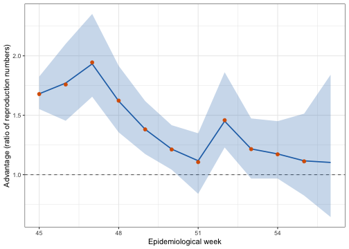
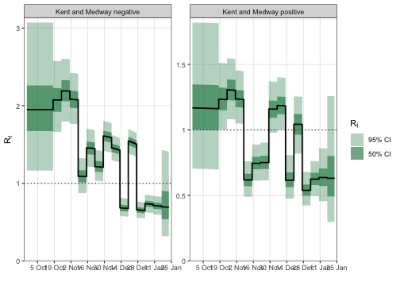
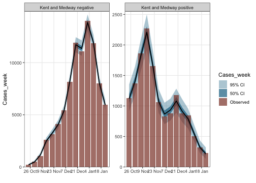

<style>
.contents .page-header {
    display: none;
}
</style>

::: {.article_container}


# Transmissibility of a New Variant

@Volz2021 used **epidemia** to ask how much more transmissible SARS-CoV-2
lineage B.1.1.7 was than the lineages it displaced in England. This tutorial
reproduces that analysis for one area.

The question has an awkward shape. Two lineages are spreading in the same
population at the same time, under the same restrictions, and both are observed
only through case counts. Anything that changes transmission for one — a
lockdown, school holidays, weather, behaviour — changes it for the other too.
What we want is the *ratio* of their reproduction numbers, and the model has to
be built so that ratio is a parameter rather than something reconstructed
afterwards from two separate fits.

<div style="border-left: 4px solid #d95f02; padding: 0.6em 1em; margin: 1.5em 0; background: #fdf6f0;">
**Read this as a demonstration of the method, not as a specification to copy.**
The model structure and priors below are the ones in the paper's own code, but a
tutorial is not an analysis. It fits **one** area rather than all of them, omits
the machinery the authors used to get every area to converge, and makes no claim
that these priors are appropriate for other data. Nothing here should be lifted
into another study as a default; the "[Not the paper's configuration]" section
at the end sets out exactly what differs and why.
</div>

## S-gene target failure

The measurement that makes this possible is an accident of assay design.
Routine PCR testing in England used a three-target assay, and B.1.1.7 carries a
deletion that makes the S-gene target fail while the other two still amplify.
"S-gene target failure" (SGTF) therefore acts as a proxy for the lineage in
ordinary testing data, without sequencing every sample.


``` r
b117 <- EnglandB117
str(b117$data)
```

```
## 'data.frame':	5880 obs. of  5 variables:
##  $ date              : Date, format: "2020-09-26" "2020-09-27" ...
##  $ area              : chr  "Bath and North East Somerset, Swindon and Wiltshire" "Bath and North East Somerset, Swindon and Wiltshire" "Bath and North East Somerset, Swindon and Wiltshire" "Bath and North East Somerset, Swindon and Wiltshire" ...
##  $ corrected_positive: num  NA NA NA NA NA NA NA NA NA NA ...
##  $ corrected_negative: num  NA NA NA NA NA NA NA NA NA NA ...
##  $ epiweek           : num  39 40 40 40 40 40 40 40 41 41 ...
```

Each area-day splits into `corrected_negative` (S-gene negative, so B.1.1.7)
and `corrected_positive` (everything else), already adjusted for testing effort
by the original authors.

We fit **Kent and Medway**, where B.1.1.7 was first identified and where
replacement went furthest — by January 2021 it accounts for the large majority
of cases there, while enough non-B.1.1.7 cases remain to serve as a comparison
arm.


``` r
area <- "Kent and Medway"

b117$data %>%
  filter(area == !!area) %>%
  summarise(days = n(),
            from = min(date), to = max(date),
            b117 = sum(corrected_negative),
            other = sum(corrected_positive)) %>%
  mutate(pct_b117 = round(100 * b117 / (b117 + other), 1))
```

```
##   days       from         to b117 other pct_b117
## 1  120 2020-09-26 2021-01-23   NA    NA       NA
```

## One area, two groups

The modelling idea is to treat each lineage in an area as its **own group**.
The area becomes two rows of the panel — `Kent and Medway positive` and
`Kent and Medway negative` — each with its own case series, seeded
independently, sharing a population.

That turns a two-lineage problem into an ordinary multi-group epidemia model,
and it is what lets the transmissibility ratio be a single coefficient.


``` r
dat <- b117$data %>%
  filter(area == !!area) %>%
  arrange(date) %>%
  mutate(week = pmax(epiweek, 42))

positive <- dat %>%
  transmute(area = paste(!!area, "positive"), date, week,
            Cases_week = corrected_positive,
            neg = FALSE, negweek = NA_real_)

negative <- dat %>%
  transmute(area = paste(!!area, "negative"), date, week,
            Cases_week = corrected_negative,
            neg = TRUE, negweek = pmax(epiweek, 45))

dat <- bind_rows(positive, negative) %>%
  left_join(b117$iar, by = "date") %>%
  fill(iar, .direction = "downup") %>%
  mutate(area = factor(area),
         pop = b117$pop$pop[b117$pop$area == !!area])
```

Two things there are worth pausing on.

`neg` is an indicator that is `TRUE` only for the B.1.1.7 group. Because it is
constant within a group and the two groups share everything else, **its
coefficient is the log transmissibility advantage** — the quantity the paper is
about. It is not a nuisance term or a correction; it is the answer.

`negweek` is the epidemiological week for the B.1.1.7 group and `NA` for the
other. A random walk indexed by it therefore exists only for B.1.1.7, which is
how the advantage is allowed to change over time. `pmax(epiweek, 45)` pools the
earliest weeks together, when B.1.1.7 counts are too small to say anything.

## The model


``` r
rt <- epirt(
  formula = R(area, date) ~ rw(time = week, prior_scale = 0.15) +
                            neg +
                            rw(time = negweek),
  prior = normal(0, 0.25),
  prior_intercept = normal(log(1.25), 0.1),
  link = "log"
)
```

Three terms, doing three jobs. `rw(time = week)` is a weekly random walk shared
by both groups: it absorbs everything that moved transmission in Kent over this
period — the November lockdown, its lifting, Christmas mixing, the January
lockdown — without any of it having to be specified. `neg` is the constant
advantage. `rw(time = negweek)` lets that advantage vary by week.

Because the link is log, the ratio of reproduction numbers between the two
groups on any day is

$$\frac{R^{(\text{B.1.1.7})}_t}{R^{(\text{other})}_t}
  = \exp\left(\beta_{\text{neg}} + w^{(\text{negweek})}_t\right),$$

with the shared walk cancelling. That cancellation is the point of the design:
the estimate does not depend on getting the epidemic trajectory right, only on
the two lineages experiencing it together.


``` r
obs <- epiobs(
  formula = Cases_week ~ 0 + iar,
  link = "identity",
  family = "quasi_poisson",
  prior = normal(location = 1, scale = b117$iar_sd, autoscale = FALSE),
  prior_aux = normal(location = 3, scale = 2),
  i2o = b117$i2o
)
```

```
## Warning: i2o does not sum to one. Please ensure this is intentional.
```

The observations are weekly case totals. There is no ascertainment regression to
fit: the infection ascertainment rate is supplied as data in the `iar` column,
and the coefficient on it — with a prior centred at 1 — only allows a modest
multiplicative correction. `i2o` is a daily infection-to-case delay spread over
seven offsets, so it sums to 7 rather than 1 and `epiobs` says so. That is
intentional: each observation covers seven days of cases.


``` r
inf <- epiinf(
  gen = EuropeCovid$si,
  seed_days = 14,
  prior_seeds = hexp(exponential(rate = 1 / 5000)),
  pop_adjust = TRUE,
  pops = pop
)
```

The seeding prior is deliberately vague — the two groups start at very different
sizes and at different times, and nothing should be assumed about either.

## Fitting


``` r
fm <- epim(
  rt = rt, inf = inf, obs = obs, data = dat,
  algorithm = "sampling", iter = 2e3, chains = 4, seed = 12345, refresh = 0,
  control = list(adapt_delta = 0.92, max_treedepth = 14)
)
```

```
## Running MCMC with 4 parallel chains...
```

```
## Chain 2 finished in 472.0 seconds.
## Chain 3 finished in 504.0 seconds.
## Chain 1 finished in 525.8 seconds.
## Chain 4 finished in 528.5 seconds.
## 
## All 4 chains finished successfully.
## Mean chain execution time: 507.6 seconds.
## Total execution time: 528.7 seconds.
```


``` r
sampler_diagnostics(fm)
```

```
## Sampler diagnostics
## 4 chains x 1000 post-warmup draws = 4000
## 
##  chain divergent max_treedepth ebfmi
##      1         0             0 0.732
##      2         0             0 0.778
##      3         0             0 0.760
##      4         0             0 0.777
## 
## Divergent transitions: 0 (0.0%)
## Hit max treedepth:     0 (0.0%)
## Lowest E-BFMI:         0.73
## Worst R-hat:           1.002  (seeds_aux)
## Lowest bulk ESS:       950  (log-posterior)
## Lowest tail ESS:       1331
## 
## No problems detected.
```

## The transmissibility advantage

The advantage in week $w$ is the ratio of the two groups' reproduction numbers,
$R^{(\text{B.1.1.7})}_t / R^{(\text{other})}_t$. Compute it from the fitted
$R_t$ rather than from the coefficients: the shared walk cancels automatically,
and it avoids depending on how the walk parameters are stored.


``` r
# Take the ratio of the two groups' fitted R_t series, which is what the
# original analysis does (transmission_model/gather_joint.R):
#
#     rt <- posterior_rt(fit)
#     Ratio_45 = quantile(rt$draws[, negative & epiweek == 45] /
#                         rt$draws[, positive & epiweek == 45], 0.5)
#
# Reading the coefficient and walk parameters out of the draws matrix instead is
# a trap: `R|rw(...)` reports the walk's INCREMENTS, so treating them as levels
# silently flattens the curve -- it gave a correlation of 0.44 with the
# published series where the ratio gives 0.99. Working from R_t avoids having to
# know the walk's parameterisation at all, and the shared walk cancels in the
# ratio by construction.
rt_post <- posterior_rt(fm)
```

```
## Running standalone generated quantities after 1 MCMC chain...
## 
## Chain 1 finished in 0.0 seconds.
```

``` r
grp <- rt_post$group
# Use the dataset's OWN epiweek column, not lubridate::epiweek(). The data
# numbers weeks continuously through the season (39..56), whereas epiweek()
# restarts at 1 each January -- which would relabel the last four weeks 1, 2, 3
# and silently drop them from the comparison.
wk_lookup <- distinct(b117$data, date, epiweek)
wk <- wk_lookup$epiweek[match(as.Date(rt_post$time), wk_lookup$date)]

advantage <- do.call(rbind, lapply(sort(unique(wk[wk >= 45])), function(w) {
  num <- rt_post$draws[, grp == paste(area, "negative") & wk == w, drop = FALSE]
  den <- rt_post$draws[, grp == paste(area, "positive") & wk == w, drop = FALSE]
  if (!ncol(num) || !ncol(den)) return(NULL)
  a <- as.numeric(num) / as.numeric(den)
  data.frame(epiweek = w,
             median = median(a),
             lower = quantile(a, 0.025)[[1]],
             upper = quantile(a, 0.975)[[1]])
}))

comparison <- advantage %>%
  left_join(b117$published %>% filter(area == !!area) %>% select(epiweek, ratio),
            by = "epiweek") %>%
  rename(published = ratio)

knitr::kable(comparison, digits = 2, row.names = FALSE,
             caption = "Estimated multiplicative transmissibility advantage of B.1.1.7 in Kent and Medway, against the value published for this area by Volz et al. (2021).")
```


Table: (\#tab:b117-advantage)Estimated multiplicative transmissibility advantage of B.1.1.7 in Kent and Medway, against the value published for this area by Volz et al. (2021).

| epiweek| median| lower| upper| published|
|-------:|------:|-----:|-----:|---------:|
|      45|   1.68|  1.55|  1.83|      1.68|
|      46|   1.77|  1.45|  2.10|      1.76|
|      47|   1.93|  1.66|  2.35|      1.94|
|      48|   1.62|  1.36|  1.92|      1.62|
|      49|   1.38|  1.17|  1.62|      1.38|
|      50|   1.22|  1.04|  1.42|      1.21|
|      51|   1.12|  0.84|  1.35|      1.11|
|      52|   1.45|  1.23|  1.86|      1.46|
|      53|   1.22|  0.97|  1.47|      1.22|
|      54|   1.17|  0.97|  1.45|      1.17|
|      55|   1.12|  0.82|  1.51|      1.11|
|      56|   1.10|  0.64|  1.84|        NA|


``` r
ggplot(comparison, aes(epiweek)) +
  geom_hline(yintercept = 1, linetype = "dashed", colour = "grey40") +
  geom_ribbon(aes(ymin = lower, ymax = upper), alpha = 0.25, fill = "#2171b5") +
  geom_line(aes(y = median), colour = "#2171b5", linewidth = 0.8) +
  geom_point(aes(y = published), colour = "#d95f02", size = 2) +
  labs(x = "Epidemiological week", y = "Advantage (ratio of reproduction numbers)") +
  theme_bw()
```

```
## Warning: Removed 1 row containing missing values or values outside the scale range
## (`geom_point()`).
```

<div class="figure" style="text-align: center">

<p class="caption">(\#fig:b117-advantage-plot)Estimated transmissibility advantage by week (line and ribbon) against the published per-area estimate (points). A ratio of one, marked by the dashed line, would mean no advantage.</p>
</div>


``` r
plot_rt(fm, step = TRUE, levels = c(50, 95)) + theme_bw()
```

```
## Running standalone generated quantities after 1 MCMC chain...
## 
## Chain 1 finished in 0.0 seconds.
```

<div class="figure" style="text-align: center">

<p class="caption">(\#fig:b117-rt-plot)Reproduction numbers for the two groups. The gap between them is the advantage; the shared shape is the epidemic both lineages experienced.</p>
</div>


``` r
plot_obs(fm, type = "Cases_week", levels = c(50, 95)) + theme_bw()
```

```
## Running standalone generated quantities after 1 MCMC chain...
## 
## Chain 1 finished in 0.0 seconds.
```

<div class="figure" style="text-align: center">

<p class="caption">(\#fig:b117-obs-plot)Posterior predictive for weekly case counts, by group.</p>
</div>

## This is one area, not the paper's answer

**The published estimate is not a single fit.** @Volz2021 fit this model
*separately to each of the areas in England* — 42 of the areas in
`EnglandB117` have the population needed for the susceptibility adjustment; the
remaining seven are NHS regions, which are aggregates of the others and are not
sized in the source. The headline figure combines those per-area fits; no single
area produces it.

That matters for reading the table above. One area gives one noisy estimate,
and the interval for a single area is wide — wide enough, in some weeks, to
include no advantage at all. The strength of the published result comes from the
same signal appearing in area after area, not from any one of them. The
England-wide series is:


``` r
knitr::kable(b117$published_england, digits = 2, row.names = FALSE,
             caption = "England-wide time-varying advantage from Volz et al. (2021), pooled across areas.")
```


Table: (\#tab:b117-england)England-wide time-varying advantage from Volz et al. (2021), pooled across areas.

| epiweek| median| lower| upper|
|-------:|------:|-----:|-----:|
|      45|   1.66|  1.11|  2.28|
|      46|   1.79|  1.20|  2.56|
|      47|   1.86|  1.26|  2.72|
|      48|   1.86|  1.29|  2.73|
|      49|   1.87|  1.31|  2.63|
|      50|   1.85|  1.29|  2.61|
|      51|   1.74|  1.19|  2.54|
|      52|   1.76|  1.42|  2.59|
|      53|   1.53|  1.11|  2.04|
|      54|   1.49|  1.08|  2.14|
|      55|   1.50|  1.01|  2.18|

To reproduce that, loop this model over every area in `b117$pop$area`, keeping
each fit separate, and combine the per-week advantages afterwards. The original
implementation does exactly that — one job per area, driven by a `Makefile`, in
`transmission_model/` of
[mrc-ide/sarscov2-b.1.1.7](https://github.com/mrc-ide/sarscov2-b.1.1.7). At
roughly a quarter of an hour per area that is a few hours of compute, which is
why this tutorial demonstrates the method on one area rather than running the
analysis.

## Not the paper's configuration {#not-the-papers-configuration}

Everything structural is the paper's: the three-term formula, `normal(0, 0.25)`
on the advantage, `normal(log(1.25), 0.1)` on the intercept, `prior_scale = 0.15`
on the shared walk, `normal(1, iar_sd)` on the ascertainment coefficient with
`autoscale = FALSE`, `normal(3, 2)` on the dispersion, `seed_days = 14`, the
vague `exponential(1/5000)` seeding, and the same generation distribution. The
week clamps (`pmax(epiweek, 42)` and `pmax(epiweek, 45)`) are theirs too. So are
the sampler settings this tutorial uses — `iter = 2000`, `chains = 4`,
`adapt_delta = 0.92`.

Three things are nonetheless **not** what produced the published numbers.

*It is one area.* The published estimate combines separate per-area fits, as the
section above describes. One area is one noisy estimate.

*There is no convergence machinery.* The original script re-runs an area that
fails its diagnostics — doubling iterations and thinning, or raising
`adapt_delta` — and records the adjusted settings. Its `fit_params.csv` holds 89
such re-runs. Kent and Medway is not among them, so this area did fit at the
defaults, which is why the settings here match; but an arbitrary area may not,
and this tutorial would simply report the bad diagnostics rather than fix them.

*`max_treedepth` is 14 here, not the 18 the original sets.* That difference is
immaterial in this instance and can be checked rather than assumed: the fit
above saturated the tree depth **zero** times, so the lower cap was never
binding. On a harder area it might be.

More generally, these priors were chosen for *this* question on *these* data —
two lineages observed through the same testing system, over four months, in one
country. The informative intercept encodes what was known about $R$ in England
in autumn 2020. The tight ascertainment prior works because the ascertainment
rate is supplied as data. None of that transfers automatically. Treat the
structure as the reusable idea and the numbers as specific to this analysis.

## What does not reproduce exactly

The counts here are **aggregates**. The raw SGSS line-list behind them is
disclosure-controlled — the authors' own processing suppresses counts below five
— so the step from testing records to these tables cannot be re-run outside PHE.
This tutorial starts where the published data starts.

The generation distribution is `EuropeCovid$si`, as in the original code, and is
assumed identical for both lineages: the model asks whether B.1.1.7 transmitted
*more*, not whether it transmitted on a different timescale. Separating those
would need data this design does not contain.

# References
<hr>

:::
