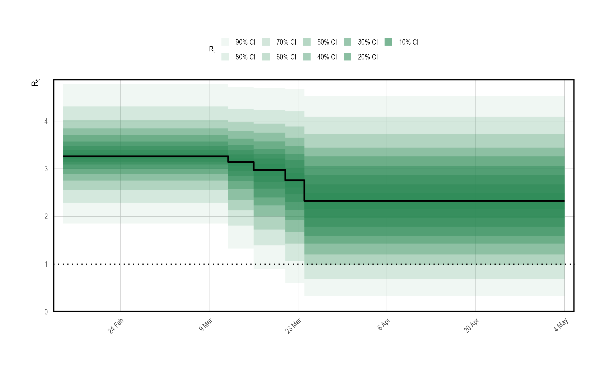
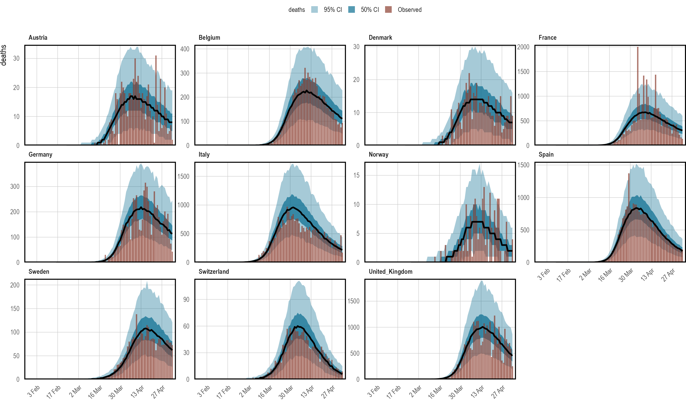
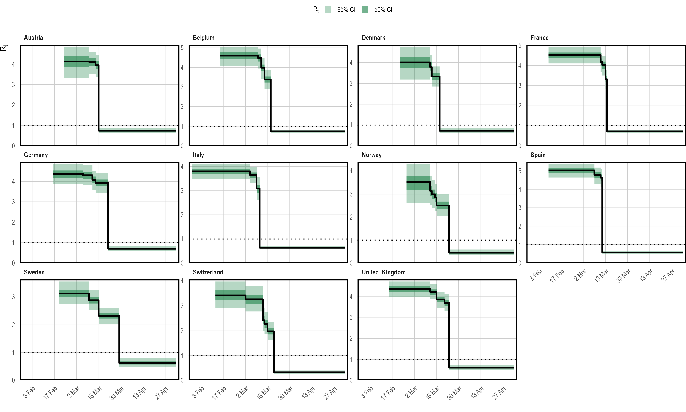
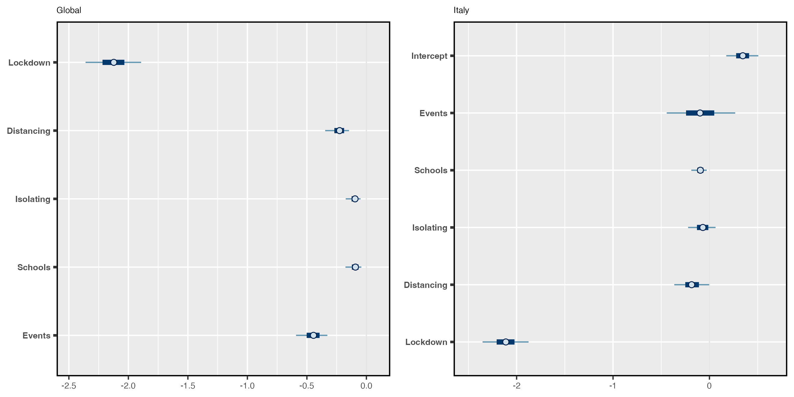
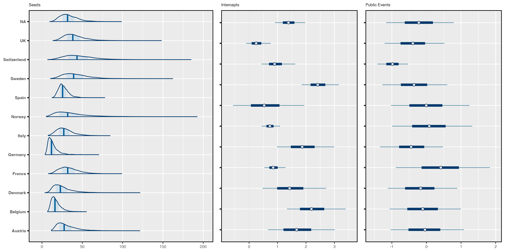
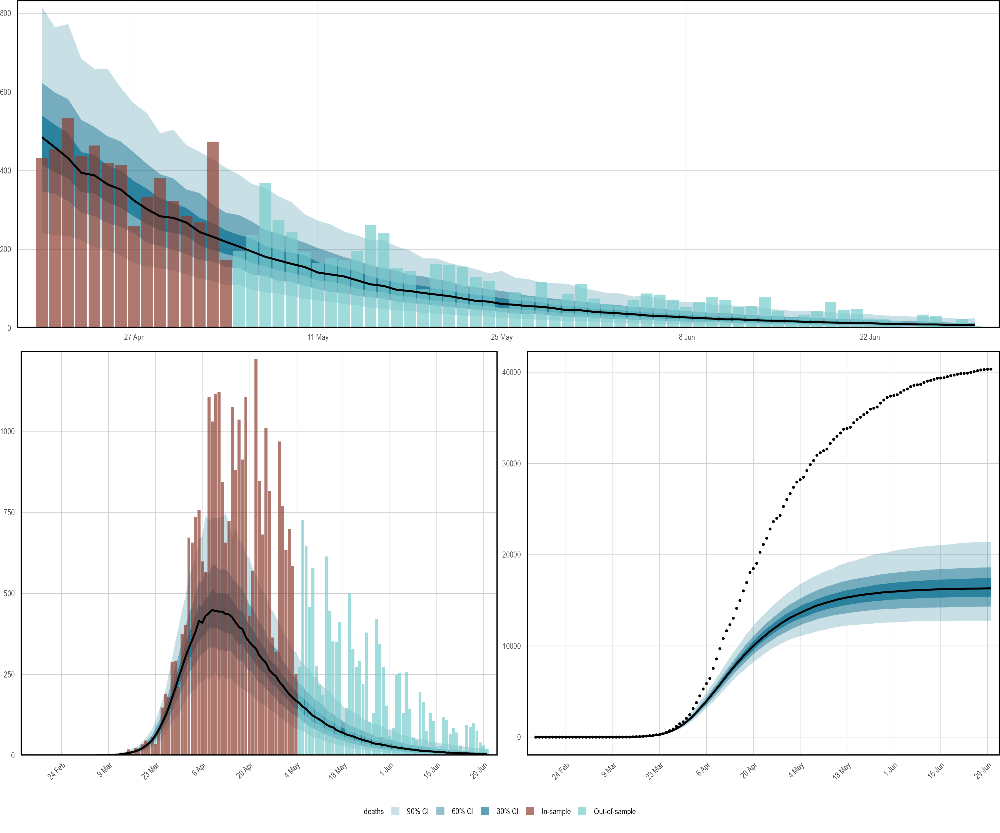

<style>
.contents .page-header {
    display: none;
} 
</style>

::: {.article_container}


# Assessing the Effects of Interventions on COVID-19 {#sec:multilevel}
<hr>

The Spanish flu [example](flu.html) considered inferring the
instantaneous reproduction number over time in a single population.
Here, we demonstrate some of the more advanced modeling capabilities of
the package.

Consider modeling the evolution of an epidemic in multiple distinct
regions. As discussed in the model [description](model-description.html), one can always approach
this by modeling each group separately. It was argued that this approach
is fast, because models may be fit independently. Nonetheless, often
there is little high quality data for some groups, and the data does
little to inform parameter estimates. This is particularly true in the
early stages of an epidemic. Joining regions together through
hierarchical models allows information to be shared between regions in a
natural way, improving parameter estimates while still permitting
between group variation.

In this section, we use a hierarchical model to estimate the effect of
non-pharmaceutical interventions (NPIs) on the transmissibility of
Covid-19. We consider the same setup as @Flaxman2020: attempting to
estimate the effect of a set of measures that were implemented in March
2020 in 11 European countries during the first wave of Covid-19. This
will be done by fitting the model to daily death data. The same set of
measures and countries that were used in @Flaxman2020 are also used
here. @Flaxman2020MA considered a version of this model that used
partial pooling for all NPI effects. Here, we consider a model that uses
the same approach.

This example is not intended to be a fully rigorous statistical
analysis. Rather, the intention is to demonstrate partial pooling of
parameters in **epidemia** and how to infer their effect sizes. We
also show how to forecast observations into the future, and how to
undertake counterfactual analyses.

Begin by loading required packages. **dplyr** will be used to manipulate
the data set. The prior distributions used below are provided directly by
**epidemia**.

``` r
library(dplyr)
library(epidemia)
```


## Data
<hr>

We use a data set `EuropeCovid2`, which is provided by
**epidemia**. This contains daily death and case data in the 11
countries concerned up until the 1^st^ July 2020. The data derives from
the WHO COVID-19 explorer as of the 5^th^ of January 2021. This differs
from the data used in @Flaxman2020, because case and death counts have
been adjusted retrospectively as new information came to light.
**epidemia** also has a data set `EuropeCovid` which contains the
same data as that in @Flaxman2020, and this could alternatively be used
for this exercise.

`EuropeCovid2` also contains binary series representing the set of
five mitigation measures considered in @Flaxman2020. These correspond to
the closing of schools and universities, the banning of public events,
encouraging social distancing, requiring self isolation if ill, and
finally the implementation of full lockdown. The dates at which these
policies were enacted are exactly the same as those used in
@Flaxman2020.

Load the data set as follows.


``` r
data("EuropeCovid2")
data <- EuropeCovid2$data
head(data)
```

```
## # A tibble: 6 × 11
## # Groups:   country [1]
##   id    country date       cases deaths schools_universities
##   <chr> <chr>   <date>     <int>  <int>                <int>
## 1 AT    Austria 2020-01-03     0      0                    0
## 2 AT    Austria 2020-01-04     0      0                    0
## 3 AT    Austria 2020-01-05     0      0                    0
## 4 AT    Austria 2020-01-06     0      0                    0
## 5 AT    Austria 2020-01-07     0      0                    0
## 6 AT    Austria 2020-01-08     0      0                    0
## # ℹ 5 more variables: self_isolating_if_ill <int>, public_events <int>,
## #   lockdown <int>, social_distancing_encouraged <int>, pop <int>
```

Recall that for each country, **epidemia** will use the earliest date
in `data` as the first date to begin seeding infections. Therefore,
we must choose an appropriate start date for each group. One option is
to use the same rule as in @Flaxman2020, and assume that seeding begins
in each country 30 days prior to observing 10 cumulative deaths. To do
this, we filter the data frame as follows.


``` r
data <- filter(data, date > date[which(cumsum(deaths) > 10)[1] - 30])
```

This leaves the following assumed start dates.


``` r
dates <- summarise(data, start = min(date), end = max(date))
head(dates)
```

```
## # A tibble: 6 × 3
##   country start      end       
##   <chr>   <date>     <date>    
## 1 Austria 2020-02-23 2020-06-30
## 2 Belgium 2020-02-15 2020-06-30
## 3 Denmark 2020-02-22 2020-06-30
## 4 France  2020-02-09 2020-06-30
## 5 Germany 2020-02-16 2020-06-30
## 6 Italy   2020-01-28 2020-06-30
```

Although `data` contains observations up until the end of June, we
fit the model using a subset of the data. We hold out the rest to
demonstrate forecasting out-of-sample. Following @Flaxman2020, the final
date considered is the 5^th^ May.


``` r
data <- filter(data, date < as.Date("2020-05-05"))
```

### Model Components

We have seen several times now that **epidemia** require the user to
specify three model components: transmission, infections, and
observations. These are now considered in turn.

#### Transmission {#sec:europe-covid_transmission}

Country-specific reproduction numbers $R^{(m)}_{t}$ are expressed in
terms of the control measures. Since the measures are encoded as binary
policy indicators, reproduction rates must follow a step function. They
are constant between policies, and either increase or decrease as
policies come into play. The implicit assumption, of course, is that
only control measures may affect transmission, and that these effects
are fully realized instantaneously.

Let $t^{(m)}_{k} \geq 0$, $k \in \{1,\ldots,5\}$ be the set of integer
times at which the $k$^th^ control measure was enacted in the $m$^th^
country. Accordingly, we let $I^{(m)}_{k}$, $k \in \{1,\ldots,5\}$ be a
set of corresponding binary vectors such that \begin{equation}
I^{(m)}_{k,t} = 
\begin{cases}
0, & \text{if } t < t^{(m)}_k \\
1. & \text{if } t \geq t^{(m)}_k
\end{cases}
\end{equation} Reproduction numbers are mathematically expressed as
\begin{equation}
R^{(m)}_{t} = R' g^{-1}\left(b^{(m)}_0 + \sum_{k=1}^{5}\left(\beta_k + b^{(m)}_k\right)I^{(m)}_{k,t}\right),
\end{equation} where $R' = 3.25$ and $g$ is the logit-link. Parameters
$b^{(m)}_0$ are country-specific intercepts, and each $b^{(m)}_k$ is a
country effect for the $k$^th^ measure. The intercepts allow each
country to have its own initial reproduction number, and hence accounts
for possible variation in the inherent transmissibility of Covid-19 in
each population. $\beta_k$ is a fixed effect for the $k$^th^ policy.
This quantity corresponds to the average effect of a measure across all
countries considered.

Control measures were implemented in quick succession in most countries.
For some countries, a subset of the measures were in fact enacted
simultaneously. For example, Germany banned public events at the same
time as implementing lockdown. The upshot of this is that policy effects
are *highly colinear* and may prove difficult to infer with
uninformative priors.

One potential remedy is to use domain knowledge to incorporate
information into the priors. In particular, it seems a priori unlikely
that the measures served to increase transmission rates significantly.
It is plausible, however, that each had a significant effect on reducing
transmission. A symmetric prior like the Gaussian does not capture this
intuition and increases the difficulty in inferring effects, because
they are more able to offset each other. This motivated the prior used
in @Flaxman2020, which was a Gamma distribution shifted to have support
other than zero.

We use the same prior in our example. Denoting the distribution of a
Gamma random variable with shape $a$ and scale $b$ by
$\text{Gamma}(a, b)$, this prior is \begin{equation}
-\beta_k - \frac{\log(1.05)}{6} \sim \text{Gamma}(1/6, 1).
\label{eq:betaprior}
\end{equation} The shift allows the measures to increase transmission
slightly.

All country-specific parameters are partially pooled by letting
\begin{equation}
b^{(m)}_k \sim N(0, \sigma_k),
\end{equation} where $\sigma_k$ are standard deviations,
$\sigma_0 \sim \text{Gamma}(2, 0.25)$ and
$\sigma_k \sim \text{Gamma}(0.5, 0.25)$ for all $k > 0$. This gives the
intercept terms more variability under the prior.

The transmission model described above is expressed programmatically as
follows.


``` r
rt <- epirt(formula = R(country, date) ~ 0 + (1 + public_events + 
              schools_universities + self_isolating_if_ill + 
              social_distancing_encouraged + lockdown || country) + 
              public_events + schools_universities + self_isolating_if_ill +
              social_distancing_encouraged + lockdown, 
            prior = shifted_gamma(shape = 1/6, scale = 1, shift = log(1.05)/6),
            prior_covariance = decov(shape = c(2, rep(0.5, 5)), scale = 0.25),
            link = scaled_logit(6.5))
```

The operator `||` is used rather than `|` for random effects.
This ensures that all effects for a given country are independent, as
was assumed in the model described above. Using `|` would
alternatively give a prior on the full covariance matrix, rather than on
the individual $\sigma_i$ terms. The argument `prior` reflects
Equation \eqref{eq:betaprior}. Since country effects are assumed
independent, the `decov` prior reduces to assigning Gamma priors to
each $\sigma_i$. By using a vector rather than a scalar for the
`shape` argument, we are able to give the prior on the intercepts a
larger shape parameter.

### Infections

Infections are kept simple here by using the basic version of the model.
That is to say that infections are taken to be a deterministic function
of seeds and reproduction numbers, propagated by the renewal process.
Extensions to modeling infections as parameters and adjustments for the
susceptible population are not considered. The model is defined as
follows.


``` r
inf <- epiinf(gen = EuropeCovid$si, seed_days = 6)
```

`EuropeCovid$si` is a numeric vector giving the serial interval
used in @Flaxman2020. As in that work, we make no distinction between
the generation distribution and serial interval here.

### Observations

In order to infer the effects of control measures on transmission, we
must fit the model to data. Here, daily deaths are used. In theory,
additional types of data can be included in the model, but such
extension are not considered here. A simple intercept model is used for
the infection fatality rate (IFR). This makes the assumption that the
IFR is constant over time. The model can be written as follows.


``` r
deaths <- epiobs(formula = deaths ~ 1, i2o = EuropeCovid2$inf2death, 
                 prior_intercept = normal(0,0.2), link = scaled_logit(0.02))
```

```
## Warning: i2o does not sum to one. Please ensure this is intentional.
```

By using `link = scaled_logit(0.02)`, we let the IFR range between
$0\%$ and $2\%$. In conjunction with the symmetric prior on the
intercept, this gives the IFR a prior mean of $1\%$.
`EuropeCovid2$inf2death` is a numeric vector giving the same
distribution for the time from infection to death as that used in
@Flaxman2020.

## Model Fitting
<hr>

In general, **epidemia**'s models should be fit using Hamiltonian
Monte Carlo. For this example, however, we use Variational Bayes (VB) as
opposed to full MCMC sampling. This is because full MCMC sampling of a
joint model of this size is computationally demanding, due in part to
renewal equation having to be evaluated for each region and for each
evaluation of the likelihood and its derivatives. Nonetheless, VB allows
rapid iteration of models and may lead to reasonable estimates of effect
sizes. For this example, we have also run full MCMC, and the inferences
reported here are not substantially different.

### Prior Check

The flu [article](flu.html) gave an example of using posterior predictive
checks. It is also useful to do prior predictive checks as these allow
the user to catch obvious mistakes that can occur when specifying the
model, and can also help to affirm that the prior is in fact reasonable.

In **epidemia** we can do this by using the `priorPD = TRUE` flag
in `epim()`. This discards the likelihood component of the
posterior, leaving just the prior. We use Hamiltonian Monte Carlo over
VB for the prior check, partly because sampling from the prior is quick
(it is the likelihood that is expensive to evaluate). In addition, we
have defined Gamma priors on some coefficients, which are generally
poorly approximated by VB.


``` r
args <- list(rt = rt, inf = inf, obs = deaths, data = data, seed = 12345, 
             refresh = 0)
pr_args <- c(args, list(algorithm = "sampling", iter = 1e3, prior_PD = TRUE))
fm_prior <- do.call(epim, pr_args)
```

```
## Running MCMC with 4 parallel chains...
## 
## Chain 3 finished in 11.4 seconds.
## Chain 1 finished in 11.5 seconds.
## Chain 2 finished in 11.8 seconds.
## Chain 4 finished in 11.8 seconds.
## 
## All 4 chains finished successfully.
## Mean chain execution time: 11.6 seconds.
## Total execution time: 12.0 seconds.
```

Figure \@ref(fig:multilevel-prior) shows approximate samples of $R_{t,m}$
from the prior distribution. This confirms that reproduction numbers
follow a step function, and that rates can both increase and decrease as
measures come into play.


```
## Running standalone generated quantities after 1 MCMC chain...
## 
## Chain 1 finished in 0.0 seconds.
```

<div class="figure" style="text-align: center">

<p class="caption">(\#fig:multilevel-prior)A prior predictive check for reproduction numbers $R_t$ in the multilevel model. Only results for the United Kingdom are presented here. The prior median is shown in black, with credible intervals shown in various shades of green. The check appears to confirm that $R_t$ follows a step-function.</p>
</div>


### Approximating the Posterior

The model will be fit using Variational Bayes by using
`algorithm = "fullrank"` in the call to `epim()`. This is
generally preferable to `"meanfield"` for these models, largely
because `"meanfield"` ignores posterior correlations. We decrease
the parameter `tol_rel_obj` from its default value, and increase
the number of iterations to aid convergence.


``` r
args$algorithm <- "fullrank"; args$iter <- 5e4; args$tol_rel_obj <- 1e-3
fm <- do.call(epim, args)
```

```
## ------------------------------------------------------------ 
## EXPERIMENTAL ALGORITHM: 
##   This procedure has not been thoroughly tested and may be unstable 
##   or buggy. The interface is subject to change. 
## ------------------------------------------------------------ 
## Gradient evaluation took 0.001371 seconds 
## 1000 transitions using 10 leapfrog steps per transition would take 13.71 seconds. 
## Adjust your expectations accordingly! 
## Begin eta adaptation. 
## Iteration:   1 / 250 [  0%]  (Adaptation) 
## Iteration:  50 / 250 [ 20%]  (Adaptation) 
## Iteration: 100 / 250 [ 40%]  (Adaptation) 
## Iteration: 150 / 250 [ 60%]  (Adaptation) 
## Iteration: 200 / 250 [ 80%]  (Adaptation) 
## Iteration: 250 / 250 [100%]  (Adaptation) 
## Success! Found best value [eta = 0.1]. 
## Begin stochastic gradient ascent. 
##   iter             ELBO   delta_ELBO_mean   delta_ELBO_med   notes  
##    100       -68469.273             1.000            1.000 
##    200       -39418.134             0.868            1.000 
##    300       -40505.514             0.588            0.737 
##    400       -25920.776             0.582            0.737 
##    500       -19705.166             0.528            0.563 
##    600       -19034.277             0.446            0.563 
##    700       -15154.925             0.419            0.315 
##    800       -14748.695             0.370            0.315 
##    900       -13234.906             0.342            0.256 
##   1000       -14322.790             0.315            0.256 
##   1100       -12420.102             0.300            0.153 
##   1200       -10982.427             0.286            0.153 
##   1300       -10554.556             0.267            0.131 
##   1400        -9537.152             0.256            0.131 
##   1500        -7844.089             0.253            0.131 
##   1600        -8453.555             0.242            0.131 
##   1700        -6940.279             0.240            0.131 
##   1800        -6983.095             0.227            0.131 
##   1900        -6659.954             0.218            0.114 
##   2000        -5977.627             0.213            0.114 
##   2100        -6144.422             0.204            0.114 
##   2200        -5875.147             0.197            0.114 
##   2300        -5157.342             0.194            0.114 
##   2400        -4804.058             0.189            0.114 
##   2500        -4834.796             0.182            0.107 
##   2600        -4704.185             0.176            0.107 
##   2700        -4361.851             0.172            0.078 
##   2800        -4301.821             0.167            0.078 
##   2900        -4085.515             0.163            0.076 
##   3000        -3942.802             0.159            0.076 
##   3100        -3966.379             0.154            0.074 
##   3200        -3766.168             0.151            0.074 
##   3300        -3701.544             0.147            0.072 
##   3400        -3632.686             0.143            0.072 
##   3500        -3573.478             0.139            0.053 
##   3600        -3532.328             0.136            0.053 
##   3700        -3512.479             0.132            0.053 
##   3800        -3533.794             0.129            0.053 
##   3900        -3449.842             0.126            0.049 
##   4000        -3403.202             0.123            0.049 
##   4100        -3402.458             0.120            0.046 
##   4200        -3398.252             0.117            0.046 
##   4300        -3370.548             0.115            0.041 
##   4400        -3380.532             0.112            0.041 
##   4500        -3348.448             0.110            0.036 
##   4600        -3348.953             0.108            0.036 
##   4700        -3333.398             0.106            0.035 
##   4800        -3312.415             0.103            0.035 
##   4900        -3312.146             0.101            0.028 
##   5000        -3302.022             0.099            0.028 
##   5100        -3318.642             0.079            0.028 
##   5200        -3320.365             0.065            0.027 
##   5300        -3309.115             0.064            0.027 
##   5400        -3286.188             0.053            0.024 
##   5500        -3267.458             0.047            0.019 
##   5600        -3274.945             0.046            0.017 
##   5700        -3256.816             0.041            0.017 
##   5800        -3252.734             0.041            0.014 
##   5900        -3258.732             0.039            0.014 
##   6000        -3267.777             0.037            0.012 
##   6100        -3267.959             0.034            0.010 
##   6200        -3228.389             0.032            0.010 
##   6300        -3252.914             0.031            0.008 
##   6400        -3241.743             0.029            0.008 
##   6500        -3243.710             0.025            0.007 
##   6600        -3235.449             0.023            0.006 
##   6700        -3218.879             0.019            0.006 
##   6800        -3209.163             0.019            0.006 
##   6900        -3217.178             0.018            0.006 
##   7000        -3237.923             0.016            0.006 
##   7100        -3206.211             0.015            0.006 
##   7200        -3210.361             0.015            0.006 
##   7300        -3187.423             0.012            0.006 
##   7400        -3187.070             0.010            0.006 
##   7500        -3188.289             0.010            0.006 
##   7600        -3187.259             0.010            0.006 
##   7700        -3178.299             0.008            0.005 
##   7800        -3193.696             0.008            0.005 
##   7900        -3174.137             0.007            0.005 
##   8000        -3178.201             0.006            0.005 
##   8100        -3160.572             0.006            0.005 
##   8200        -3164.091             0.005            0.005 
##   8300        -3174.318             0.005            0.003 
##   8400        -3164.060             0.005            0.003 
##   8500        -3162.032             0.004            0.003 
##   8600        -3149.922             0.004            0.003 
##   8700        -3155.167             0.004            0.003 
##   8800        -3149.391             0.004            0.003 
##   8900        -3149.667             0.004            0.003 
##   9000        -3127.292             0.004            0.003 
##   9100        -3125.969             0.004            0.003 
##   9200        -3145.373             0.004            0.003 
##   9300        -3134.571             0.004            0.003 
##   9400        -3155.310             0.004            0.003 
##   9500        -3137.211             0.004            0.003 
##   9600        -3125.683             0.004            0.003 
##   9700        -3121.008             0.004            0.003 
##   9800        -3120.979             0.003            0.003 
##   9900        -3115.237             0.003            0.003 
##   10000        -3111.411             0.003            0.003 
##   10100        -3130.050             0.003            0.003 
##   10200        -3117.716             0.004            0.003 
##   10300        -3115.733             0.003            0.003 
##   10400        -3099.808             0.003            0.003 
##   10500        -3119.507             0.003            0.003 
##   10600        -3104.807             0.003            0.003 
##   10700        -3103.518             0.003            0.003 
##   10800        -3098.658             0.003            0.003 
##   10900        -3095.964             0.003            0.003 
##   11000        -3099.024             0.003            0.003 
##   11100        -3093.665             0.003            0.003 
##   11200        -3087.870             0.003            0.003 
##   11300        -3083.418             0.003            0.003 
##   11400        -3099.942             0.003            0.003 
##   11500        -3079.323             0.003            0.003 
##   11600        -3086.471             0.003            0.003 
##   11700        -3074.939             0.003            0.003 
##   11800        -3080.677             0.003            0.002 
##   11900        -3074.470             0.003            0.002 
##   12000        -3077.575             0.003            0.002 
##   12100        -3078.763             0.003            0.002 
##   12200        -3076.651             0.003            0.002 
##   12300        -3063.512             0.003            0.002 
##   12400        -3070.616             0.003            0.002 
##   12500        -3069.505             0.003            0.002 
##   12600        -3091.164             0.003            0.002 
##   12700        -3062.916             0.003            0.002 
##   12800        -3055.557             0.003            0.002 
##   12900        -3059.314             0.003            0.002 
##   13000        -3064.930             0.003            0.002 
##   13100        -3056.152             0.003            0.002 
##   13200        -3051.491             0.003            0.002 
##   13300        -3072.706             0.003            0.002 
##   13400        -3057.582             0.003            0.002 
##   13500        -3051.220             0.003            0.002 
##   13600        -3041.680             0.003            0.002 
##   13700        -3039.343             0.003            0.002 
##   13800        -3052.031             0.003            0.002 
##   13900        -3061.531             0.003            0.002 
##   14000        -3047.109             0.003            0.002 
##   14100        -3033.926             0.003            0.002 
##   14200        -3050.030             0.003            0.002 
##   14300        -3035.998             0.003            0.002 
##   14400        -3041.372             0.003            0.002 
##   14500        -3040.982             0.003            0.002 
##   14600        -3042.357             0.003            0.002 
##   14700        -3041.030             0.003            0.002 
##   14800        -3030.977             0.003            0.002 
##   14900        -3026.420             0.003            0.002 
##   15000        -3043.644             0.003            0.002 
##   15100        -3027.526             0.003            0.002 
##   15200        -3034.624             0.003            0.002 
##   15300        -3026.162             0.003            0.002 
##   15400        -3036.910             0.003            0.002 
##   15500        -3034.086             0.003            0.002 
##   15600        -3018.082             0.003            0.002 
##   15700        -3030.682             0.003            0.002 
##   15800        -3048.620             0.003            0.002 
##   15900        -3026.772             0.003            0.003 
##   16000        -3028.390             0.003            0.003 
##   16100        -3031.607             0.003            0.003 
##   16200        -3024.393             0.003            0.003 
##   16300        -3013.912             0.003            0.003 
##   16400        -3025.564             0.003            0.003 
##   16500        -3014.532             0.003            0.003 
##   16600        -3021.834             0.003            0.003 
##   16700        -3032.104             0.003            0.003 
##   16800        -3031.602             0.003            0.003 
##   16900        -3027.536             0.003            0.003 
##   17000        -3009.678             0.003            0.003 
##   17100        -3011.169             0.003            0.003 
##   17200        -3009.511             0.003            0.003 
##   17300        -3000.308             0.003            0.003 
##   17400        -3015.564             0.003            0.003 
##   17500        -3018.045             0.003            0.003 
##   17600        -3013.489             0.003            0.003 
##   17700        -3008.599             0.003            0.003 
##   17800        -3006.371             0.003            0.003 
##   17900        -2998.202             0.003            0.003 
##   18000        -3000.373             0.003            0.003 
##   18100        -3023.140             0.003            0.003 
##   18200        -3004.614             0.003            0.003 
##   18300        -3001.433             0.003            0.003 
##   18400        -3002.143             0.003            0.003 
##   18500        -2997.587             0.003            0.003 
##   18600        -2999.266             0.003            0.003 
##   18700        -3002.860             0.003            0.003 
##   18800        -2989.871             0.003            0.003 
##   18900        -3001.649             0.003            0.003 
##   19000        -2997.178             0.003            0.002 
##   19100        -3011.504             0.003            0.002 
##   19200        -2997.509             0.003            0.002 
##   19300        -2993.660             0.003            0.002 
##   19400        -2995.587             0.003            0.002 
##   19500        -2997.376             0.003            0.002 
##   19600        -2983.712             0.003            0.002 
##   19700        -3001.196             0.003            0.003 
##   19800        -2995.861             0.003            0.002 
##   19900        -2987.245             0.003            0.003 
##   20000        -3000.921             0.003            0.003 
##   20100        -2990.418             0.003            0.003 
##   20200        -2989.190             0.003            0.003 
##   20300        -2986.846             0.003            0.002 
##   20400        -2998.799             0.003            0.002 
##   20500        -2986.332             0.003            0.003 
##   20600        -2987.134             0.003            0.002 
##   20700        -2987.682             0.003            0.002 
##   20800        -2977.012             0.003            0.002 
##   20900        -2997.219             0.003            0.002 
##   21000        -2992.038             0.003            0.002 
##   21100        -2980.765             0.003            0.002 
##   21200        -2982.621             0.003            0.002 
##   21300        -2981.111             0.003            0.002 
##   21400        -2984.481             0.003            0.002 
##   21500        -2985.775             0.002            0.002 
##   21600        -2980.330             0.002            0.002 
##   21700        -2983.147             0.002            0.002 
##   21800        -3004.849             0.003            0.002 
##   21900        -2982.630             0.003            0.002 
##   22000        -2990.718             0.003            0.002 
##   22100        -2986.165             0.003            0.002 
##   22200        -2974.297             0.003            0.002 
##   22300        -2972.638             0.003            0.002 
##   22400        -2981.552             0.003            0.002 
##   22500        -2985.118             0.003            0.002 
##   22600        -2974.161             0.003            0.002 
##   22700        -2978.111             0.003            0.002 
##   22800        -2982.632             0.003            0.002 
##   22900        -2971.965             0.003            0.002 
##   23000        -2984.723             0.003            0.002 
##   23100        -2972.485             0.003            0.002 
##   23200        -2986.624             0.003            0.002 
##   23300        -3002.705             0.003            0.003 
##   23400        -2975.258             0.003            0.003 
##   23500        -2991.783             0.003            0.003 
##   23600        -2978.540             0.003            0.004 
##   23700        -2965.653             0.003            0.004 
##   23800        -2967.917             0.003            0.004 
##   23900        -2973.533             0.003            0.003 
##   24000        -2980.919             0.003            0.003 
##   24100        -2968.689             0.003            0.003 
##   24200        -2978.710             0.003            0.003 
##   24300        -2982.583             0.003            0.003 
##   24400        -2990.435             0.003            0.003 
##   24500        -2979.163             0.003            0.003 
##   24600        -2977.095             0.003            0.003 
##   24700        -2973.307             0.003            0.003 
##   24800        -2973.039             0.003            0.003 
##   24900        -2976.951             0.003            0.003 
##   25000        -2971.663             0.003            0.003 
##   25100        -2964.860             0.003            0.002 
##   25200        -2969.487             0.003            0.002 
##   25300        -2972.449             0.003            0.002 
##   25400        -2965.745             0.003            0.002 
##   25500        -2972.875             0.003            0.002 
##   25600        -2970.137             0.003            0.002 
##   25700        -2983.110             0.003            0.002 
##   25800        -2966.753             0.003            0.002 
##   25900        -2966.459             0.003            0.002 
##   26000        -2959.229             0.003            0.002 
##   26100        -2962.208             0.003            0.002 
##   26200        -2969.967             0.003            0.002 
##   26300        -2978.148             0.003            0.002 
##   26400        -2978.524             0.003            0.002 
##   26500        -2970.698             0.003            0.002 
##   26600        -2969.938             0.003            0.002 
##   26700        -2970.163             0.003            0.002 
##   26800        -2964.257             0.003            0.002 
##   26900        -2965.646             0.003            0.002 
##   27000        -2956.045             0.003            0.002 
##   27100        -2959.483             0.003            0.002 
##   27200        -2976.280             0.003            0.002 
##   27300        -2972.832             0.003            0.002 
##   27400        -2965.157             0.003            0.002 
##   27500        -2972.044             0.003            0.002 
##   27600        -2958.479             0.003            0.002 
##   27700        -2958.732             0.003            0.002 
##   27800        -2965.071             0.003            0.002 
##   27900        -2964.740             0.003            0.002 
##   28000        -2956.303             0.002            0.002 
##   28100        -2964.733             0.002            0.002 
##   28200        -2964.414             0.002            0.002 
##   28300        -2960.285             0.002            0.002 
##   28400        -2960.944             0.002            0.002 
##   28500        -2959.991             0.002            0.002 
##   28600        -2962.720             0.002            0.002 
##   28700        -2962.230             0.002            0.002 
##   28800        -2956.941             0.002            0.002 
##   28900        -2962.413             0.002            0.002 
##   29000        -2960.049             0.002            0.002 
##   29100        -2959.948             0.002            0.002 
##   29200        -2961.289             0.002            0.001 
##   29300        -2951.968             0.002            0.002 
##   29400        -2961.661             0.002            0.002 
##   29500        -2961.876             0.002            0.001 
##   29600        -2973.598             0.002            0.002 
##   29700        -2952.395             0.002            0.002 
##   29800        -2958.459             0.002            0.002 
##   29900        -2957.842             0.002            0.002 
##   30000        -2948.305             0.002            0.002 
##   30100        -2964.120             0.002            0.002 
##   30200        -2959.290             0.002            0.002 
##   30300        -2954.905             0.002            0.002 
##   30400        -2948.107             0.002            0.002 
##   30500        -2961.159             0.002            0.002 
##   30600        -2958.134             0.002            0.002 
##   30700        -2952.174             0.002            0.002 
##   30800        -2960.385             0.002            0.002 
##   30900        -2951.984             0.002            0.002 
##   31000        -2955.962             0.002            0.002 
##   31100        -2951.370             0.002            0.002 
##   31200        -2956.533             0.002            0.002 
##   31300        -2943.656             0.002            0.002 
##   31400        -2953.587             0.002            0.002 
##   31500        -2955.656             0.002            0.002 
##   31600        -2950.713             0.002            0.002 
##   31700        -2952.455             0.002            0.002 
##   31800        -2950.408             0.002            0.002 
##   31900        -2951.122             0.002            0.002 
##   32000        -2948.025             0.002            0.002 
##   32100        -2945.033             0.002            0.002 
##   32200        -2968.096             0.002            0.002 
##   32300        -2952.056             0.002            0.002 
##   32400        -2943.507             0.002            0.002 
##   32500        -2951.786             0.002            0.002 
##   32600        -2956.591             0.002            0.002 
##   32700        -2961.672             0.002            0.002 
##   32800        -2953.512             0.002            0.002 
##   32900        -2951.995             0.002            0.002 
##   33000        -2951.962             0.002            0.002 
##   33100        -2959.344             0.002            0.002 
##   33200        -2955.502             0.002            0.002 
##   33300        -2946.292             0.002            0.002 
##   33400        -2945.116             0.002            0.002 
##   33500        -2948.559             0.002            0.002 
##   33600        -2955.692             0.002            0.002 
##   33700        -2950.873             0.002            0.002 
##   33800        -2956.207             0.002            0.002 
##   33900        -2944.200             0.002            0.002 
##   34000        -2947.851             0.002            0.002 
##   34100        -2956.530             0.002            0.002 
##   34200        -2959.388             0.002            0.002 
##   34300        -2961.245             0.002            0.002 
##   34400        -2947.292             0.002            0.002 
##   34500        -2949.398             0.002            0.002 
##   34600        -2949.106             0.002            0.002 
##   34700        -2944.970             0.002            0.002 
##   34800        -2940.799             0.002            0.002 
##   34900        -2948.891             0.002            0.002 
##   35000        -2959.566             0.002            0.002 
##   35100        -2950.878             0.002            0.002 
##   35200        -2944.309             0.002            0.002 
##   35300        -2948.759             0.002            0.002 
##   35400        -2947.987             0.002            0.002 
##   35500        -2945.226             0.002            0.002 
##   35600        -2951.025             0.002            0.002 
##   35700        -2949.525             0.002            0.002 
##   35800        -2951.365             0.002            0.002 
##   35900        -2954.500             0.002            0.002 
##   36000        -2945.413             0.002            0.002 
##   36100        -2957.007             0.002            0.002 
##   36200        -2940.722             0.002            0.002 
##   36300        -2946.587             0.002            0.002 
##   36400        -2953.228             0.002            0.002 
##   36500        -2954.817             0.002            0.002 
##   36600        -2953.529             0.002            0.002 
##   36700        -2948.719             0.002            0.002 
##   36800        -2955.269             0.002            0.002 
##   36900        -2945.981             0.002            0.002 
##   37000        -2951.326             0.002            0.002 
##   37100        -2946.602             0.002            0.002 
##   37200        -2951.521             0.002            0.002 
##   37300        -2962.632             0.002            0.002 
##   37400        -2944.358             0.002            0.002 
##   37500        -2946.103             0.002            0.002 
##   37600        -2952.608             0.002            0.002 
##   37700        -2938.706             0.002            0.002 
##   37800        -2937.885             0.002            0.002 
##   37900        -2954.066             0.002            0.002 
##   38000        -2937.069             0.002            0.002 
##   38100        -2949.513             0.002            0.002 
##   38200        -2941.680             0.002            0.002 
##   38300        -2948.523             0.002            0.002 
##   38400        -2944.128             0.002            0.002 
##   38500        -2947.158             0.002            0.002 
##   38600        -2956.432             0.002            0.002 
##   38700        -2944.937             0.002            0.002 
##   38800        -2941.630             0.002            0.002 
##   38900        -2940.007             0.002            0.002 
##   39000        -2938.236             0.002            0.002 
##   39100        -2947.518             0.002            0.002 
##   39200        -2933.333             0.002            0.002 
##   39300        -2936.519             0.002            0.002 
##   39400        -2948.399             0.002            0.002 
##   39500        -2944.448             0.002            0.002 
##   39600        -2943.323             0.002            0.002 
##   39700        -2940.263             0.002            0.002 
##   39800        -2946.741             0.002            0.002 
##   39900        -2942.715             0.002            0.002 
##   40000        -2942.829             0.002            0.002 
##   40100        -2948.470             0.002            0.002 
##   40200        -2940.049             0.002            0.002 
##   40300        -2941.311             0.002            0.002 
##   40400        -2941.236             0.002            0.002 
##   40500        -2942.956             0.002            0.002 
##   40600        -2937.657             0.002            0.002 
##   40700        -2945.067             0.002            0.002 
##   40800        -2939.005             0.002            0.002 
##   40900        -2946.692             0.002            0.002 
##   41000        -2940.241             0.002            0.002 
##   41100        -2941.737             0.002            0.002 
##   41200        -2939.654             0.002            0.002 
##   41300        -2942.886             0.002            0.002 
##   41400        -2940.325             0.002            0.002 
##   41500        -2935.502             0.002            0.002 
##   41600        -2938.865             0.002            0.002 
##   41700        -2945.265             0.002            0.002 
##   41800        -2946.138             0.002            0.002 
##   41900        -2945.419             0.002            0.002 
##   42000        -2936.727             0.002            0.002 
##   42100        -2939.891             0.002            0.002 
##   42200        -2931.886             0.002            0.002 
##   42300        -2948.889             0.002            0.002 
##   42400        -2940.040             0.002            0.002 
##   42500        -2937.946             0.002            0.002 
##   42600        -2937.224             0.002            0.002 
##   42700        -2941.519             0.002            0.001 
##   42800        -2945.283             0.002            0.001 
##   42900        -2938.306             0.002            0.001 
##   43000        -2929.859             0.002            0.001 
##   43100        -2936.523             0.002            0.001 
##   43200        -2932.445             0.002            0.001 
##   43300        -2935.256             0.002            0.001 
##   43400        -2941.187             0.002            0.001 
##   43500        -2940.093             0.002            0.001 
##   43600        -2936.759             0.002            0.001 
##   43700        -2943.208             0.002            0.001 
##   43800        -2937.888             0.002            0.001 
##   43900        -2934.131             0.002            0.001 
##   44000        -2939.105             0.002            0.001 
##   44100        -2939.504             0.002            0.001 
##   44200        -2949.715             0.002            0.001 
##   44300        -2932.829             0.002            0.001 
##   44400        -2939.961             0.002            0.001 
##   44500        -2949.035             0.002            0.002 
##   44600        -2937.623             0.002            0.002 
##   44700        -2947.350             0.002            0.002 
##   44800        -2941.578             0.002            0.002 
##   44900        -2938.733             0.002            0.002 
##   45000        -2935.286             0.002            0.002 
##   45100        -2937.038             0.002            0.002 
##   45200        -2939.861             0.002            0.002 
##   45300        -2943.998             0.002            0.002 
##   45400        -2936.432             0.002            0.002 
##   45500        -2936.566             0.002            0.002 
##   45600        -2939.338             0.002            0.002 
##   45700        -2940.596             0.002            0.001 
##   45800        -2942.759             0.002            0.001 
##   45900        -2930.519             0.002            0.001 
##   46000        -2939.475             0.002            0.001 
##   46100        -2932.108             0.002            0.001 
##   46200        -2941.831             0.002            0.002 
##   46300        -2943.489             0.002            0.002 
##   46400        -2928.291             0.002            0.002 
##   46500        -2942.220             0.002            0.002 
##   46600        -2938.688             0.002            0.002 
##   46700        -2941.056             0.002            0.002 
##   46800        -2937.678             0.002            0.002 
##   46900        -2938.760             0.002            0.002 
##   47000        -2933.588             0.002            0.002 
##   47100        -2927.838             0.002            0.002 
##   47200        -2941.877             0.002            0.002 
##   47300        -2937.043             0.002            0.002 
##   47400        -2937.242             0.002            0.002 
##   47500        -2940.256             0.002            0.002 
##   47600        -2933.843             0.002            0.002 
##   47700        -2932.141             0.002            0.002 
##   47800        -2936.193             0.002            0.002 
##   47900        -2933.925             0.002            0.002 
##   48000        -2937.961             0.002            0.001 
##   48100        -2934.909             0.002            0.001 
##   48200        -2932.627             0.002            0.001 
##   48300        -2930.382             0.002            0.001 
##   48400        -2937.649             0.002            0.001 
##   48500        -2928.349             0.002            0.001 
##   48600        -2930.846             0.002            0.001 
##   48700        -2938.170             0.002            0.001 
##   48800        -2934.026             0.002            0.001 
##   48900        -2936.808             0.002            0.001 
##   49000        -2933.813             0.002            0.001 
##   49100        -2930.882             0.002            0.001 
##   49200        -2937.793             0.002            0.001 
##   49300        -2942.198             0.002            0.001 
##   49400        -2933.800             0.002            0.001 
##   49500        -2933.721             0.002            0.001 
##   49600        -2935.257             0.002            0.001 
##   49700        -2935.143             0.002            0.001 
##   49800        -2929.538             0.002            0.001 
##   49900        -2940.268             0.002            0.001 
##   50000        -2933.608             0.002            0.001 
## Informational Message: The maximum number of iterations is reached! The algorithm may not have converged. 
## This variational approximation is not guaranteed to be meaningful. 
## Drawing a sample of size 1000 from the approximate posterior...  
## COMPLETED. 
## Finished in  23.2 seconds.
```

A first step in evaluating the model fit is to perform posterior
predictive checks. This is to confirm that the model adequately explains
the observed daily deaths in each region. This can be done using the
command `plot_obs(fm, type = "deaths", levels = c(50, 95))`. The
plot is shown in Figure \@ref(fig:multilevel-obs-plots).


```
## Running standalone generated quantities after 1 MCMC chain...
## 
## Chain 1 finished in 0.0 seconds.
```

<div class="figure" style="text-align: center">

<p class="caption">(\#fig:multilevel-obs-plots)Posterior predictive checks. Observed daily deaths (red) is plotted as a bar plot. Credible intervals from the posterior are plotted in shades of blue, in addition to the posterior median in black. Each panel shows the data for a single country.</p>
</div>

Figure \@ref(fig:multilevel-obs-plots) suggest that the epidemic was
bought under control in each group considered. Indeed, one would expect
that the posterior distribution for reproduction numbers lies largely
below one in each region. Figure \@ref(fig:multilevel-rt-plots) is the
result of `plot_rt(fm, step = T, levels = c(50,95))`, and confirms
this.


```
## Running standalone generated quantities after 1 MCMC chain...
## 
## Chain 1 finished in 0.0 seconds.
```

<div class="figure" style="text-align: center">

<p class="caption">(\#fig:multilevel-rt-plots)Inferred reproduction numbers in each country. Credible intervals from the posterior are plotted in shades of green, in addition to the posterior median in black. Each panel shows the data for a single country.</p>
</div>

## Effect Sizes
<hr>

In **epidemia**, estimated effect sizes can be visualized using the
`plot.epimodel` method. This serves a similar purpose to
`plot.stanreg` in **rstanarm**, providing an interface to the
**bayesplot** package. The models in **epidemia** often have many
parameters, some of which pertain to a particular part of the model
(i.e. transmission), and some which pertain to particular groups (i.e.,
country-specific terms). Therefore `plot.epimodel` has arguments
`par_models`, `par_types` and `par_groups`, which
restrict the parameters considered to particular parts of the model.

As an example, credible intervals for the global coefficients $\beta_i$
can be plotted using the command
`plot(fm, par_models = "R", par_types = "fixed")`. This leads to
the left plot in Figure \@ref(fig:multilevel-effects-plots).

Figure \@ref(fig:multilevel-effects-plots) shows a large negative
coefficient for lockdown, suggesting that this is on average the most
effective intervention. The effect of banning public events is the next
largest, while the other policy effects appear closer to zero. Note that
the left plot in Figure \@ref(fig:multilevel-effects-plots) shows only global
coefficients, and does not show inferred effects in any given country.
To assess the latter, one must instead consider the quantities
$\beta_i + b^{(m)}_i$. We do this by extracting the underlying draws
using `as.matrix.epimodel`, as is done below for Italy.


``` r
beta <- as.matrix(fm, par_models = "R", par_types = "fixed")
b <- as.matrix(fm, regex_pars = "^R\\|b", par_groups = "Italy")
mat <- cbind(b[,1], beta + b[,2:6])
labels <- c("Events", "Schools", "Isolating", "Distancing", "Lockdown")
colnames(mat) <- c("Intercept", labels)
```

<div class="figure" style="text-align: center">

<p class="caption">(\#fig:multilevel-effects-plots)**Left**: Global Effect sizes for the five policy measures considered. **Right**: Effect sizes specific to Italy. The global and country-specific effects may differ because the effects are *partially pooled*.</p>
</div>

Calling `bayesplot::mcmc_intervals(mat)` leads to the results shown
in the right panel of Figure \@ref(fig:multilevel-effects-plots).

Figure \@ref(fig:multilevel-effects-plots) has relatively narrow
intervals for many of the effect sizes. This appears to be an artifact
of using Variational Bayes. In particular, when repeating this analysis
with full MCMC, we observe that the intervals for all policies other
than lockdown overlap with zero.

Consider now the role of partial pooling in this analysis. Figure
\@ref(fig:multilevel-rt-plots) shows that Sweden did enough to reduce $R$
below one. However, it did so without a full lockdown. Given the small
effect sizes for other measures, the model must explain Sweden using the
country-specific terms. Figure \@ref(fig:multilevel-interval-plots) shows
estimated seeds, intercepts and the effects of banning public events for
each country. Sweden has a lower intercept than other terms which in
turn suggests a lower $R_0$ - giving the effects less to do to explain
Sweden. There is greater variability in seeding, because the magnitude
of future infections becomes less sensitive to initial conditions when
the rate of growth is lower. Figure \@ref(fig:multilevel-interval-plots)
shows that the model estimates a large negative coefficient for public
events in Sweden. This is significantly larger then the effects for
other policies - which are not reported here. However, the
idiosyncrasies relating to Sweden must be explained in this model by at
least one of the covariates, and the large effect for public policy in
Sweden is most probably an artifact of this. Nonetheless, the use of
partial pooling is essential for explaining difference between
countries. If full pooling were used, effect sizes would be overly
influenced by outliers like Sweden. This argument is made in more detail
in @Flaxman2020MA.

<div class="figure" style="text-align: center">

<p class="caption">(\#fig:multilevel-interval-plots) **Left**: Inferred daily seeded infections in each country. These have been assumed to occur over a period of 6 days. **Middle**: Estimated Intercepts in the linear predictor for reproduction numbers. **Right**: Country-specific effect sizes corresponding to the banning of public events.</p>
</div>

## Forecasting
<hr>

Forecasting within **epidemia** is straightforward, and consists of
constructing a new data frame which is used in place of the original
data frame. This could, for example, change the values of covariates, or
alternatively include new observations in order to check the
out-of-sample performance of the fitted model.

Recall that `EuropeCovid2` holds daily death data up until the end
of June 2020, however we only fitted the model up until the $5$^th^ May.
The following constructs a data frame `newdata` which contains the
additional observations. Note that we are careful to select the same
start dates as in the original data frame.


``` r
newdata <- EuropeCovid2$data
newdata <- filter(newdata, date > date[which(cumsum(deaths) > 10)[1] - 30])
```

This data frame can be passed to plotting functions `plot_rt()`,
`plot_obs()`, `plot_infections()` and
`plot_infectious()`. If the raw samples are desired, we can also
pass as an argument to `posterior_rt()`, `posterior_predict()`
etc. The top panel of Figure \@ref(fig:multilevel-counterfactuals) is the
result of using the command
`plot_obs(fm, type = "deaths", newdata = newdata, groups = "Italy")`.
This plots the out of sample observations with credible intervals from
the forecast.


```
## Running standalone generated quantities after 1 MCMC chain...
## 
## Chain 1 finished in 0.0 seconds.
```

## Counterfactuals

Counterfactual scenarios are also easy. Again, one simply has to modify
the data frame used. In this case we shift all policy measures back
three days.


``` r
shift <- function(x, k) c(x[-(1:k)], rep(1,k))
days <- 3

newdata <- mutate(newdata,
  lockdown = shift(lockdown, days),
  public_events = shift(public_events, days),
  social_distancing_encouraged = shift(social_distancing_encouraged, days),
  self_isolating_if_ill = shift(self_isolating_if_ill, days),
  schools_universities = shift(schools_universities, days)
)
```

The bottom panel of Figure \@ref(fig:multilevel-counterfactuals) visualizes
the counterfactual scenario of all policies being implemented in the UK
three days earlier. Deaths are projected over both the in-sample period,
and the out-of-sample period. The left plot is obtained using
`plot_obs(fm, type = "deaths", newdata = newdata, groups = "United_Kingdom")`,
while the right plot adds the `cumulative = TRUE` argument. We reiterate
that these results are not intended to be fully rigorous: they are
simply there to illustrate usage of **epidemia**.


```
## Running standalone generated quantities after 1 MCMC chain...
## 
## Chain 1 finished in 0.0 seconds.
```

```
## Running standalone generated quantities after 1 MCMC chain...
## 
## Chain 1 finished in 0.0 seconds.
```

<div class="figure" style="text-align: center">

<p class="caption">(\#fig:multilevel-counterfactuals)Forecasts and counterfactual scenarios. All results pertain to the United Kingdom. **Top**: An out-of-sample forecast for daily deaths. **Bottom:** Results corresponding to a a counterfactual whereby all policies were implemented 3 days earlier. The left plot shows credible intervals for daily deaths under this scenario. The right presents cumulative deaths. The black dotted line shows observed cumulative deaths.</p>
</div>

# References 
<hr>

:::
