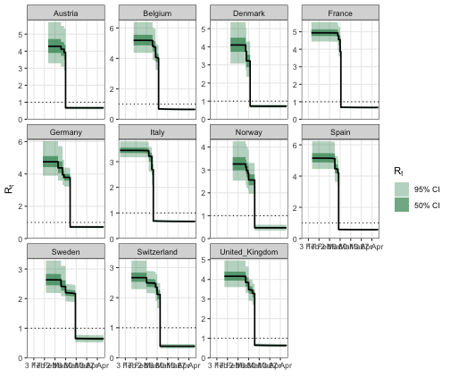
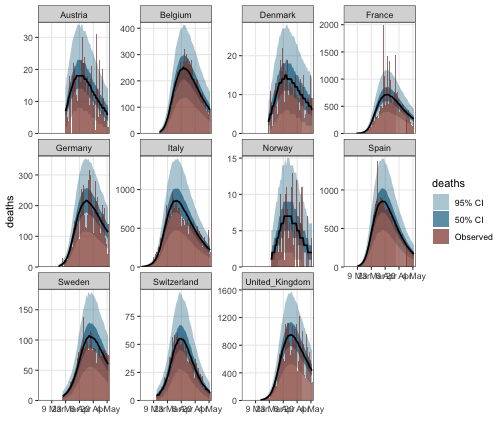

<style>
.contents .page-header {
    display: none;
}
</style>

::: {.article_container}


# Reproducing Flaxman et al. (2020)

**epidemia** grew out of the model in @Flaxman2020, the *Nature* paper that
estimated the effect of non-pharmaceutical interventions on Covid-19
transmission across eleven European countries. That paper reports one headline
result: **lockdown accounts for essentially all of the measured reduction in
transmission**, and the other four measures sit near zero.

The [multilevel tutorial](europe-covid.html) fits a *related but different*
model to the same data and reaches a different conclusion, putting a substantial
effect on social distancing as well. That is not a contradiction — it is two
different specifications. This tutorial writes down Flaxman's specification
exactly, so the two can be compared on equal terms.

The result is a close match. Lockdown comes out at **80.8% [75.1%, 84.5%]**
against the paper's **81% [75%, 87%]**, with the other five effects at zero.

## The model

From `stan-models/base-nature.stan` in the paper's
[repository](https://github.com/ImperialCollegeLondon/covid19model):

```stan
Rt[,m] = mu[m] * exp(-X[m][,1:6] * alpha[1:6]
                     - X[m][,5] * lockdown[m]
                     - X[m][,7] * last_intervention[m]);

alpha[i] = alpha_hier[i] - log(1.05) / 6.0;
alpha_hier        ~ gamma(0.1667, 1);
gamma             ~ normal(0, 0.2);
lockdown          ~ normal(0, gamma);
last_intervention ~ normal(0, gamma);
kappa             ~ normal(0, 0.5);
mu                ~ normal(3.28, kappa);
tau ~ exponential(0.03);   y[m] ~ exponential(1 / tau);
ifr_noise         ~ normal(1, 0.1);
phi               ~ normal(0, 5);
```

Three features of that program are easy to get wrong, and each one matters.

**There are seven covariate columns, not five.** `utils/process-covariates.r`
builds six,

```r
df_features = data.frame('school' = school, 'selfIsolation' = selfIsolation,
                         'publicEvents' = publicEvents,
                         'firstIntervention' = firstIntervention,
                         'lockdown' = lockdown,
                         'socialDistancing' = socialDistancing)
```

and then bolts on a seventh:

```r
X2 = array(0, c(stan_data$M, N2, 7))
X2[,,1:6] = stan_data$X
X2[which(countries == "Sweden"),,7] = X2[which(countries == "Sweden"),,3]
```

Column 4, `firstIntervention`, is 1 once *any* measure is in force. It absorbs
the common "something changed" drop, leaving the five individual coefficients to
explain only what distinguishes them from one another. Column 7 is **zero
everywhere except Sweden**, where it copies column 3 (public events).

**Column 7 is the "last intervention" term.** Sweden's lockdown date in the
paper's `interventions.rds` is the sentinel `2090-03-17` — it never locked down —
and its last measure was the public-events ban. For every other country lockdown
*is* the last intervention, because measures enacted after lockdown are collapsed
onto the lockdown date. So `lockdown[m]` and `last_intervention[m]` are one
construct seen twice: **each country gets a single country-specific effect on its
own last measure**, routed through column 5 for the ten that locked down and
through column 7 for Sweden. That is why they share the scale `gamma`. For each
country exactly one of the two is identified; the other is a draw from its prior.

**Column 7 has no pooled coefficient.** The linear predictor multiplies
`X[,1:6]` by `alpha[1:6]` and `X[,7]` by `last_intervention[m]` alone.
(`alpha[7]` is declared and given a prior, but never enters the likelihood.) A
pooled coefficient there would double-count: Sweden's public events already
carry `alpha[3]` through column 3. In a formula this is simply a covariate that
appears in the random-effect term and not in the fixed part.

## Data


``` r
data <- EuropeCovid2$data %>%
  ungroup() %>%
  arrange(country, date)
```

The paper's death data (`COVID-19-up-to-date.rds`) ends on **5 May 2020**, and
the *Nature* analysis stops there. `EuropeCovid2` runs to 30 June, so the window
has to be truncated — fitting the extra eight weeks of post-lockdown data lets
`social_distancing_encouraged`, which is in force everywhere and never lifted,
absorb sustained suppression that belongs to lockdown.


``` r
data <- data %>% filter(date <= as.Date("2020-05-05"))
```

`process-covariates.r` starts each country's series 30 days before its
cumulative deaths reach 10, and begins the likelihood on day 31
(`EpidemicStart = index1 + 1 - index2`). The 30-day run-up is simulated but not
fitted, which `epidemia` expresses by setting those observations to `NA`.


``` r
data <- data %>%
  group_by(country) %>%
  filter(row_number() >= which(cumsum(deaths) >= 10)[1] - 30) %>%
  mutate(deaths = replace(deaths, row_number() <= 30, NA),
         pop = first(na.omit(pop))) %>%   # pop is NA on pre-epidemic rows
  ungroup()
```

Now the two extra design columns.


``` r
data <- data %>% mutate(
  first_intervention = 1 * ((schools_universities + self_isolating_if_ill +
                             public_events + lockdown +
                             social_distancing_encouraged) >= 1),
  sweden_public_events = public_events * (country == "Sweden")
)

# column 7 is Sweden-only, exactly as X2[,,7] is built
stopifnot(all(data$sweden_public_events[data$country != "Sweden"] == 0))
```

The per-country infection fatality ratios are the paper's (`data/popt-ifr.rds`);
`EuropeCovid2$data$pop` already carries its populations.


``` r
ifr <- c(Austria = 0.010388226, Belgium = 0.010959878, Denmark = 0.010207470,
         France = 0.012556187, Germany = 0.012332443, Italy = 0.012449626,
         Norway = 0.009149564, Spain = 0.010783873, Sweden = 0.010311043,
         Switzerland = 0.010213453, United_Kingdom = 0.010350438)
countries <- levels(factor(data$country))
ifr_m   <- ifr[countries]
ifr_ref <- mean(ifr_m)
```

## Transmission

`link = "log"` gives $R_t = \exp(\eta)$, which is Flaxman's multiplicative form
with $\beta_k = -\alpha_k$. The `shifted_gamma` prior is exactly his: **epidemia**
gives `-z_beta` a Gamma density and sets `beta = z_beta + shift`, so
$\beta = \text{shift} - \Gamma(1/6, 1)$, matching
`alpha[i] = alpha_hier[i] - log(1.05)/6`.

`sweden_public_events` appears **only** inside the `||` term, so it gets a
country effect and no pooled coefficient — column 7's structure, written
directly.


``` r
rt <- epirt(
  formula = R(country, date) ~ 1 + schools_universities + self_isolating_if_ill +
    public_events + first_intervention + lockdown +
    social_distancing_encouraged +
    (1 + lockdown + sweden_public_events || country),
  link = "log",
  prior = shifted_gamma(shape = 1/6, scale = 1, shift = log(1.05) / 6),
  prior_intercept = normal(log(3.28), 0.05),
  prior_covariance = decov(shape = 1, scale = 0.09, concentration = 1)
)
```

Two approximations are buried in those last two lines, and they are worth being
explicit about.

*The intercept.* Flaxman puts `mu[m] ~ normal(3.28, kappa)` on the $R_0$ scale
with the hyper-mean **fixed** at 3.28. A log link can only carry a prior on
$\log R_0$, so the global intercept is pinned near $\log 3.28$ instead and the
country variation is carried by the random intercept.

*The covariance.* Flaxman gives the two country slopes one shared scale
(`gamma ~ half-normal(0, 0.2)`) and the intercept its own
(`kappa ~ half-normal(0, 0.5)`, about 0.12 on the log scale). `decov` splits a
single scale across all three components with a Dirichlet, so they share rather
than separate. `scale = 0.09` is chosen so the implied prior on $R_0$ matches:


``` r
inf <- epiinf(gen = EuropeCovid$si, seed_days = 6L,
              pop_adjust = TRUE, pops = pop)

deaths <- epiobs(
  formula = deaths ~ 0 + country,
  i2o     = EuropeCovid2$inf2death * ifr_ref,
  family  = "neg_binom",
  link    = "identity",
  prior   = normal(location = ifr_m / ifr_ref, scale = 0.1 * ifr_m / ifr_ref)
)

args <- list(rt = rt, inf = inf, obs = deaths, data = data, seed = 12345)
pp <- do.call(epim, c(args, list(algorithm = "sampling", iter = 1e3,
                                 chains = 2, prior_PD = TRUE, refresh = 0)))
```

```
## Running MCMC with 2 parallel chains...
```

```
## Chain 1 finished in 11.4 seconds.
## Chain 2 finished in 11.7 seconds.
## 
## Both chains finished successfully.
## Mean chain execution time: 11.6 seconds.
## Total execution time: 11.9 seconds.
```

``` r
r0 <- posterior_rt(pp)$draws[, 1]
```

```
## Running standalone generated quantities after 1 MCMC chain...
## 
## Chain 1 finished in 0.0 seconds.
```

``` r
c(mean = mean(r0), sd = sd(r0))
```

```
##      mean        sd 
## 3.2961888 0.4251561
```

Flaxman's prior implies a mean of 3.28 and a standard deviation of about 0.40.

## Infections and deaths

`seed_days = 6` and `prior_seeds = hexp(exponential(0.03))` are **epidemia's
defaults**, and they already *are* Flaxman's seeding: `tau ~ Exp(0.03)`,
`y[m] ~ Exp(1/tau)`.

The observation model needs no ascertainment regression. Flaxman's
`f = h * s` (IFR times delay) is data and `ifr_noise[m] ~ normal(1, 0.1)` is a
tight per-country multiplier, so an identity link on a one-hot country design
gives exactly that: the IFR goes into `i2o` and the coefficient carries
`ifr_noise[m] * IFR_m / IFR_ref`.

One further approximation: Flaxman depletes susceptibles linearly,
`Rt_adj = (S / pop) * Rt`, where `epiinf(pop_adjust = TRUE)` saturates,
$i = S(1 - e^{-i'/P})$. The two agree to first order in $i'/P$, and cumulative
attack rates over this window are a few percent.

## Fitting


``` r
fm <- do.call(epim, c(args, list(
  algorithm = "sampling", iter = 2e3, chains = 4, refresh = 0,
  control = list(adapt_delta = 0.99, max_treedepth = 14)
)))
```

```
## Running MCMC with 4 parallel chains...
```

```
## Chain 3 finished in 2310.9 seconds.
## Chain 1 finished in 2615.4 seconds.
## Chain 4 finished in 3101.7 seconds.
## Chain 2 finished in 3154.1 seconds.
## 
## All 4 chains finished successfully.
## Mean chain execution time: 2795.5 seconds.
## Total execution time: 3154.2 seconds.
```


``` r
sampler_diagnostics(fm)
```

```
## Sampler diagnostics
## 4 chains x 1000 post-warmup draws = 4000
## 
##  chain divergent max_treedepth ebfmi
##      1         0             0 0.846
##      2         0             0 0.936
##      3         0             0 0.925
##      4         0             0 0.816
## 
## Divergent transitions: 0 (0.0%)
## Hit max treedepth:     0 (0.0%)
## Lowest E-BFMI:         0.82
## Worst R-hat:           1.004  (log-posterior)
## Lowest bulk ESS:       1089  (log-posterior)
## Lowest tail ESS:       NA
## 
## No problems detected.
```

## Effect sizes

The paper reports effects as a **relative reduction in $R_t$**, which for the
log link is $1 - e^{\beta_k}$.


``` r
mat <- as.matrix(fm, par_types = "fixed")
npis <- c(schools_universities = "Schools", self_isolating_if_ill = "Isolating",
          public_events = "Events", first_intervention = "Any intervention",
          lockdown = "Lockdown", social_distancing_encouraged = "Distancing")

reductions <- do.call(rbind, lapply(names(npis), function(v) {
  q <- quantile(100 * (1 - exp(mat[, paste0("R|", v)])), c(0.5, 0.025, 0.975))
  data.frame(intervention = npis[[v]], median = q[[1]],
             lower = q[[2]], upper = q[[3]])
}))
knitr::kable(reductions, digits = 1, row.names = FALSE,
             caption = "Relative reduction in Rt (%)")
```


Table: (\#tab:flaxman-effects)Relative reduction in Rt (%)

|intervention     | median| lower| upper|
|:----------------|------:|-----:|-----:|
|Schools          |    0.0|  -0.8|  25.2|
|Isolating        |   -0.1|  -0.8|  23.1|
|Events           |   -0.7|  -0.8|  12.2|
|Any intervention |   -0.3|  -0.8|  20.7|
|Lockdown         |   80.7|  75.1|  84.5|
|Distancing       |    5.7|  -0.8|  34.3|

Lockdown carries essentially the whole effect and the other five sit at zero,
which is the *Nature* figure.

The country terms show the "last intervention" structure directly. Sweden's
effect lands on public events, its final measure, while its lockdown slot stays
at the prior because the column is identically zero:


``` r
all_draws <- as.matrix(fm)
show <- c("lockdown country:Sweden", "sweden_public_events country:Sweden",
          "lockdown country:Italy", "lockdown country:Spain",
          "lockdown country:United_Kingdom")
knitr::kable(do.call(rbind, lapply(show, function(cn) {
  x <- all_draws[, paste0("R|b[", cn, "]")]
  data.frame(term = cn, median = median(x),
             lower = quantile(x, 0.025)[[1]], upper = quantile(x, 0.975)[[1]])
})), digits = 3, row.names = FALSE, caption = "Country effects")
```


Table: (\#tab:flaxman-country-effects)Country effects

|term                                | median|  lower|  upper|
|:-----------------------------------|------:|------:|------:|
|lockdown country:Sweden             |  0.000| -0.401|  0.379|
|sweden_public_events country:Sweden | -1.184| -1.501| -0.887|
|lockdown country:Italy              |  0.286|  0.106|  0.498|
|lockdown country:Spain              | -0.265| -0.509| -0.066|
|lockdown country:United_Kingdom     |  0.041| -0.174|  0.259|


``` r
plot_rt(fm, step = TRUE, levels = c(50, 95)) + theme_bw()
```

```
## Running standalone generated quantities after 1 MCMC chain...
## 
## Chain 1 finished in 0.0 seconds.
```

<div class="figure" style="text-align: center">

<p class="caption">(\#fig:flaxman-rt-plot)Estimated reproduction numbers.</p>
</div>


``` r
plot_obs(fm, type = "deaths", levels = c(50, 95)) + theme_bw()
```

```
## Running standalone generated quantities after 1 MCMC chain...
## 
## Chain 1 finished in 0.0 seconds.
```

<div class="figure" style="text-align: center">

<p class="caption">(\#fig:flaxman-obs-plot)Posterior predictive for daily deaths.</p>
</div>

## What does not reproduce exactly

Two inputs differ from the paper's and neither is a modelling choice.

*The death series is a later vintage.* `EuropeCovid2` carries subsequent ECDC
revisions: 299 of the 1364 overlapping country-days differ, with totals to 5 May
running 12.9% higher for Sweden, 8.7% for Switzerland and 5.4% for Spain, while
Austria, Germany, Italy and Norway match exactly.

*The infection-to-death distribution is a day early.* `EuropeCovid2$inf2death`
has a mean delay of 22.9 days against the paper's 23.9 (5.1 days
infection-to-onset plus 18.8 onset-to-death).

What does match exactly: the intervention dates (all 55 country-measure cells),
the collapsing of post-lockdown measures onto the lockdown date, and the serial
interval (`EuropeCovid$si` agrees with the paper's `serial-interval.rds` to
1.4e-16).

As with the other tutorials, this reproduces a published analysis to demonstrate
the software; the epidemiological caveats in @Flaxman2020 — above all that the
interventions are highly collinear and that only lockdown is separately
identifiable — apply here unchanged.

# References
<hr>

:::
