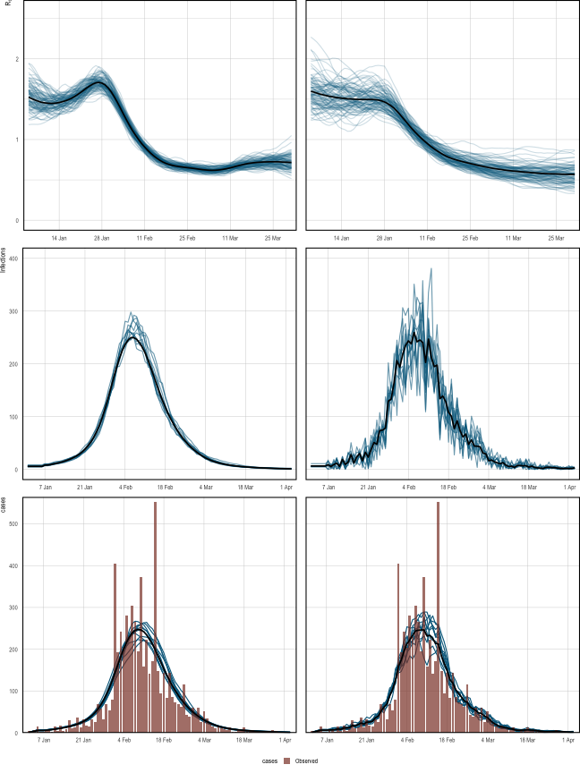

<style>
.contents .page-header {
    display: none;
  } 
</style>

::: {.article_container}


#  Spanish Flu in Baltimore {#sec:flu}
<hr>

Our first example infers $R_t$ during the H1N1 pandemic in Baltimore in 1918, using only case counts and a serial interval. This is, relatively speaking, a simple setting 
for several reasons. Only a single population (that of Baltimore) and 
observational model (case data) are considered. $R_t$ will
follow a daily random walk with no additional covariates. Of course, **epidemia** 
is capable of more complex modeling, and other articles take a 
step in this direction.


``` r
library(epidemia)
library(lubridate)
```

In addition to inferring $R_t$, this example demonstrates how to 
undertake posterior predictive checks to graphically assess model fit. The basic model
outlined above is then extended to add variation to the infection process, 
as was outlined in the model [description](model-description.html). This 
is particularly useful for this example because infection counts are low. We will also see that the extended model appears to have a computational advantage in this setting.

First use the following command, which ensures parallel execution if multiple cores 
are available.

``` r
options(mc.cores = parallel::detectCores())
```

The case data is provided by the **R** package **EpiEstim**.


``` r
library(EpiEstim)
data("Flu1918")
print(Flu1918)
```

```
## $incidence
##  [1]   5   1   6  15   2   3   8   7   2  15   4  17   4  10  31  11  13  36  13
## [20]  33  17  15  32  27  70  58  32  69  54  80 405 192 243 204 280 229 304 265
## [39] 196 372 158 222 141 172 553 148  95 144  85 143  87  73  70  62 116  44  38
## [58]  60  45  60  27  51  34  22  16  11  18  11  10   8  13   3   3   6   6  13
## [77]   5   6   6   5   5   1   2   2   3   8   4   1   2   3   1   0
## 
## $si_distr
##  [1] 0.000 0.233 0.359 0.198 0.103 0.053 0.027 0.014 0.007 0.003 0.002 0.001
```

## Data
<hr>

First form the `data`argument, which will eventually be passed to the 
model fitting function `epim()`. Recall that this must be a data frame 
containing all observations and covariates used to fit the model. Therefore, 
we require a column giving cases over time. In this 
example, no covariates are required. $R_t$ follows a daily random walk, 
with no additional covariates. In addition, the case ascertainment rate 
will be assumed at 100\%, and so no covariates are used for this model either.


``` r
date <- as.Date("1918-01-01") + seq(0, along.with = c(NA, Flu1918$incidence))
data <- data.frame(city = "Baltimore", cases = c(NA, Flu1918$incidence), 
                   date = date)
```

The variable `date`has been constructed so that the first cases 
are seen on the second day of the epidemic rather than the first. 
This ensures that the first observation can be explained by past infections.

## Transmission
<hr>

Recall that we wish to model $R_t$ by a daily random walk. This is 
specified by a call to `epirt()`. The 
`formula`argument defines the linear predictor which 
is then transformed by the link function. A random walk can be 
added to the predictor using the `rw()` function. This has an optional 
`time` argument which allows the random walk increments to occur at 
a different frequency to the `date` column. This can be employed, for 
example, to define a weekly random walk. If unspecified, the increments are 
daily. The increments are modeled as half-normal with a scale hyperparameter. 
The value of this is set using the `prior_scale` argument. This is used 
in the snippet below.

``` r
rt <- epirt(formula = R(city, date) ~ 1 + rw(prior_scale = 0.01),
            prior_intercept = normal(log(2), 0.2), link = 'log')
```
The prior on the intercept gives the initial reproduction number $R_0$ a prior mean of roughly 2.

## Observations
<hr>

Multiple observational models can 
be collected into a list and passed to `epim()` as the `obs` 
argument. In this case, only case data is used and so there is only one 
such model.

``` r
obs <-  epiobs(formula = cases ~ 0 + offset(rep(1,93)), link = "identity", 
               i2o = rep(.25,4))
```
For the purpose of this exercise, we have assumed that all infections will 
eventually manifest as a case. The above snippet implies \textit{full}
ascertainment, i.e. $\alpha_t = 1$ for all $t$. This is achieved using 
`offset()`, which allows vectors to be added to the linear predictor 
without multiplication by an unknown parameter.

The `i2o` argument implies 
that cases are recorded with equal probability in any of the four days after 
infection. 

## Infections
<hr>

Two infection models are considered. The first uses the renewal equation to propagate infections. The extended model 
adds variance to this process, and can be applied by using `latent = TRUE` 
in the call to `epiinf()`.


``` r
inf <- epiinf(gen = Flu1918$si_distr)
inf_ext <-  epiinf(gen = Flu1918$si_distr, latent = TRUE, 
                   prior_aux = normal(10,2))
```

The argument `gen` takes a discrete generation distribution. Here we have 
used the serial interval provided by **EpiEstim**. This makes the implicit assumption that the serial interval approximates the 
generation time. `prior_aux` sets 
the prior on the coefficient of dispersion $d$. This prior assumes that 
infections have conditional variance around 10 times the conditional mean.

## Fitting the Model
<hr>

We are left to collect all remaining arguments required for `epim()`. This 
is done as follows.

``` r
args <- list(rt = rt, obs = obs, inf = inf, data = data, iter = 2e3,
             seed = 12345,
             control = list(max_treedepth = 12, adapt_delta = 0.95))
args_ext <- args; args_ext$inf <- inf_ext
```

The arguments `iter` and `seed` set the number of MCMC iterations
and seeds respectively, and are passed directly on to the `$sample()`
method of the **cmdstanr** model. The random-walk parameterisation of
$R_t$ gives a posterior geometry that the sampler explores more reliably
with a slightly larger `max_treedepth` and `adapt_delta`; these are passed
through `control` (mirroring the **rstan** interface) and forwarded to the
sampler.

We wrap the calls to `epim()` in `system.time` in order to assess 
the computational cost of fitting the models. The snippet below fits both 
versions of the model. `fm1` and `fm2`are the fitted basic model 
and extended model respectively.

``` r
system.time(fm1 <- do.call(epim, args))
```

```
## Running MCMC with 4 parallel chains...
## 
## Chain 1 Iteration:    1 / 2000 [  0%]  (Warmup)
```

```
## Chain 1 Informational Message: The current Metropolis proposal is about to be rejected because of the following issue:
```

```
## Chain 1 Exception: epidemia_base_model_namespace::log_prob: load[2, 1] is nan, but must be greater than or equal to 0.000000 (in '/Users/smishra/Documents/GitHub/epidemia/inst/stan//tparameters/infections_rt.stan', line 2, column 0, included from
```

```
## Chain 1 '/var/folders/3b/9h2hhrtd6m10021mpjqtv6s40000gn/T/RtmpjLMmec/model-14cfd92d1684.stan', line 62, column 0)
```

```
## Chain 1 If this warning occurs sporadically, such as for highly constrained variable types like covariance matrices, then the sampler is fine,
```

```
## Chain 1 but if this warning occurs often then your model may be either severely ill-conditioned or misspecified.
```

```
## Chain 1
```

```
## Chain 1 Informational Message: The current Metropolis proposal is about to be rejected because of the following issue:
```

```
## Chain 1 Exception: epidemia_base_model_namespace::log_prob: load[2, 1] is nan, but must be greater than or equal to 0.000000 (in '/Users/smishra/Documents/GitHub/epidemia/inst/stan//tparameters/infections_rt.stan', line 2, column 0, included from
```

```
## Chain 1 '/var/folders/3b/9h2hhrtd6m10021mpjqtv6s40000gn/T/RtmpjLMmec/model-14cfd92d1684.stan', line 62, column 0)
```

```
## Chain 1 If this warning occurs sporadically, such as for highly constrained variable types like covariance matrices, then the sampler is fine,
```

```
## Chain 1 but if this warning occurs often then your model may be either severely ill-conditioned or misspecified.
```

```
## Chain 1
```

```
## Chain 1 Informational Message: The current Metropolis proposal is about to be rejected because of the following issue:
```

```
## Chain 1 Exception: epidemia_base_model_namespace::log_prob: load[11, 1] is nan, but must be greater than or equal to 0.000000 (in '/Users/smishra/Documents/GitHub/epidemia/inst/stan//tparameters/infections_rt.stan', line 2, column 0, included from
```

```
## Chain 1 '/var/folders/3b/9h2hhrtd6m10021mpjqtv6s40000gn/T/RtmpjLMmec/model-14cfd92d1684.stan', line 62, column 0)
```

```
## Chain 1 If this warning occurs sporadically, such as for highly constrained variable types like covariance matrices, then the sampler is fine,
```

```
## Chain 1 but if this warning occurs often then your model may be either severely ill-conditioned or misspecified.
```

```
## Chain 1
```

```
## Chain 2 Iteration:    1 / 2000 [  0%]  (Warmup)
```

```
## Chain 2 Informational Message: The current Metropolis proposal is about to be rejected because of the following issue:
```

```
## Chain 2 Exception: epidemia_base_model_namespace::log_prob: load[2, 1] is nan, but must be greater than or equal to 0.000000 (in '/Users/smishra/Documents/GitHub/epidemia/inst/stan//tparameters/infections_rt.stan', line 2, column 0, included from
```

```
## Chain 2 '/var/folders/3b/9h2hhrtd6m10021mpjqtv6s40000gn/T/RtmpjLMmec/model-14cfd92d1684.stan', line 62, column 0)
```

```
## Chain 2 If this warning occurs sporadically, such as for highly constrained variable types like covariance matrices, then the sampler is fine,
```

```
## Chain 2 but if this warning occurs often then your model may be either severely ill-conditioned or misspecified.
```

```
## Chain 2
```

```
## Chain 2 Informational Message: The current Metropolis proposal is about to be rejected because of the following issue:
```

```
## Chain 2 Exception: epidemia_base_model_namespace::log_prob: load[8, 1] is nan, but must be greater than or equal to 0.000000 (in '/Users/smishra/Documents/GitHub/epidemia/inst/stan//tparameters/infections_rt.stan', line 2, column 0, included from
```

```
## Chain 2 '/var/folders/3b/9h2hhrtd6m10021mpjqtv6s40000gn/T/RtmpjLMmec/model-14cfd92d1684.stan', line 62, column 0)
```

```
## Chain 2 If this warning occurs sporadically, such as for highly constrained variable types like covariance matrices, then the sampler is fine,
```

```
## Chain 2 but if this warning occurs often then your model may be either severely ill-conditioned or misspecified.
```

```
## Chain 2
```

```
## Chain 2 Informational Message: The current Metropolis proposal is about to be rejected because of the following issue:
```

```
## Chain 2 Exception: epidemia_base_model_namespace::log_prob: load[17, 1] is nan, but must be greater than or equal to 0.000000 (in '/Users/smishra/Documents/GitHub/epidemia/inst/stan//tparameters/infections_rt.stan', line 2, column 0, included from
```

```
## Chain 2 '/var/folders/3b/9h2hhrtd6m10021mpjqtv6s40000gn/T/RtmpjLMmec/model-14cfd92d1684.stan', line 62, column 0)
```

```
## Chain 2 If this warning occurs sporadically, such as for highly constrained variable types like covariance matrices, then the sampler is fine,
```

```
## Chain 2 but if this warning occurs often then your model may be either severely ill-conditioned or misspecified.
```

```
## Chain 2
```

```
## Chain 3 Iteration:    1 / 2000 [  0%]  (Warmup)
```

```
## Chain 3 Informational Message: The current Metropolis proposal is about to be rejected because of the following issue:
```

```
## Chain 3 Exception: epidemia_base_model_namespace::log_prob: load[2, 1] is nan, but must be greater than or equal to 0.000000 (in '/Users/smishra/Documents/GitHub/epidemia/inst/stan//tparameters/infections_rt.stan', line 2, column 0, included from
```

```
## Chain 3 '/var/folders/3b/9h2hhrtd6m10021mpjqtv6s40000gn/T/RtmpjLMmec/model-14cfd92d1684.stan', line 62, column 0)
```

```
## Chain 3 If this warning occurs sporadically, such as for highly constrained variable types like covariance matrices, then the sampler is fine,
```

```
## Chain 3 but if this warning occurs often then your model may be either severely ill-conditioned or misspecified.
```

```
## Chain 3
```

```
## Chain 3 Informational Message: The current Metropolis proposal is about to be rejected because of the following issue:
```

```
## Chain 3 Exception: epidemia_base_model_namespace::log_prob: load[2, 1] is nan, but must be greater than or equal to 0.000000 (in '/Users/smishra/Documents/GitHub/epidemia/inst/stan//tparameters/infections_rt.stan', line 2, column 0, included from
```

```
## Chain 3 '/var/folders/3b/9h2hhrtd6m10021mpjqtv6s40000gn/T/RtmpjLMmec/model-14cfd92d1684.stan', line 62, column 0)
```

```
## Chain 3 If this warning occurs sporadically, such as for highly constrained variable types like covariance matrices, then the sampler is fine,
```

```
## Chain 3 but if this warning occurs often then your model may be either severely ill-conditioned or misspecified.
```

```
## Chain 3
```

```
## Chain 3 Informational Message: The current Metropolis proposal is about to be rejected because of the following issue:
```

```
## Chain 3 Exception: epidemia_base_model_namespace::log_prob: load[11, 1] is nan, but must be greater than or equal to 0.000000 (in '/Users/smishra/Documents/GitHub/epidemia/inst/stan//tparameters/infections_rt.stan', line 2, column 0, included from
```

```
## Chain 3 '/var/folders/3b/9h2hhrtd6m10021mpjqtv6s40000gn/T/RtmpjLMmec/model-14cfd92d1684.stan', line 62, column 0)
```

```
## Chain 3 If this warning occurs sporadically, such as for highly constrained variable types like covariance matrices, then the sampler is fine,
```

```
## Chain 3 but if this warning occurs often then your model may be either severely ill-conditioned or misspecified.
```

```
## Chain 3
```

```
## Chain 4 Iteration:    1 / 2000 [  0%]  (Warmup)
```

```
## Chain 4 Informational Message: The current Metropolis proposal is about to be rejected because of the following issue:
```

```
## Chain 4 Exception: epidemia_base_model_namespace::log_prob: load[2, 1] is nan, but must be greater than or equal to 0.000000 (in '/Users/smishra/Documents/GitHub/epidemia/inst/stan//tparameters/infections_rt.stan', line 2, column 0, included from
```

```
## Chain 4 '/var/folders/3b/9h2hhrtd6m10021mpjqtv6s40000gn/T/RtmpjLMmec/model-14cfd92d1684.stan', line 62, column 0)
```

```
## Chain 4 If this warning occurs sporadically, such as for highly constrained variable types like covariance matrices, then the sampler is fine,
```

```
## Chain 4 but if this warning occurs often then your model may be either severely ill-conditioned or misspecified.
```

```
## Chain 4
```

```
## Chain 4 Informational Message: The current Metropolis proposal is about to be rejected because of the following issue:
```

```
## Chain 4 Exception: epidemia_base_model_namespace::log_prob: load[8, 1] is nan, but must be greater than or equal to 0.000000 (in '/Users/smishra/Documents/GitHub/epidemia/inst/stan//tparameters/infections_rt.stan', line 2, column 0, included from
```

```
## Chain 4 '/var/folders/3b/9h2hhrtd6m10021mpjqtv6s40000gn/T/RtmpjLMmec/model-14cfd92d1684.stan', line 62, column 0)
```

```
## Chain 4 If this warning occurs sporadically, such as for highly constrained variable types like covariance matrices, then the sampler is fine,
```

```
## Chain 4 but if this warning occurs often then your model may be either severely ill-conditioned or misspecified.
```

```
## Chain 4
```

```
## Chain 4 Informational Message: The current Metropolis proposal is about to be rejected because of the following issue:
```

```
## Chain 4 Exception: epidemia_base_model_namespace::log_prob: load[17, 1] is nan, but must be greater than or equal to 0.000000 (in '/Users/smishra/Documents/GitHub/epidemia/inst/stan//tparameters/infections_rt.stan', line 2, column 0, included from
```

```
## Chain 4 '/var/folders/3b/9h2hhrtd6m10021mpjqtv6s40000gn/T/RtmpjLMmec/model-14cfd92d1684.stan', line 62, column 0)
```

```
## Chain 4 If this warning occurs sporadically, such as for highly constrained variable types like covariance matrices, then the sampler is fine,
```

```
## Chain 4 but if this warning occurs often then your model may be either severely ill-conditioned or misspecified.
```

```
## Chain 4
```

```
## Chain 4 Iteration:  100 / 2000 [  5%]  (Warmup) 
## Chain 1 Iteration:  100 / 2000 [  5%]  (Warmup) 
## Chain 2 Iteration:  100 / 2000 [  5%]  (Warmup) 
## Chain 3 Iteration:  100 / 2000 [  5%]  (Warmup) 
## Chain 2 Iteration:  200 / 2000 [ 10%]  (Warmup) 
## Chain 1 Iteration:  200 / 2000 [ 10%]  (Warmup) 
## Chain 4 Iteration:  200 / 2000 [ 10%]  (Warmup) 
## Chain 3 Iteration:  200 / 2000 [ 10%]  (Warmup) 
## Chain 2 Iteration:  300 / 2000 [ 15%]  (Warmup) 
## Chain 1 Iteration:  300 / 2000 [ 15%]  (Warmup) 
## Chain 4 Iteration:  300 / 2000 [ 15%]  (Warmup) 
## Chain 3 Iteration:  300 / 2000 [ 15%]  (Warmup) 
## Chain 1 Iteration:  400 / 2000 [ 20%]  (Warmup) 
## Chain 2 Iteration:  400 / 2000 [ 20%]  (Warmup) 
## Chain 4 Iteration:  400 / 2000 [ 20%]  (Warmup) 
## Chain 3 Iteration:  400 / 2000 [ 20%]  (Warmup) 
## Chain 2 Iteration:  500 / 2000 [ 25%]  (Warmup) 
## Chain 4 Iteration:  500 / 2000 [ 25%]  (Warmup) 
## Chain 1 Iteration:  500 / 2000 [ 25%]  (Warmup) 
## Chain 3 Iteration:  500 / 2000 [ 25%]  (Warmup) 
## Chain 2 Iteration:  600 / 2000 [ 30%]  (Warmup) 
## Chain 4 Iteration:  600 / 2000 [ 30%]  (Warmup) 
## Chain 1 Iteration:  600 / 2000 [ 30%]  (Warmup) 
## Chain 3 Iteration:  600 / 2000 [ 30%]  (Warmup) 
## Chain 2 Iteration:  700 / 2000 [ 35%]  (Warmup) 
## Chain 4 Iteration:  700 / 2000 [ 35%]  (Warmup) 
## Chain 1 Iteration:  700 / 2000 [ 35%]  (Warmup) 
## Chain 3 Iteration:  700 / 2000 [ 35%]  (Warmup) 
## Chain 2 Iteration:  800 / 2000 [ 40%]  (Warmup) 
## Chain 4 Iteration:  800 / 2000 [ 40%]  (Warmup) 
## Chain 1 Iteration:  800 / 2000 [ 40%]  (Warmup) 
## Chain 3 Iteration:  800 / 2000 [ 40%]  (Warmup) 
## Chain 2 Iteration:  900 / 2000 [ 45%]  (Warmup) 
## Chain 4 Iteration:  900 / 2000 [ 45%]  (Warmup) 
## Chain 1 Iteration:  900 / 2000 [ 45%]  (Warmup) 
## Chain 3 Iteration:  900 / 2000 [ 45%]  (Warmup) 
## Chain 4 Iteration: 1000 / 2000 [ 50%]  (Warmup) 
## Chain 4 Iteration: 1001 / 2000 [ 50%]  (Sampling) 
## Chain 2 Iteration: 1000 / 2000 [ 50%]  (Warmup) 
## Chain 2 Iteration: 1001 / 2000 [ 50%]  (Sampling) 
## Chain 1 Iteration: 1000 / 2000 [ 50%]  (Warmup) 
## Chain 1 Iteration: 1001 / 2000 [ 50%]  (Sampling) 
## Chain 3 Iteration: 1000 / 2000 [ 50%]  (Warmup) 
## Chain 3 Iteration: 1001 / 2000 [ 50%]  (Sampling) 
## Chain 4 Iteration: 1100 / 2000 [ 55%]  (Sampling) 
## Chain 2 Iteration: 1100 / 2000 [ 55%]  (Sampling) 
## Chain 1 Iteration: 1100 / 2000 [ 55%]  (Sampling) 
## Chain 3 Iteration: 1100 / 2000 [ 55%]  (Sampling) 
## Chain 4 Iteration: 1200 / 2000 [ 60%]  (Sampling) 
## Chain 1 Iteration: 1200 / 2000 [ 60%]  (Sampling) 
## Chain 2 Iteration: 1200 / 2000 [ 60%]  (Sampling) 
## Chain 4 Iteration: 1300 / 2000 [ 65%]  (Sampling) 
## Chain 3 Iteration: 1200 / 2000 [ 60%]  (Sampling) 
## Chain 1 Iteration: 1300 / 2000 [ 65%]  (Sampling) 
## Chain 2 Iteration: 1300 / 2000 [ 65%]  (Sampling) 
## Chain 4 Iteration: 1400 / 2000 [ 70%]  (Sampling) 
## Chain 3 Iteration: 1300 / 2000 [ 65%]  (Sampling) 
## Chain 1 Iteration: 1400 / 2000 [ 70%]  (Sampling) 
## Chain 2 Iteration: 1400 / 2000 [ 70%]  (Sampling) 
## Chain 4 Iteration: 1500 / 2000 [ 75%]  (Sampling) 
## Chain 3 Iteration: 1400 / 2000 [ 70%]  (Sampling) 
## Chain 1 Iteration: 1500 / 2000 [ 75%]  (Sampling) 
## Chain 2 Iteration: 1500 / 2000 [ 75%]  (Sampling) 
## Chain 4 Iteration: 1600 / 2000 [ 80%]  (Sampling) 
## Chain 1 Iteration: 1600 / 2000 [ 80%]  (Sampling) 
## Chain 3 Iteration: 1500 / 2000 [ 75%]  (Sampling) 
## Chain 4 Iteration: 1700 / 2000 [ 85%]  (Sampling) 
## Chain 2 Iteration: 1600 / 2000 [ 80%]  (Sampling) 
## Chain 1 Iteration: 1700 / 2000 [ 85%]  (Sampling) 
## Chain 3 Iteration: 1600 / 2000 [ 80%]  (Sampling) 
## Chain 4 Iteration: 1800 / 2000 [ 90%]  (Sampling) 
## Chain 2 Iteration: 1700 / 2000 [ 85%]  (Sampling) 
## Chain 1 Iteration: 1800 / 2000 [ 90%]  (Sampling) 
## Chain 4 Iteration: 1900 / 2000 [ 95%]  (Sampling) 
## Chain 3 Iteration: 1700 / 2000 [ 85%]  (Sampling) 
## Chain 2 Iteration: 1800 / 2000 [ 90%]  (Sampling) 
## Chain 1 Iteration: 1900 / 2000 [ 95%]  (Sampling) 
## Chain 4 Iteration: 2000 / 2000 [100%]  (Sampling) 
## Chain 4 finished in 19.0 seconds.
## Chain 3 Iteration: 1800 / 2000 [ 90%]  (Sampling) 
## Chain 1 Iteration: 2000 / 2000 [100%]  (Sampling) 
## Chain 2 Iteration: 1900 / 2000 [ 95%]  (Sampling) 
## Chain 1 finished in 19.7 seconds.
## Chain 3 Iteration: 1900 / 2000 [ 95%]  (Sampling) 
## Chain 2 Iteration: 2000 / 2000 [100%]  (Sampling) 
## Chain 2 finished in 20.7 seconds.
## Chain 3 Iteration: 2000 / 2000 [100%]  (Sampling) 
## Chain 3 finished in 21.4 seconds.
## 
## All 4 chains finished successfully.
## Mean chain execution time: 20.2 seconds.
## Total execution time: 21.4 seconds.
```

```
##    user  system elapsed 
##  82.019   0.395  22.902
```

``` r
system.time(fm2 <- do.call(epim, args_ext))
```

```
## Running MCMC with 4 parallel chains...
## 
## Chain 1 Iteration:    1 / 2000 [  0%]  (Warmup)
```

```
## Chain 1 Informational Message: The current Metropolis proposal is about to be rejected because of the following issue:
```

```
## Chain 1 Exception: normal_lpdf: Scale parameter[27] is 0, but must be positive! (in '/Users/smishra/Documents/GitHub/epidemia/inst/stan//model/priors_inf.stan', line 13, column 6, included from
```

```
## Chain 1 '/var/folders/3b/9h2hhrtd6m10021mpjqtv6s40000gn/T/RtmpjLMmec/model-14cfd92d1684.stan', line 141, column 0)
```

```
## Chain 1 If this warning occurs sporadically, such as for highly constrained variable types like covariance matrices, then the sampler is fine,
```

```
## Chain 1 but if this warning occurs often then your model may be either severely ill-conditioned or misspecified.
```

```
## Chain 1
```

```
## Chain 1 Informational Message: The current Metropolis proposal is about to be rejected because of the following issue:
```

```
## Chain 1 Exception: normal_lpdf: Scale parameter[27] is 0, but must be positive! (in '/Users/smishra/Documents/GitHub/epidemia/inst/stan//model/priors_inf.stan', line 13, column 6, included from
```

```
## Chain 1 '/var/folders/3b/9h2hhrtd6m10021mpjqtv6s40000gn/T/RtmpjLMmec/model-14cfd92d1684.stan', line 141, column 0)
```

```
## Chain 1 If this warning occurs sporadically, such as for highly constrained variable types like covariance matrices, then the sampler is fine,
```

```
## Chain 1 but if this warning occurs often then your model may be either severely ill-conditioned or misspecified.
```

```
## Chain 1
```

```
## Chain 1 Informational Message: The current Metropolis proposal is about to be rejected because of the following issue:
```

```
## Chain 1 Exception: epidemia_base_model_namespace::log_prob: load[23, 1] is nan, but must be greater than or equal to 0.000000 (in '/Users/smishra/Documents/GitHub/epidemia/inst/stan//tparameters/infections_rt.stan', line 2, column 0, included from
```

```
## Chain 1 '/var/folders/3b/9h2hhrtd6m10021mpjqtv6s40000gn/T/RtmpjLMmec/model-14cfd92d1684.stan', line 62, column 0)
```

```
## Chain 1 If this warning occurs sporadically, such as for highly constrained variable types like covariance matrices, then the sampler is fine,
```

```
## Chain 1 but if this warning occurs often then your model may be either severely ill-conditioned or misspecified.
```

```
## Chain 1
```

```
## Chain 1 Informational Message: The current Metropolis proposal is about to be rejected because of the following issue:
```

```
## Chain 1 Exception: normal_lpdf: Location parameter[47] is inf, but must be finite! (in '/Users/smishra/Documents/GitHub/epidemia/inst/stan//model/priors_inf.stan', line 13, column 6, included from
```

```
## Chain 1 '/var/folders/3b/9h2hhrtd6m10021mpjqtv6s40000gn/T/RtmpjLMmec/model-14cfd92d1684.stan', line 141, column 0)
```

```
## Chain 1 If this warning occurs sporadically, such as for highly constrained variable types like covariance matrices, then the sampler is fine,
```

```
## Chain 1 but if this warning occurs often then your model may be either severely ill-conditioned or misspecified.
```

```
## Chain 1
```

```
## Chain 2 Iteration:    1 / 2000 [  0%]  (Warmup)
```

```
## Chain 2 Informational Message: The current Metropolis proposal is about to be rejected because of the following issue:
```

```
## Chain 2 Exception: normal_lpdf: Scale parameter[27] is 0, but must be positive! (in '/Users/smishra/Documents/GitHub/epidemia/inst/stan//model/priors_inf.stan', line 13, column 6, included from
```

```
## Chain 2 '/var/folders/3b/9h2hhrtd6m10021mpjqtv6s40000gn/T/RtmpjLMmec/model-14cfd92d1684.stan', line 141, column 0)
```

```
## Chain 2 If this warning occurs sporadically, such as for highly constrained variable types like covariance matrices, then the sampler is fine,
```

```
## Chain 2 but if this warning occurs often then your model may be either severely ill-conditioned or misspecified.
```

```
## Chain 2
```

```
## Chain 2 Informational Message: The current Metropolis proposal is about to be rejected because of the following issue:
```

```
## Chain 2 Exception: normal_lpdf: Scale parameter[27] is 0, but must be positive! (in '/Users/smishra/Documents/GitHub/epidemia/inst/stan//model/priors_inf.stan', line 13, column 6, included from
```

```
## Chain 2 '/var/folders/3b/9h2hhrtd6m10021mpjqtv6s40000gn/T/RtmpjLMmec/model-14cfd92d1684.stan', line 141, column 0)
```

```
## Chain 2 If this warning occurs sporadically, such as for highly constrained variable types like covariance matrices, then the sampler is fine,
```

```
## Chain 2 but if this warning occurs often then your model may be either severely ill-conditioned or misspecified.
```

```
## Chain 2
```

```
## Chain 2 Informational Message: The current Metropolis proposal is about to be rejected because of the following issue:
```

```
## Chain 2 Exception: epidemia_base_model_namespace::log_prob: load[16, 1] is nan, but must be greater than or equal to 0.000000 (in '/Users/smishra/Documents/GitHub/epidemia/inst/stan//tparameters/infections_rt.stan', line 2, column 0, included from
```

```
## Chain 2 '/var/folders/3b/9h2hhrtd6m10021mpjqtv6s40000gn/T/RtmpjLMmec/model-14cfd92d1684.stan', line 62, column 0)
```

```
## Chain 2 If this warning occurs sporadically, such as for highly constrained variable types like covariance matrices, then the sampler is fine,
```

```
## Chain 2 but if this warning occurs often then your model may be either severely ill-conditioned or misspecified.
```

```
## Chain 2
```

```
## Chain 2 Informational Message: The current Metropolis proposal is about to be rejected because of the following issue:
```

```
## Chain 2 Exception: normal_lpdf: Location parameter[28] is inf, but must be finite! (in '/Users/smishra/Documents/GitHub/epidemia/inst/stan//model/priors_inf.stan', line 13, column 6, included from
```

```
## Chain 2 '/var/folders/3b/9h2hhrtd6m10021mpjqtv6s40000gn/T/RtmpjLMmec/model-14cfd92d1684.stan', line 141, column 0)
```

```
## Chain 2 If this warning occurs sporadically, such as for highly constrained variable types like covariance matrices, then the sampler is fine,
```

```
## Chain 2 but if this warning occurs often then your model may be either severely ill-conditioned or misspecified.
```

```
## Chain 2
```

```
## Chain 3 Iteration:    1 / 2000 [  0%]  (Warmup)
```

```
## Chain 3 Informational Message: The current Metropolis proposal is about to be rejected because of the following issue:
```

```
## Chain 3 Exception: normal_lpdf: Scale parameter[27] is 0, but must be positive! (in '/Users/smishra/Documents/GitHub/epidemia/inst/stan//model/priors_inf.stan', line 13, column 6, included from
```

```
## Chain 3 '/var/folders/3b/9h2hhrtd6m10021mpjqtv6s40000gn/T/RtmpjLMmec/model-14cfd92d1684.stan', line 141, column 0)
```

```
## Chain 3 If this warning occurs sporadically, such as for highly constrained variable types like covariance matrices, then the sampler is fine,
```

```
## Chain 3 but if this warning occurs often then your model may be either severely ill-conditioned or misspecified.
```

```
## Chain 3
```

```
## Chain 3 Informational Message: The current Metropolis proposal is about to be rejected because of the following issue:
```

```
## Chain 3 Exception: normal_lpdf: Scale parameter[27] is 0, but must be positive! (in '/Users/smishra/Documents/GitHub/epidemia/inst/stan//model/priors_inf.stan', line 13, column 6, included from
```

```
## Chain 3 '/var/folders/3b/9h2hhrtd6m10021mpjqtv6s40000gn/T/RtmpjLMmec/model-14cfd92d1684.stan', line 141, column 0)
```

```
## Chain 3 If this warning occurs sporadically, such as for highly constrained variable types like covariance matrices, then the sampler is fine,
```

```
## Chain 3 but if this warning occurs often then your model may be either severely ill-conditioned or misspecified.
```

```
## Chain 3
```

```
## Chain 3 Informational Message: The current Metropolis proposal is about to be rejected because of the following issue:
```

```
## Chain 3 Exception: epidemia_base_model_namespace::log_prob: load[23, 1] is nan, but must be greater than or equal to 0.000000 (in '/Users/smishra/Documents/GitHub/epidemia/inst/stan//tparameters/infections_rt.stan', line 2, column 0, included from
```

```
## Chain 3 '/var/folders/3b/9h2hhrtd6m10021mpjqtv6s40000gn/T/RtmpjLMmec/model-14cfd92d1684.stan', line 62, column 0)
```

```
## Chain 3 If this warning occurs sporadically, such as for highly constrained variable types like covariance matrices, then the sampler is fine,
```

```
## Chain 3 but if this warning occurs often then your model may be either severely ill-conditioned or misspecified.
```

```
## Chain 3
```

```
## Chain 4 Iteration:    1 / 2000 [  0%]  (Warmup)
```

```
## Chain 4 Informational Message: The current Metropolis proposal is about to be rejected because of the following issue:
```

```
## Chain 4 Exception: normal_lpdf: Scale parameter[27] is 0, but must be positive! (in '/Users/smishra/Documents/GitHub/epidemia/inst/stan//model/priors_inf.stan', line 13, column 6, included from
```

```
## Chain 4 '/var/folders/3b/9h2hhrtd6m10021mpjqtv6s40000gn/T/RtmpjLMmec/model-14cfd92d1684.stan', line 141, column 0)
```

```
## Chain 4 If this warning occurs sporadically, such as for highly constrained variable types like covariance matrices, then the sampler is fine,
```

```
## Chain 4 but if this warning occurs often then your model may be either severely ill-conditioned or misspecified.
```

```
## Chain 4
```

```
## Chain 4 Informational Message: The current Metropolis proposal is about to be rejected because of the following issue:
```

```
## Chain 4 Exception: normal_lpdf: Scale parameter[27] is 0, but must be positive! (in '/Users/smishra/Documents/GitHub/epidemia/inst/stan//model/priors_inf.stan', line 13, column 6, included from
```

```
## Chain 4 '/var/folders/3b/9h2hhrtd6m10021mpjqtv6s40000gn/T/RtmpjLMmec/model-14cfd92d1684.stan', line 141, column 0)
```

```
## Chain 4 If this warning occurs sporadically, such as for highly constrained variable types like covariance matrices, then the sampler is fine,
```

```
## Chain 4 but if this warning occurs often then your model may be either severely ill-conditioned or misspecified.
```

```
## Chain 4
```

```
## Chain 4 Informational Message: The current Metropolis proposal is about to be rejected because of the following issue:
```

```
## Chain 4 Exception: epidemia_base_model_namespace::log_prob: load[23, 1] is nan, but must be greater than or equal to 0.000000 (in '/Users/smishra/Documents/GitHub/epidemia/inst/stan//tparameters/infections_rt.stan', line 2, column 0, included from
```

```
## Chain 4 '/var/folders/3b/9h2hhrtd6m10021mpjqtv6s40000gn/T/RtmpjLMmec/model-14cfd92d1684.stan', line 62, column 0)
```

```
## Chain 4 If this warning occurs sporadically, such as for highly constrained variable types like covariance matrices, then the sampler is fine,
```

```
## Chain 4 but if this warning occurs often then your model may be either severely ill-conditioned or misspecified.
```

```
## Chain 4
```

```
## Chain 4 Iteration:  100 / 2000 [  5%]  (Warmup) 
## Chain 3 Iteration:  100 / 2000 [  5%]  (Warmup) 
## Chain 3 Iteration:  200 / 2000 [ 10%]  (Warmup) 
## Chain 4 Iteration:  200 / 2000 [ 10%]  (Warmup) 
## Chain 1 Iteration:  100 / 2000 [  5%]  (Warmup) 
## Chain 3 Iteration:  300 / 2000 [ 15%]  (Warmup) 
## Chain 4 Iteration:  300 / 2000 [ 15%]  (Warmup) 
## Chain 1 Iteration:  200 / 2000 [ 10%]  (Warmup) 
## Chain 2 Iteration:  100 / 2000 [  5%]  (Warmup) 
## Chain 3 Iteration:  400 / 2000 [ 20%]  (Warmup) 
## Chain 4 Iteration:  400 / 2000 [ 20%]  (Warmup) 
## Chain 1 Iteration:  300 / 2000 [ 15%]  (Warmup) 
## Chain 2 Iteration:  200 / 2000 [ 10%]  (Warmup) 
## Chain 3 Iteration:  500 / 2000 [ 25%]  (Warmup) 
## Chain 4 Iteration:  500 / 2000 [ 25%]  (Warmup) 
## Chain 2 Iteration:  300 / 2000 [ 15%]  (Warmup) 
## Chain 3 Iteration:  600 / 2000 [ 30%]  (Warmup) 
## Chain 4 Iteration:  600 / 2000 [ 30%]  (Warmup) 
## Chain 1 Iteration:  400 / 2000 [ 20%]  (Warmup) 
## Chain 3 Iteration:  700 / 2000 [ 35%]  (Warmup) 
## Chain 4 Iteration:  700 / 2000 [ 35%]  (Warmup) 
## Chain 1 Iteration:  500 / 2000 [ 25%]  (Warmup) 
## Chain 2 Iteration:  400 / 2000 [ 20%]  (Warmup) 
## Chain 1 Iteration:  600 / 2000 [ 30%]  (Warmup) 
## Chain 2 Iteration:  500 / 2000 [ 25%]  (Warmup) 
## Chain 3 Iteration:  800 / 2000 [ 40%]  (Warmup) 
## Chain 4 Iteration:  800 / 2000 [ 40%]  (Warmup) 
## Chain 1 Iteration:  700 / 2000 [ 35%]  (Warmup) 
## Chain 2 Iteration:  600 / 2000 [ 30%]  (Warmup) 
## Chain 3 Iteration:  900 / 2000 [ 45%]  (Warmup) 
## Chain 4 Iteration:  900 / 2000 [ 45%]  (Warmup) 
## Chain 1 Iteration:  800 / 2000 [ 40%]  (Warmup) 
## Chain 2 Iteration:  700 / 2000 [ 35%]  (Warmup) 
## Chain 3 Iteration: 1000 / 2000 [ 50%]  (Warmup) 
## Chain 3 Iteration: 1001 / 2000 [ 50%]  (Sampling) 
## Chain 4 Iteration: 1000 / 2000 [ 50%]  (Warmup) 
## Chain 4 Iteration: 1001 / 2000 [ 50%]  (Sampling) 
## Chain 3 Iteration: 1100 / 2000 [ 55%]  (Sampling) 
## Chain 4 Iteration: 1100 / 2000 [ 55%]  (Sampling) 
## Chain 1 Iteration:  900 / 2000 [ 45%]  (Warmup) 
## Chain 2 Iteration:  800 / 2000 [ 40%]  (Warmup) 
## Chain 3 Iteration: 1200 / 2000 [ 60%]  (Sampling) 
## Chain 4 Iteration: 1200 / 2000 [ 60%]  (Sampling) 
## Chain 1 Iteration: 1000 / 2000 [ 50%]  (Warmup) 
## Chain 1 Iteration: 1001 / 2000 [ 50%]  (Sampling) 
## Chain 2 Iteration:  900 / 2000 [ 45%]  (Warmup) 
## Chain 3 Iteration: 1300 / 2000 [ 65%]  (Sampling) 
## Chain 4 Iteration: 1300 / 2000 [ 65%]  (Sampling) 
## Chain 1 Iteration: 1100 / 2000 [ 55%]  (Sampling) 
## Chain 2 Iteration: 1000 / 2000 [ 50%]  (Warmup) 
## Chain 2 Iteration: 1001 / 2000 [ 50%]  (Sampling) 
## Chain 3 Iteration: 1400 / 2000 [ 70%]  (Sampling) 
## Chain 4 Iteration: 1400 / 2000 [ 70%]  (Sampling) 
## Chain 1 Iteration: 1200 / 2000 [ 60%]  (Sampling) 
## Chain 3 Iteration: 1500 / 2000 [ 75%]  (Sampling) 
## Chain 4 Iteration: 1500 / 2000 [ 75%]  (Sampling) 
## Chain 1 Iteration: 1300 / 2000 [ 65%]  (Sampling) 
## Chain 2 Iteration: 1100 / 2000 [ 55%]  (Sampling) 
## Chain 3 Iteration: 1600 / 2000 [ 80%]  (Sampling) 
## Chain 4 Iteration: 1600 / 2000 [ 80%]  (Sampling) 
## Chain 1 Iteration: 1400 / 2000 [ 70%]  (Sampling) 
## Chain 2 Iteration: 1200 / 2000 [ 60%]  (Sampling) 
## Chain 4 Iteration: 1700 / 2000 [ 85%]  (Sampling) 
## Chain 3 Iteration: 1700 / 2000 [ 85%]  (Sampling) 
## Chain 4 Iteration: 1800 / 2000 [ 90%]  (Sampling) 
## Chain 1 Iteration: 1500 / 2000 [ 75%]  (Sampling) 
## Chain 2 Iteration: 1300 / 2000 [ 65%]  (Sampling) 
## Chain 3 Iteration: 1800 / 2000 [ 90%]  (Sampling) 
## Chain 4 Iteration: 1900 / 2000 [ 95%]  (Sampling) 
## Chain 1 Iteration: 1600 / 2000 [ 80%]  (Sampling) 
## Chain 2 Iteration: 1400 / 2000 [ 70%]  (Sampling) 
## Chain 3 Iteration: 1900 / 2000 [ 95%]  (Sampling) 
## Chain 1 Iteration: 1700 / 2000 [ 85%]  (Sampling) 
## Chain 1 Iteration: 1800 / 2000 [ 90%]  (Sampling) 
## Chain 2 Iteration: 1500 / 2000 [ 75%]  (Sampling) 
## Chain 3 Iteration: 2000 / 2000 [100%]  (Sampling) 
## Chain 4 Iteration: 2000 / 2000 [100%]  (Sampling) 
## Chain 3 finished in 3.8 seconds.
## Chain 4 finished in 3.8 seconds.
## Chain 1 Iteration: 1900 / 2000 [ 95%]  (Sampling) 
## Chain 1 Iteration: 2000 / 2000 [100%]  (Sampling) 
## Chain 2 Iteration: 1600 / 2000 [ 80%]  (Sampling) 
## Chain 1 finished in 4.1 seconds.
## Chain 2 Iteration: 1700 / 2000 [ 85%]  (Sampling) 
## Chain 2 Iteration: 1800 / 2000 [ 90%]  (Sampling) 
## Chain 2 Iteration: 1900 / 2000 [ 95%]  (Sampling) 
## Chain 2 Iteration: 2000 / 2000 [100%]  (Sampling) 
## Chain 2 finished in 4.6 seconds.
## 
## All 4 chains finished successfully.
## Mean chain execution time: 4.1 seconds.
## Total execution time: 4.7 seconds.
```

```
##    user  system elapsed 
##  17.638   0.314   6.212
```
Note the stark difference in running time. The extended model appears to fit 
faster even though there are $87$ additional parameters being sampled (daily 
infections after the seeding period, and the coefficient of dispersion). 
We conjecture that the additional variance 
around infections adds slack to the model, and leads to a posterior distribution 
that is easier to sample.

The results of both models are shown in Figure \@ref(fig:flu1918-plots). This 
Figure has been produced using **epidemia**'s plotting functions `spaghetti_rt()`, `spaghetti_infections()` and `spaghetti_obs()`. The key difference 
stems from the infection process. In the basic model, infections are deterministic 
given $R_t$ and seeds. However when infection counts are low, we 
generally expect high variance in the infection process. Since this 
variance is  unaccounted for, the model appears to place too much confidence in 
$R_t$ in this setting. The extended model on the other hand, 
has much wider credible intervals for $R_t$ when infections are low. This is intuitive:
 when counts are low, changes in infections could be explained by either the 
 variance in the offspring distribution of those who are infected, or by changes 
 in the $R_t$ value. This model captures this intuition.
 
Posterior predictive checks are shown in the bottom panel of Figure \@ref(fig:flu1918-plots), 
and show that both models are able to fit the data well.


```
## Running standalone generated quantities after 1 MCMC chain...
## 
## Chain 1 finished in 0.0 seconds.
```

```
## Running standalone generated quantities after 1 MCMC chain...
## 
## Chain 1 finished in 0.0 seconds.
```

```
## Running standalone generated quantities after 1 MCMC chain...
## 
## Chain 1 finished in 0.0 seconds.
```

```
## Running standalone generated quantities after 1 MCMC chain...
## 
## Chain 1 finished in 0.0 seconds.
```

```
## Running standalone generated quantities after 1 MCMC chain...
## 
## Chain 1 finished in 0.0 seconds.
```

```
## Running standalone generated quantities after 1 MCMC chain...
## 
## Chain 1 finished in 0.0 seconds.
```

<div class="figure" style="text-align: center">

<p class="caption">(\#fig:flu1918-plots)Spaghetti plots showing the median (black) and sample paths (blue) from the posterior distribution. The **left** corresponds to the basic model, and the **right** panel is for the extended version. **Top**: inferred time-varying reproduction numbers, which have been smoothed over 7 days for illustration. **Middle**: Inferred latent infections. **Bottom**: observed cases, and cases simulated from the posterior. These align closely, and so do not flag problems with the model fit.</p>
</div>

:::
