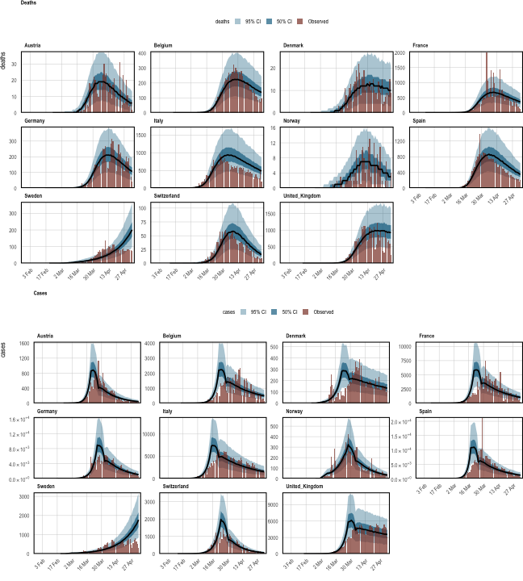
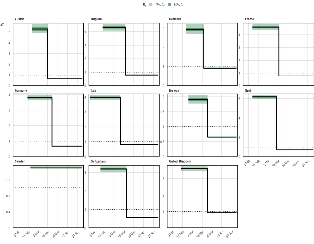
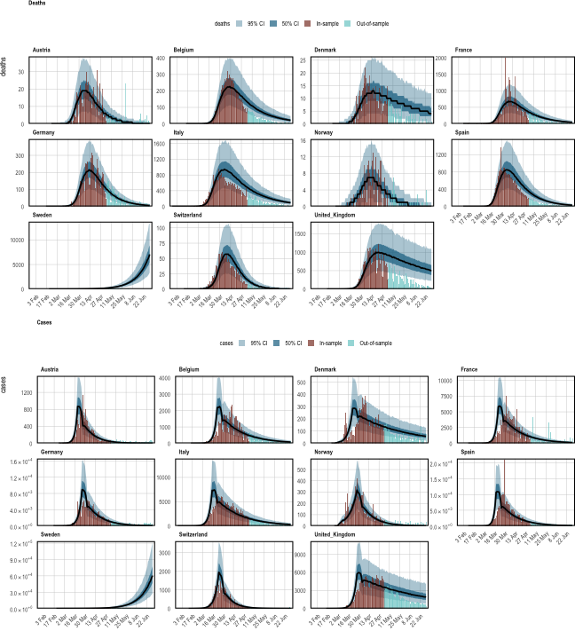
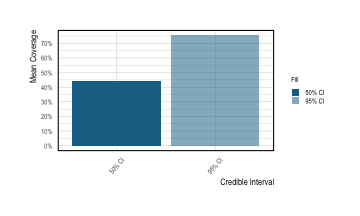

<style>
.contents .page-header {
    display: none;
}
</style>

::: {.article_container}


# Combining Partial Pooling with Several Data Streams
<hr>

The [multilevel](europe-covid.html) tutorial pooled parameters across eleven
countries, but fitted to a single data stream (deaths). The
[multiple observations](multiple-obs.html) tutorial jointly fitted two data
streams, but to a single region. These two capabilities are independent, and
**epidemia** lets you use both at once: a hierarchical model for $R_t$ across
groups, conditioned on several observation series simultaneously.

That combination is worth its own example because the two features interact.
Each observation series has its own ascertainment regression and its own
auxiliary parameters, while the transmission model shares information across
groups. Deaths pin down the absolute scale of the epidemic through a
comparatively stable infection fatality rate; cases are far more numerous and
so are more informative about *changes* in transmission, but their
ascertainment rate is much more uncertain. Fitting both lets each do the job it
is suited to, and partial pooling then lets countries with less informative data
borrow strength from the rest.

One limitation to keep in mind throughout: **partial pooling applies to the
$R_t$ regression only.** `epirt()` takes a `prior_covariance` argument;
`epiobs()` does not. Group-specific ascertainment must be written as fixed
effects (for example `deaths ~ 0 + country`) rather than as `(1 | country)`.


``` r
library(epidemia)
library(dplyr)
options(mc.cores = parallel::detectCores())
```

## Data
<hr>

We use `EuropeCovid2`, which holds daily deaths *and* daily cases for eleven
European countries, together with the binary intervention series used by
@Flaxman2020. We use all eleven.

That is worth a word, because it is tempting to cut the panel down to make the
example run faster. Doing so costs more than it saves. A partially pooled slope
asks the data to estimate a *variance* across groups, and a handful of groups
barely identifies it: the global effect $\beta$ and the deviations $b^{(m)}$ can
trade off against each other almost freely, which shows up as a ridge the
sampler has to crawl along. Fitting this model to three countries leaves
divergent transitions and a tail effective sample size in the tens. The
[sampler diagnostics](#checking-the-sampler) below show what the full panel
looks like instead.


``` r
data("EuropeCovid2")
data <- EuropeCovid2$data

groups <- sort(unique(as.character(data$country)))
groups
```

```
##  [1] "Austria"        "Belgium"        "Denmark"        "France"        
##  [5] "Germany"        "Italy"          "Norway"         "Spain"         
##  [9] "Sweden"         "Switzerland"    "United_Kingdom"
```

As in the multilevel tutorial, seeding is assumed to begin thirty days before
the tenth cumulative death in each country, and the model is fitted up to the
5^th^ of May. The remainder is held back so we can forecast into it.


``` r
data <- filter(data, date > date[which(cumsum(deaths) > 10)[1] - 30])
fit_data <- filter(data, date < as.Date("2020-05-05"))
```

## Transmission
<hr>

Reproduction numbers follow the same partially pooled step function as the
multilevel tutorial, simplified to a single intervention so that the example
stays small:

$$
R^{(m)}_t = R' g^{-1}\left(b^{(m)}_0 + \left(\beta + b^{(m)}\right) I^{(m)}_t\right),
$$

where $I^{(m)}_t$ indicates lockdown in country $m$, $\beta$ is the average
effect across countries, and $b^{(m)}_0$, $b^{(m)}$ are country deviations.


``` r
rt <- epirt(
  formula = R(country, date) ~ 0 + (1 + lockdown || country) + lockdown,
  prior = shifted_gamma(shape = 1/6, scale = 1, shift = log(1.05)/6),
  prior_covariance = decov(shape = c(2, 0.5), scale = 0.25),
  link = scaled_logit(6.5)
)
```

`||` rather than `|` makes the intercept and lockdown deviations independent,
so `decov()` reduces to a separate prior on each standard deviation. The vector
`shape` gives the intercepts more prior variability than the effects. Note that
`decov()` is the only covariance prior **epidemia** supports — `lkj()` is
exported but the Stan program does not implement it, and `epirt()` will say so.


``` r
inf <- epiinf(gen = EuropeCovid$si, seed_days = 6)
```

## Two Observation Models
<hr>

### Deaths

A constant infection fatality rate, as in the multilevel tutorial. The
`scaled_logit(0.02)` link confines the IFR to $[0\%, 2\%]$, and the symmetric
prior on the intercept centres it at $1\%$.


``` r
deaths <- epiobs(
  formula = deaths ~ 1,
  i2o = EuropeCovid2$inf2death,
  prior_intercept = normal(0, 0.2),
  link = scaled_logit(0.02)
)
```

```
## Warning: i2o does not sum to one. Please ensure this is intentional.
```

### Cases

It is worth being explicit about what this observation model does, because it is
easy to assume that fitting to cases means fitting infections. It does not.
Cases are a *delayed, partially ascertained* view of the latent infections
$i_t$. Writing $\alpha^{(m)}_t$ for the infection ascertainment ratio (IAR) in
country $m$ and $\pi^{\text{case}}_k$ for the infection-to-case delay
distribution,

\begin{equation}
\mathbb{E}\left[Y^{\text{cases}}_{t,m}\right]
  \;=\; \alpha^{(m)}_t \sum_{k} \pi^{\text{case}}_{k}\, i_{t-k, m},
(\#eq:cases-mean)
\end{equation}

with $\sum_k \pi^{\text{case}}_k = 1$. So infections are convolved with a delay
distribution and then scaled down by an ascertainment ratio that is itself a
fitted parameter. Deaths work identically, with $\pi^{\text{death}}$ and the IFR
in place of $\pi^{\text{case}}$ and the IAR.

The two pieces map onto the two arguments of `epiobs()`:

- **`i2o`** is $\pi^{\text{case}}$. Here it is deliberately crude — infections go
  undetected for four days, then are equally likely to be reported over the
  following week. It sums to one, as a delay distribution must. A serious
  analysis would motivate it from testing data.
- **`formula` + `link`** give $\alpha^{(m)}_t$. Case ascertainment differed
  markedly between these countries in early 2020, so unlike the IFR we let it
  vary by country. Because `epiobs()` has no `prior_covariance`, this is a
  *fixed* effect per country — `0 + country` — not a partially pooled one.
  `scaled_logit(0.4)` confines the IAR to $[0\%, 40\%]$.


``` r
cases <- epiobs(
  formula = cases ~ 0 + country,
  i2o = c(rep(0, 4), rep(1/7, 7)),
  prior = normal(0, 0.5),
  link = scaled_logit(0.4)
)
```

`epiobs()` warns that `i2o` does not sum to one. That is expected here and not a
mistake: `scaled_logit(K)` is implemented by folding the cap $K$ into `i2o` and
using a plain logit link, so the stored vector sums to $K$ rather than to $1$.
The delay distribution you supplied still sums to one.

## Fitting
<hr>

Both series are passed together as a list. Everything else is unchanged from a
single-series fit.


``` r
fm <- epim(
  rt = rt, inf = inf, obs = list(deaths, cases),
  data = fit_data, group_subset = groups,
  iter = 1e3, seed = 12345, refresh = 0,
  control = list(max_treedepth = 12, adapt_delta = 0.95)
)
```

```
## Running MCMC with 4 parallel chains...
```

```
## Chain 1 finished in 436.9 seconds.
## Chain 3 finished in 440.2 seconds.
## Chain 4 finished in 453.4 seconds.
## Chain 2 finished in 465.1 seconds.
## 
## All 4 chains finished successfully.
## Mean chain execution time: 448.9 seconds.
## Total execution time: 465.2 seconds.
```

`all_obs_types()` confirms both series are in the model, and each carries its
own parameters.


``` r
all_obs_types(fm)
```

```
## [1] "deaths" "cases"
```

## Checking the Sampler {#checking-the-sampler}
<hr>

Before reading anything off a fit, check that the sampler actually explored the
posterior. CmdStan prints its warnings to the console while it runs, but those
warnings are not part of the draws — scroll past them, or reload a saved model
in a new session, and they are gone. `sampler_diagnostics()` keeps them with the
fit.


``` r
sampler_diagnostics(fm)
```

```
## Sampler diagnostics
## 4 chains x 500 post-warmup draws = 2000
## 
##  chain divergent max_treedepth ebfmi
##      1         0             0 0.867
##      2         0             0 0.943
##      3         0             0 0.810
##      4         0             0 0.929
## 
## Divergent transitions: 0 (0.0%)
## Hit max treedepth:     0 (0.0%)
## Lowest E-BFMI:         0.81
## Worst R-hat:           1.010  (R|lockdown)
## Lowest bulk ESS:       380  (R|Sigma[country:(Intercept),(Intercept)])
## Lowest tail ESS:       491
## 
## Warnings:
## * Bulk ESS of 380 for R|Sigma[country:(Intercept),(Intercept)] is 95
##   per chain, below the 100 per chain that keeps posterior summaries
##   stable.
```

The three quantities answer different questions. **Divergent transitions** mean
the sampler could not follow the posterior's curvature; they bias the result and
drawing more samples does not help, so they have to be fixed by raising
`adapt_delta` or reparameterising. **Max treedepth** is an efficiency problem
rather than a correctness one — the sampler was still making progress when it
ran out of steps. **E-BFMI** below about 0.2 suggests the momentum resampling is
not exploring the energy distribution well.

This is also where the choice to keep all eleven countries pays off. The same
model on three countries returns ten divergent transitions, eighteen iterations
at maximum treedepth, and a tail effective sample size of 59 — versus none, none,
and a tail ESS in the hundreds here.

## Checking Both Series
<hr>

A joint model must explain *every* series it is fitted to. `plot_obs()` takes a
`type` argument to select one.


```
## Running standalone generated quantities after 1 MCMC chain...
## 
## Chain 1 finished in 0.0 seconds.
```

```
## Running standalone generated quantities after 1 MCMC chain...
## 
## Chain 1 finished in 0.0 seconds.
```

<div class="figure" style="text-align: center">

<p class="caption">(\#fig:mlmo-ppc)Posterior predictive checks for both data streams. **Top**: daily deaths. **Bottom**: daily cases. Observed counts are the red bars; the posterior median is black, with 50\% and 95\% credible intervals in shades of blue.</p>
</div>

Reproduction numbers are shown per country. Because the effects are partially
pooled, each country's curve is informed by the others.


```
## Running standalone generated quantities after 1 MCMC chain...
## 
## Chain 1 finished in 0.0 seconds.
```

<div class="figure" style="text-align: center">

<p class="caption">(\#fig:mlmo-rt-plot)Inferred reproduction numbers in each country, plotted as a step function because the only covariate is a binary policy indicator.</p>
</div>

## Where Partial Pooling Shows Up
<hr>

The global lockdown effect $\beta$ and the country deviations $b^{(m)}$ are
separate parameters. As in the multilevel tutorial, a country's total effect is
$\beta + b^{(m)}$, recovered from the draws with `as.matrix()`.


``` r
beta <- as.matrix(fm, par_models = "R", par_types = "fixed")
b <- as.matrix(fm, regex_pars = "^R\\|b\\[lockdown", par_groups = groups)
total <- sweep(b, MARGIN = 1, STATS = beta[, 1], FUN = "+")
colnames(total) <- groups
round(t(apply(total, 2, quantile, probs = c(0.05, 0.5, 0.95))), 2)
```

```
##                   5%   50%   95%
## Austria        -4.20 -3.74 -3.39
## Belgium        -2.84 -2.66 -2.49
## Denmark        -1.80 -1.62 -1.45
## France         -3.10 -2.91 -2.76
## Germany        -2.63 -2.50 -2.37
## Italy          -2.51 -2.40 -2.29
## Norway         -1.45 -1.33 -1.20
## Spain          -5.76 -5.02 -4.48
## Sweden         -4.26 -2.51 -0.77
## Switzerland    -2.46 -2.35 -2.23
## United_Kingdom -2.12 -2.01 -1.90
```

The country-specific case ascertainment intercepts, by contrast, are ordinary
fixed effects and can be read straight off the parameter names.


``` r
grep("^cases\\|", colnames(as.matrix(fm)), value = TRUE)
```

```
##  [1] "cases|countryAustria"        "cases|countryBelgium"       
##  [3] "cases|countryDenmark"        "cases|countryFrance"        
##  [5] "cases|countryGermany"        "cases|countryItaly"         
##  [7] "cases|countryNorway"         "cases|countrySpain"         
##  [9] "cases|countrySweden"         "cases|countrySwitzerland"   
## [11] "cases|countryUnited_Kingdom" "cases|reciprocal dispersion"
```

## Checking the ascertainment
<hr>

Equation \@ref(eq:cases-mean) is easy to state and easy to get wrong, so it is
worth confirming from the fit itself that cases really are a scaled-down view of
infections rather than the infections themselves.

One wrinkle: `posterior_linpred(transform = TRUE)` applies the *inverse link*,
which — because `scaled_logit(K)` is stored as a plain logit with $K$ folded into
`i2o` — returns $\text{logit}^{-1}(\eta)$ and **not** the rate itself. Multiply
by $K$ to recover the ascertainment ratio.


``` r
K_cases <- 0.4
iar <- posterior_linpred(fm, type = "cases", transform = TRUE)

iar_by_country <- sapply(groups, function(g)
  median(iar$draws[, iar$group == g]) * K_cases)
round(iar_by_country, 3)
```

```
##        Austria        Belgium        Denmark         France        Germany 
##          0.265          0.069          0.186          0.059          0.268 
##          Italy         Norway          Spain         Sweden    Switzerland 
##          0.057          0.317          0.081          0.045          0.197 
## United_Kingdom 
##          0.051
```

Now compare the implied totals. If the model were fitting infections directly,
these ratios would sit at one.


``` r
infections <- posterior_infections(fm)
```

```
## Running standalone generated quantities after 1 MCMC chain...
## 
## Chain 1 finished in 0.0 seconds.
```

``` r
predicted <- posterior_predict(fm, types = "cases")
```

```
## Running standalone generated quantities after 1 MCMC chain...
## 
## Chain 1 finished in 0.0 seconds.
```

``` r
ratio <- sapply(groups, function(g)
  sum(colMeans(predicted$draws[, predicted$group == g])) /
  sum(colMeans(infections$draws[, infections$group == g])))
round(ratio, 3)
```

```
##        Austria        Belgium        Denmark         France        Germany 
##          0.260          0.065          0.168          0.056          0.256 
##          Italy         Norway          Spain         Sweden    Switzerland 
##          0.054          0.307          0.077          0.027          0.195 
## United_Kingdom 
##          0.044
```

The two agree: only a fraction of infections becomes a recorded case, and that
fraction is a fitted quantity that differs by country. Italy's much lower
ascertainment is the model's way of reconciling a large inferred epidemic with a
comparatively small number of confirmed cases.

## Forecasting Both Series
<hr>

Forecasting works exactly as in the single-series case: build a data frame
covering the longer period and pass it as `newdata`. Every observation series is
projected forward.


``` r
newdata <- data
```


```
## Running standalone generated quantities after 1 MCMC chain...
## 
## Chain 1 finished in 0.0 seconds.
```

```
## Running standalone generated quantities after 1 MCMC chain...
## 
## Chain 1 finished in 0.0 seconds.
```

<div class="figure" style="text-align: center">

<p class="caption">(\#fig:mlmo-forecast)Out-of-sample forecasts for both series. The model was fitted only up to the 5th of May; everything to the right of that date is a forecast, and the observed values there were not used in fitting.</p>
</div>

Forecasts can also be scored. `evaluate_forecast()` returns daily error metrics
and credible-interval coverage, for one series at a time.


``` r
ev <- evaluate_forecast(fm, newdata = newdata, type = "deaths",
                        levels = c(50, 95))
```

```
## Running standalone generated quantities after 1 MCMC chain...
## 
## Chain 1 finished in 0.0 seconds.
```

``` r
head(ev$error)
```

```
##     group       date     crps mean_abs_error median_abs_error
## 1 Austria 2020-02-23 0.00e+00         0.0000                0
## 2 Austria 2020-02-24 0.00e+00         0.0000                0
## 3 Austria 2020-02-25 0.00e+00         0.0000                0
## 4 Austria 2020-02-26 0.00e+00         0.0000                0
## 5 Austria 2020-02-27 0.00e+00         0.0000                0
## 6 Austria 2020-02-28 2.25e-06         0.0015                0
```


```
## Running standalone generated quantities after 1 MCMC chain...
## 
## Chain 1 finished in 0.0 seconds.
```

<div class="figure" style="text-align: center">

<p class="caption">(\#fig:mlmo-coverage)Empirical coverage of the 50\% and 95\% credible intervals for daily deaths, over the whole modelled period.</p>
</div>

## Caveats
<hr>

As with the other tutorials, this example demonstrates the software rather than
making a defensible epidemiological claim. Eleven countries is a modest basis
for partial pooling; the infection-to-case distribution is invented; case
ascertainment certainly varied over time as well as between countries, which an
`rw()` term in the `cases` model would capture (see the
[multiple observations](multiple-obs.html) tutorial); and no adjustment is made
for the susceptible population.

# References
<hr>

:::
