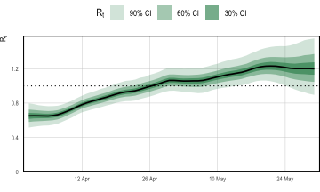
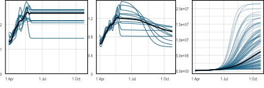
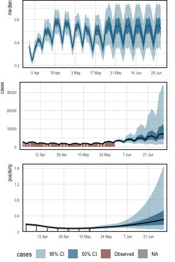

<style>
.contents .page-header {
    display: none;
  } 
</style>

::: {.article_container}


# Tracking SARS-CoV-2 In England
<hr>

Previous examples conditioned on a single observation series (case and
death counts respectively). Simple models were used for describing
ascertainment rates. The flu [example](flu.html) assumed
*full ascertainment* of infections, while the multilevel [example](multilevel-multi-obs.html) took the IFR to be *constant but unknown*.
Population adjustments were not considered, and both examples modeled
the entire history of the epidemic from the first observed cases.

Here we model the trajectory of SARS-CoV-2 in England using data over a
two month period from late March 2021 through to the end of May. In
doing so, we relax the aforementioned modeling assumptions and
demonstrate further capabilities of the package. Population adjustments
are applied in order to explicitly account for pre-existing immunity in
the population. The model is conditioned on two observation series:
daily case counts, and positivity from seroprevalence surveys. This example is 
inspired by this [paper](https://rss.org.uk/RSS/media/File-library/News/2021/MishraScott.pdf),  which uses **epidemia** to track SARS-CoV-2 at the local authority level in the UK.

Fitting the model to case counts requires a model for the case
ascertainment rates (IAR). Unlike in previous examples, we do not assume
that this is constant. While the IFR of Sars-CoV-2 may be broadly stable
over several weeks or months, the IAR could vary frequently, not least
due to changes in testing capacity, surge testing, and the general
prevalence of the disease. Therefore we opt instead to *infer the
time-varying IAR from positivity data*, which should provide an "anchor"
for the absolute size of the latent infection process. We allow IAR
dynamics to be inferred by modeling it as a random walk.

Our goal is to infer recent infection dynamics, and also to project
future infection and case counts. These goals do not necessitate a
detailed understanding of the fully history of disease dynamics, and is
primarily why we limit ourselves to a two month period. Other reasons
include that modeling the entire history is computationally demanding
and requires more intricate modeling to explain the full trajectory.

First load required packages.


``` r
library(epidemia)
library(lubridate)
library(dplyr)
options(mc.cores = parallel::detectCores())
```

## Data
<hr>

**epidemia** has a data set `EnglandNewCases` that contains daily
counts of confirmed SARS-CoV-2 infections in England from the 1^st^
January 2020 up to and including the 30^th^ May 2021. The data was
downloaded from @PHE on the 4^nd^ of June 2021.


``` r
data("EnglandNewCases")
data <- EnglandNewCases
```

The model will be fit to the most recent two months (60 days) of case
count data, starting on the 1^st^ April. We take the first modeled date
to be 20 days prior to this initial observation, which is the 12^th^
March. This initial 20 days will be the seeding period.


``` r
data <- filter(data, date > max(date) - 80)
data$cases[1:20] <- NA
```

## Transmission Model
<hr>

As in the flu example, we model $R_t$ as a transformed random walk
with daily updates. In later sections, however, we will make projections
that assume $R_t$ remains at its current value. For this reason, we
provide a new column in `data` to control the random walk
increments. This will allow us to "stop" the walk updating at dates
after the 30^th^ May.


``` r
data <- data %>% mutate(dt = replace(date, date < as.Date("2020-04-01"), NA))
```

The model for $R_t$ is

$$
R_t = K g^{-1}\left(\beta_0 + w_t\right),
$$

where $K= 7$ and $g$ is the logit link. The term $w_t$ is a random walk
satisfying the recursion $w_t = w_{t-1} + \epsilon_t$ and initial
condition $w_{-1} = 0$. The daily updates $\epsilon_t$ are given a prior
$\epsilon_t \sim \mathcal{N}(0, \sigma)$, and the scale hyperparameter
follows $\sigma \sim \mathcal{N}^{+}(0, 0.05)$. The intercept $\beta_0$
is assigned a normal prior, so that $\beta_0 \sim \mathcal{N}(-1, 1)$.
This prior has been chosen to reflect our belief that the epidemic was
under control at start of March. We have, however, provided a large
scale to reflect uncertainty over the initial value. The full
transmission model is represented as follows.


``` r
rt <- epirt(formula = R(region, date) ~ 1 + rw(time = dt, prior_scale=0.05), 
            link = scaled_logit(7), prior_intercept = normal(-1,1))
```

## Infection Model
<hr>

Daily recorded cases are consistently above 1000 over the period
considered. Given the large infection counts, we do not consider
extending the infection model to add variation around the renewal
equation. Such extensions would be useful for modeling the epidemic at a
finer scale, say at the local authority level. Please refer [here](flu.html) for 
an example of how this is done.

We account for pre-existing immunity through population adjustments,
which were described in the model description. The first modeled
date is the 12^th^ of March 2021, over a year before SARS-CoV-2 was
first detected in England. It is likely that prior infection and
vaccination will have induced a degree of immunity within the
population. Accounting for this helps to constrain long term forecasts
for the size of the susceptible population.

Mathematically, our model describes infections $i_t$ for $t>0$ by

```{=tex}
\begin{align*}
i'_t & = R_t\sum_{s < t} i_s \pi_{t-s},\\
i_t &= S_t \left( 1 - \exp\left(-\frac{i'_t}{P}\right)\right),
\end{align*}
```
where $P$ is the population size and $S_t$ is the time-varying
susceptible population. We use the same generation distribution $\pi_k$
as in the [multilevel model](multilevel-multi-obs.html). The initial susceptible population
$S_{v}$ is given a prior $S_v \sim \mathcal{N}(0.48, 0.10)$. This is
motivated by an ONS antibody survey [@ons_antibody], which estimates
that 51% of the population in England would have tested positive for
SARS-CoV-2 antibodies between the 8^nd^ March and the 14^th^ March. It
is important however to distinguish the presence of antibodies from
immunity. An individual's level of antibodies may be below the required
threshold to test positive, however they may have protection through
T-cells. Similarly the presence of antibodies does not imply immunity.
For these reasons, and due to wide credible intervals for the ONS
estimate, we have used a large standard deviation on the prior immune
population.

The population of England was estimated to be 56,286,961 as of mid-2019
[@ons_pop]. This is added to `data` as a static variable.


``` r
data$pop <- pop <-  56286961
```

The infection model is expressed as follows.


``` r
inf <- epiinf(gen = EuropeCovid$si, seed_days=20L, pop_adjust = TRUE, pops = pop, 
              prior_susc = normal(0.49, 0.1), prior_seeds = normal(15e3, 2e3))
```

## Observation Models
<hr>

Models are defined for our two data series: case counts and positivity
rates derived from a seroprevalence study. These are discussed in turn.

### Case Counts

Letting $Y^{(1)}_{t}$ denote daily case counts, we model
$Y_t^{(1)} \sim \text{QP}(y^{(1)}_t,d)$ and

$$
y_t = \alpha^{(1)}_{t}\left(\frac{1}{7} \sum_{s=1}^{7} i_{t-s-3}\right),
$$

where $\text{QP}$ denotes the quasi-poisson distribution with mean
$y^{(1)}_t$ and variance-to-mean ratio $d$, which is given the prior
$d \sim \mathcal{N}^{+}(10,5)$. The assumption here is that infections
over the last three days are undetected, and those occurring over the
week before are equally likely to be detected.

The IAR $\alpha_t^{(1)}$ is modeled as a random walk with additional
dummy dummy day-of-week variables to account for a clear weekly pattern
in the data (see Figure \@ref(fig:eng-proj-obs)). We take

$$
\alpha^{(1)}_t = g^{-1}\left(\beta^{(1)}_0 + w^{(1)}_t + \sum_{k=1}^{6} \gamma_k D_{k,t}\right),
$$

where $g$ is the logit-link, $\beta_0^{(1)} \sim \mathcal{N}(0,1.5)$ is
an intercept, and $w_t^{(1)}$ is a random walk following the same model
as the walk for $R_t$, however starting on the first observation date
(1^st^ April) rather than immediately after the seeding period. The
prior on $\beta_0^{(1)}$ has a large scale to reflect our prior
uncertainty over the IAR, allowing the posterior to be largely driven by
the positivity data. The terms $D_{k,t}$ are dummy indicators for the
day of the week, and $\gamma_k \sim \mathcal{N}(0, 0.5)$ are associated
weekday effects. These terms allow modeling weekly seasonality. First
add the day-of-week factors to `data`.


``` r
data$day <- wday(data$date, label=T)
```

The aforementioned model is defined as follows.


``` r
cases <- epiobs(formula = cases ~ 1 + factor(day, ordered = FALSE) +
                  rw(time = dt, prior_scale = 0.05),
                i2o =  c(rep(0,3), rep(1/7,7)), link = "logit", 
                prior_intercept = normal(0,1.5), prior = normal(0,0.5), 
                family = "quasi_poisson", prior_aux = normal(10,5))
```

### Seroprevalence Data

The ONS Infection survey [@ons_infections] provides weekly estimates of
positivity rates among the English population. These numbers are based
on repeated RT-PCR tests on a representative sample of the population.
We leverage this data for the week beginning the 28^th^ March, and for
the subsequent 6 weeks. We arbitrarily use Thursday of each week as the
representative date for the positivity rates.


``` r
ons <- data.frame(date = as.Date("2021-04-01") + 7 * (0:6),
                  positivity = c(0.21, 0.17, 0.1, 0.08, 0.07, 0.09, 0.09))
data <- left_join(data, ons)
```

Let $Y_t^{(2)}$ be the observed positivity rate at time $t$. This is an
estimate of the proportion of the population who, at that point of time,
would test positive on an RT-PCR test. We model this as
$Y_t^{(2)} \sim \mathcal{N}(y_{t}^{(2)}, \sigma^2)$, where

\begin{equation} 
y_t^{(2)} = \frac{\sum_{s=1}^{14} i_{t-s-3}}{P}.
(\#eq:mean-positive)
\end{equation}

Equation \@ref(eq:mean-positive) assumes that those infected in the
previous three days will definitively test negative, and that everyone
infected within the two weeks before this will definitively test
positive. All infections occurring before this will not be detected.
This is, of course, a simplification. A careful model requires an
understanding of the likelihood of testing positive in an RT-PCR test
$k$ days after infection, and also accounting for the
sensitivity/specificity of the tests. We have made the above assumption
in the absence of such information.

Equation \@ref(eq:mean-positive) does not fit within our usual
framework for observations. In particular, there is no explicit
ascertainment rate, and the infection weights $\pi_k$ do not form a
probability distribution. Nonetheless, infections are still weighted
linearly, and this model can be represented as follows.


``` r
data$off <- 1
ons <- epiobs(formula = positivity ~ 0 + offset(off), 
              i2o = c(rep(0,3), rep(1,14)) * 100 / pop, link = "identity",
              family = "normal", prior_aux = normal(0.01, 2.5e-3))
```

Here we have assigned a prior $\sigma \sim \mathcal{N}^+(0.01, 0.0025)$.
This is motivated by the credible intervals in the ONS study.

## Fitting and Analysis
<hr>

The model is fit with the NUTS sampler. In order to ensure a large
enough effective sample size, we increase the maximum tree depth for the
algorithm and use 4,000 iterations.


``` r
fm <- epim(rt = rt, inf = inf, obs = list(cases, ons), data = data, 
           iter = 4e3, control = list(max_treedepth = 12), seed=12345)
```

```
## Running MCMC with 4 parallel chains...
## 
## Chain 1 Iteration:    1 / 4000 [  0%]  (Warmup)
```

```
## Chain 2 Iteration:    1 / 4000 [  0%]  (Warmup)
```

```
## Chain 3 Iteration:    1 / 4000 [  0%]  (Warmup)
```

```
## Chain 4 Iteration:    1 / 4000 [  0%]  (Warmup)
```

```
## Chain 1 Iteration:  100 / 4000 [  2%]  (Warmup) 
## Chain 2 Iteration:  100 / 4000 [  2%]  (Warmup) 
## Chain 3 Iteration:  100 / 4000 [  2%]  (Warmup) 
## Chain 4 Iteration:  100 / 4000 [  2%]  (Warmup) 
## Chain 3 Iteration:  200 / 4000 [  5%]  (Warmup) 
## Chain 2 Iteration:  200 / 4000 [  5%]  (Warmup) 
## Chain 1 Iteration:  200 / 4000 [  5%]  (Warmup) 
## Chain 4 Iteration:  200 / 4000 [  5%]  (Warmup) 
## Chain 3 Iteration:  300 / 4000 [  7%]  (Warmup) 
## Chain 2 Iteration:  300 / 4000 [  7%]  (Warmup) 
## Chain 1 Iteration:  300 / 4000 [  7%]  (Warmup) 
## Chain 4 Iteration:  300 / 4000 [  7%]  (Warmup) 
## Chain 3 Iteration:  400 / 4000 [ 10%]  (Warmup) 
## Chain 2 Iteration:  400 / 4000 [ 10%]  (Warmup) 
## Chain 4 Iteration:  400 / 4000 [ 10%]  (Warmup) 
## Chain 1 Iteration:  400 / 4000 [ 10%]  (Warmup) 
## Chain 2 Iteration:  500 / 4000 [ 12%]  (Warmup) 
## Chain 3 Iteration:  500 / 4000 [ 12%]  (Warmup) 
## Chain 1 Iteration:  500 / 4000 [ 12%]  (Warmup) 
## Chain 4 Iteration:  500 / 4000 [ 12%]  (Warmup) 
## Chain 2 Iteration:  600 / 4000 [ 15%]  (Warmup) 
## Chain 3 Iteration:  600 / 4000 [ 15%]  (Warmup) 
## Chain 1 Iteration:  600 / 4000 [ 15%]  (Warmup) 
## Chain 4 Iteration:  600 / 4000 [ 15%]  (Warmup) 
## Chain 2 Iteration:  700 / 4000 [ 17%]  (Warmup) 
## Chain 1 Iteration:  700 / 4000 [ 17%]  (Warmup) 
## Chain 3 Iteration:  700 / 4000 [ 17%]  (Warmup) 
## Chain 4 Iteration:  700 / 4000 [ 17%]  (Warmup) 
## Chain 2 Iteration:  800 / 4000 [ 20%]  (Warmup) 
## Chain 1 Iteration:  800 / 4000 [ 20%]  (Warmup) 
## Chain 3 Iteration:  800 / 4000 [ 20%]  (Warmup) 
## Chain 4 Iteration:  800 / 4000 [ 20%]  (Warmup) 
## Chain 2 Iteration:  900 / 4000 [ 22%]  (Warmup) 
## Chain 1 Iteration:  900 / 4000 [ 22%]  (Warmup) 
## Chain 3 Iteration:  900 / 4000 [ 22%]  (Warmup) 
## Chain 4 Iteration:  900 / 4000 [ 22%]  (Warmup) 
## Chain 2 Iteration: 1000 / 4000 [ 25%]  (Warmup) 
## Chain 1 Iteration: 1000 / 4000 [ 25%]  (Warmup) 
## Chain 3 Iteration: 1000 / 4000 [ 25%]  (Warmup) 
## Chain 4 Iteration: 1000 / 4000 [ 25%]  (Warmup) 
## Chain 2 Iteration: 1100 / 4000 [ 27%]  (Warmup) 
## Chain 1 Iteration: 1100 / 4000 [ 27%]  (Warmup) 
## Chain 3 Iteration: 1100 / 4000 [ 27%]  (Warmup) 
## Chain 4 Iteration: 1100 / 4000 [ 27%]  (Warmup) 
## Chain 2 Iteration: 1200 / 4000 [ 30%]  (Warmup) 
## Chain 1 Iteration: 1200 / 4000 [ 30%]  (Warmup) 
## Chain 3 Iteration: 1200 / 4000 [ 30%]  (Warmup) 
## Chain 4 Iteration: 1200 / 4000 [ 30%]  (Warmup) 
## Chain 2 Iteration: 1300 / 4000 [ 32%]  (Warmup) 
## Chain 1 Iteration: 1300 / 4000 [ 32%]  (Warmup) 
## Chain 3 Iteration: 1300 / 4000 [ 32%]  (Warmup) 
## Chain 4 Iteration: 1300 / 4000 [ 32%]  (Warmup) 
## Chain 2 Iteration: 1400 / 4000 [ 35%]  (Warmup) 
## Chain 1 Iteration: 1400 / 4000 [ 35%]  (Warmup) 
## Chain 3 Iteration: 1400 / 4000 [ 35%]  (Warmup) 
## Chain 4 Iteration: 1400 / 4000 [ 35%]  (Warmup) 
## Chain 1 Iteration: 1500 / 4000 [ 37%]  (Warmup) 
## Chain 2 Iteration: 1500 / 4000 [ 37%]  (Warmup) 
## Chain 3 Iteration: 1500 / 4000 [ 37%]  (Warmup) 
## Chain 4 Iteration: 1500 / 4000 [ 37%]  (Warmup) 
## Chain 1 Iteration: 1600 / 4000 [ 40%]  (Warmup) 
## Chain 2 Iteration: 1600 / 4000 [ 40%]  (Warmup) 
## Chain 3 Iteration: 1600 / 4000 [ 40%]  (Warmup) 
## Chain 4 Iteration: 1600 / 4000 [ 40%]  (Warmup) 
## Chain 1 Iteration: 1700 / 4000 [ 42%]  (Warmup) 
## Chain 2 Iteration: 1700 / 4000 [ 42%]  (Warmup) 
## Chain 4 Iteration: 1700 / 4000 [ 42%]  (Warmup) 
## Chain 3 Iteration: 1700 / 4000 [ 42%]  (Warmup) 
## Chain 1 Iteration: 1800 / 4000 [ 45%]  (Warmup) 
## Chain 2 Iteration: 1800 / 4000 [ 45%]  (Warmup) 
## Chain 4 Iteration: 1800 / 4000 [ 45%]  (Warmup) 
## Chain 3 Iteration: 1800 / 4000 [ 45%]  (Warmup) 
## Chain 1 Iteration: 1900 / 4000 [ 47%]  (Warmup) 
## Chain 2 Iteration: 1900 / 4000 [ 47%]  (Warmup) 
## Chain 4 Iteration: 1900 / 4000 [ 47%]  (Warmup) 
## Chain 3 Iteration: 1900 / 4000 [ 47%]  (Warmup) 
## Chain 1 Iteration: 2000 / 4000 [ 50%]  (Warmup) 
## Chain 1 Iteration: 2001 / 4000 [ 50%]  (Sampling) 
## Chain 4 Iteration: 2000 / 4000 [ 50%]  (Warmup) 
## Chain 4 Iteration: 2001 / 4000 [ 50%]  (Sampling) 
## Chain 2 Iteration: 2000 / 4000 [ 50%]  (Warmup) 
## Chain 2 Iteration: 2001 / 4000 [ 50%]  (Sampling) 
## Chain 3 Iteration: 2000 / 4000 [ 50%]  (Warmup) 
## Chain 3 Iteration: 2001 / 4000 [ 50%]  (Sampling) 
## Chain 1 Iteration: 2100 / 4000 [ 52%]  (Sampling) 
## Chain 2 Iteration: 2100 / 4000 [ 52%]  (Sampling) 
## Chain 4 Iteration: 2100 / 4000 [ 52%]  (Sampling) 
## Chain 3 Iteration: 2100 / 4000 [ 52%]  (Sampling) 
## Chain 1 Iteration: 2200 / 4000 [ 55%]  (Sampling) 
## Chain 2 Iteration: 2200 / 4000 [ 55%]  (Sampling) 
## Chain 4 Iteration: 2200 / 4000 [ 55%]  (Sampling) 
## Chain 3 Iteration: 2200 / 4000 [ 55%]  (Sampling) 
## Chain 1 Iteration: 2300 / 4000 [ 57%]  (Sampling) 
## Chain 2 Iteration: 2300 / 4000 [ 57%]  (Sampling) 
## Chain 4 Iteration: 2300 / 4000 [ 57%]  (Sampling) 
## Chain 3 Iteration: 2300 / 4000 [ 57%]  (Sampling) 
## Chain 1 Iteration: 2400 / 4000 [ 60%]  (Sampling) 
## Chain 2 Iteration: 2400 / 4000 [ 60%]  (Sampling) 
## Chain 4 Iteration: 2400 / 4000 [ 60%]  (Sampling) 
## Chain 3 Iteration: 2400 / 4000 [ 60%]  (Sampling) 
## Chain 1 Iteration: 2500 / 4000 [ 62%]  (Sampling) 
## Chain 2 Iteration: 2500 / 4000 [ 62%]  (Sampling) 
## Chain 4 Iteration: 2500 / 4000 [ 62%]  (Sampling) 
## Chain 3 Iteration: 2500 / 4000 [ 62%]  (Sampling) 
## Chain 1 Iteration: 2600 / 4000 [ 65%]  (Sampling) 
## Chain 2 Iteration: 2600 / 4000 [ 65%]  (Sampling) 
## Chain 4 Iteration: 2600 / 4000 [ 65%]  (Sampling) 
## Chain 3 Iteration: 2600 / 4000 [ 65%]  (Sampling) 
## Chain 1 Iteration: 2700 / 4000 [ 67%]  (Sampling) 
## Chain 2 Iteration: 2700 / 4000 [ 67%]  (Sampling) 
## Chain 4 Iteration: 2700 / 4000 [ 67%]  (Sampling) 
## Chain 3 Iteration: 2700 / 4000 [ 67%]  (Sampling) 
## Chain 1 Iteration: 2800 / 4000 [ 70%]  (Sampling) 
## Chain 2 Iteration: 2800 / 4000 [ 70%]  (Sampling) 
## Chain 4 Iteration: 2800 / 4000 [ 70%]  (Sampling) 
## Chain 3 Iteration: 2800 / 4000 [ 70%]  (Sampling) 
## Chain 1 Iteration: 2900 / 4000 [ 72%]  (Sampling) 
## Chain 2 Iteration: 2900 / 4000 [ 72%]  (Sampling) 
## Chain 4 Iteration: 2900 / 4000 [ 72%]  (Sampling) 
## Chain 3 Iteration: 2900 / 4000 [ 72%]  (Sampling) 
## Chain 1 Iteration: 3000 / 4000 [ 75%]  (Sampling) 
## Chain 2 Iteration: 3000 / 4000 [ 75%]  (Sampling) 
## Chain 4 Iteration: 3000 / 4000 [ 75%]  (Sampling) 
## Chain 3 Iteration: 3000 / 4000 [ 75%]  (Sampling) 
## Chain 1 Iteration: 3100 / 4000 [ 77%]  (Sampling) 
## Chain 2 Iteration: 3100 / 4000 [ 77%]  (Sampling) 
## Chain 4 Iteration: 3100 / 4000 [ 77%]  (Sampling) 
## Chain 3 Iteration: 3100 / 4000 [ 77%]  (Sampling) 
## Chain 1 Iteration: 3200 / 4000 [ 80%]  (Sampling) 
## Chain 2 Iteration: 3200 / 4000 [ 80%]  (Sampling) 
## Chain 4 Iteration: 3200 / 4000 [ 80%]  (Sampling) 
## Chain 3 Iteration: 3200 / 4000 [ 80%]  (Sampling) 
## Chain 1 Iteration: 3300 / 4000 [ 82%]  (Sampling) 
## Chain 2 Iteration: 3300 / 4000 [ 82%]  (Sampling) 
## Chain 4 Iteration: 3300 / 4000 [ 82%]  (Sampling) 
## Chain 3 Iteration: 3300 / 4000 [ 82%]  (Sampling) 
## Chain 1 Iteration: 3400 / 4000 [ 85%]  (Sampling) 
## Chain 2 Iteration: 3400 / 4000 [ 85%]  (Sampling) 
## Chain 4 Iteration: 3400 / 4000 [ 85%]  (Sampling) 
## Chain 3 Iteration: 3400 / 4000 [ 85%]  (Sampling) 
## Chain 1 Iteration: 3500 / 4000 [ 87%]  (Sampling) 
## Chain 2 Iteration: 3500 / 4000 [ 87%]  (Sampling) 
## Chain 4 Iteration: 3500 / 4000 [ 87%]  (Sampling) 
## Chain 3 Iteration: 3500 / 4000 [ 87%]  (Sampling) 
## Chain 1 Iteration: 3600 / 4000 [ 90%]  (Sampling) 
## Chain 2 Iteration: 3600 / 4000 [ 90%]  (Sampling) 
## Chain 4 Iteration: 3600 / 4000 [ 90%]  (Sampling) 
## Chain 3 Iteration: 3600 / 4000 [ 90%]  (Sampling) 
## Chain 1 Iteration: 3700 / 4000 [ 92%]  (Sampling) 
## Chain 2 Iteration: 3700 / 4000 [ 92%]  (Sampling) 
## Chain 4 Iteration: 3700 / 4000 [ 92%]  (Sampling) 
## Chain 3 Iteration: 3700 / 4000 [ 92%]  (Sampling) 
## Chain 1 Iteration: 3800 / 4000 [ 95%]  (Sampling) 
## Chain 2 Iteration: 3800 / 4000 [ 95%]  (Sampling) 
## Chain 4 Iteration: 3800 / 4000 [ 95%]  (Sampling) 
## Chain 3 Iteration: 3800 / 4000 [ 95%]  (Sampling) 
## Chain 2 Iteration: 3900 / 4000 [ 97%]  (Sampling) 
## Chain 1 Iteration: 3900 / 4000 [ 97%]  (Sampling) 
## Chain 4 Iteration: 3900 / 4000 [ 97%]  (Sampling) 
## Chain 3 Iteration: 3900 / 4000 [ 97%]  (Sampling) 
## Chain 2 Iteration: 4000 / 4000 [100%]  (Sampling) 
## Chain 2 finished in 171.8 seconds.
## Chain 1 Iteration: 4000 / 4000 [100%]  (Sampling) 
## Chain 4 Iteration: 4000 / 4000 [100%]  (Sampling) 
## Chain 1 finished in 172.0 seconds.
## Chain 4 finished in 172.0 seconds.
## Chain 3 Iteration: 4000 / 4000 [100%]  (Sampling) 
## Chain 3 finished in 173.0 seconds.
## 
## All 4 chains finished successfully.
## Mean chain execution time: 172.2 seconds.
## Total execution time: 173.2 seconds.
```

Figure \@ref(fig:eng-rt) plots credible intervals for $R_t$ over the two
month period for which we have data. The model appears confident that
$R_t$ has risen above $1$ over this time, and indeed daily cases appear
to be rising as of the end of May. The credible intervals widen towards
30^th^ May because there is a lag between reproduction numbers and
recording cases.


```
## Running standalone generated quantities after 1 MCMC chain...
## 
## Chain 1 finished in 0.0 seconds.
```

<div class="figure" style="text-align: center">

<p class="caption">(\#fig:eng-rt)$R_t$ in England over the period starting on the 1^st^ April 2021 and ending the 30^th^ May 2021</p>
</div>

The role of the population adjustment in this model is best understood
by looking at long term forecasts. As was shown in the multilevel example, to make forecasts we have to construct a new data
frame. This can be passed as the `newdata` argument to
`epidemia`'s plotting functions.


``` r
fut <- tibble(date = max(data$date) + seq_len(150), region = "England", 
              cases = -1, dt = max(data$date), positivity = -1, off = 1, 
              pop = data$pop[1])
fut$day <- wday(fut$date, label=T)
newdata <- rbind(data, fut)
```

For all dates after the modeled period, the `dt` column is equal
the the final modeled day (30^th^ May). In effect, this fixes the random
walks for $R_t$ and $\alpha_t^{(2)}$ at their most recent value. All
forecasts made here are conditional on this assumption.

Figure \@ref(fig:eng-proj-rt) forecasts both $R_t$ and cumulative
infections. The leftmost panel shows the *unadjusted*
reproduction number, which we denote by $R_t^u$. This is the value of
$R_t$ if the entire population were susceptible, and is
the quantity modeled by `epirt()`. The `adjusted` $R_t$ is
then taken to be

$$
R_t = \frac{S_{t-1}}{P} R^{\text{u}}_t.
$$

Figure \@ref(fig:eng-proj-rt) shows that $R_t^u$ remains pathwise
constant over the projected period. $R_t$ on the other hand falls
smoothly as the susceptible population is diminished. Cumulative
infections also taper out as the reduction in $S_t$ causes $R_t$ to fall
below $1$. The population adjustment serves to *constrain*
long-term forecasts for the total size of the population. Without this
adjustment infections could continue to rise exponentially over time.


```
## Running standalone generated quantities after 1 MCMC chain...
## 
## Chain 1 finished in 0.0 seconds.
```

```
## Running standalone generated quantities after 1 MCMC chain...
## 
## Chain 1 finished in 0.0 seconds.
```

```
## Running standalone generated quantities after 1 MCMC chain...
## 
## Chain 1 finished in 0.0 seconds.
```

<div class="figure" style="text-align: center">

<p class="caption">(\#fig:eng-proj-rt)Long term forecasts for $R_t$ and infections, continuing until the 27^th^ October 2021. The median is plotted in black, while sample paths are in blue. **Left** shows the unadjusted $R_t$, while the **center** shows adjusted $R_t$. The **right** plot shows projected infections over time. These plots are produced with **epidemia**'s spaghetti plot functions.</p>
</div>

The top panel of Figure \@ref(fig:eng-proj-obs) shows the IAR over time.
The IAR exhibits strong weekday effects, and appears to increase during
the first half of April. The pattern repeats after the 30^th^ May
because we have stopped the random walk. The bottom two plots
demonstrate that the model is able to fit the observed data well. These
plots have been generated with `plot_linpred()` and `plot_obs()`.


```
## Running standalone generated quantities after 1 MCMC chain...
## 
## Chain 1 finished in 0.0 seconds.
```

```
## Running standalone generated quantities after 1 MCMC chain...
## 
## Chain 1 finished in 0.0 seconds.
```

<div class="figure" style="text-align: center">

<p class="caption">(\#fig:eng-proj-obs)Historical estimates for IAR, daily cases, and positivity rates. Also included are 1 month forecasts for each quantity. The **top** panel presents the IAR over time. For illustration, the daily effects have been excluded from this. The **center** shows daily case counts, and the **bottom** gives positivity.</p>
</div>

The primary purpose of this example is to demonstrate advanced modeling
in **epidemia**. The model itself has many limitations, These include
the quite naive specification of the prior on $S_t$, and not accounting
for vaccinations during the modeled period. In addition the `i2o`
argument used in the observational models is not motivated by data from
previous studies.

# References

:::
